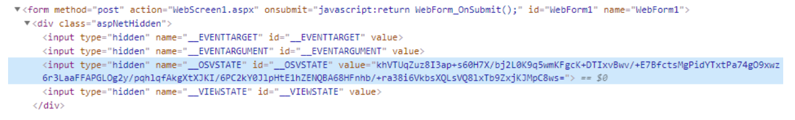
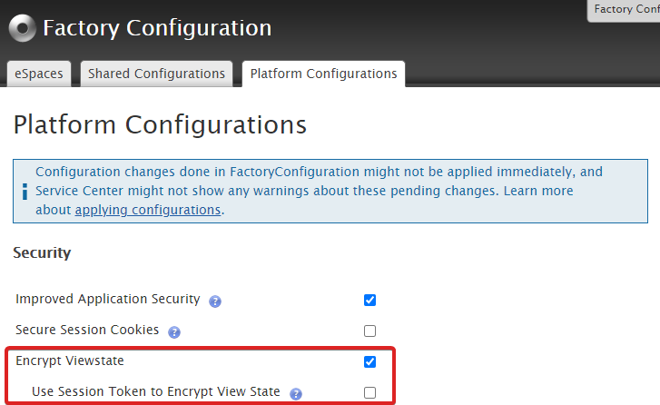

# Encrypt web apps view state

Applies only to Traditional Web Apps.

The view state is used by the OutSystems underlying technology for traditional web applications (ASP.NET). This mechanism is used to preserve the client-side state of a web page when a postback occurs. The view state stores the values and controls of the page between requests.
 
The view state is a hidden field in the HTML of the web page. Its value property stores the view state encoded information. It's a good practice to encrypt the view state and avoid using it to store sensitive information.

Check the [Microsoft documentation](https://docs.microsoft.com/en-us/dotnet/api/system.web.ui.control.viewstate?view=netframework-4.8) for more information about the view state.

## Encrypting the view state using Factory Configuration

Because a page's view state can contain sensitive information (such as the inputs a user added on a form) it's a good practice to encrypt the view state.
It’s possible to encrypt the view state using the supported Forge component [Factory Configuration](https://www.outsystems.com/forge/component-overview/25/factory-configuration):

1. Install Factory Configuration in the environment you wish to encrypt the view state.

1. Open it on the browser and login using your LifeTime/Service Center credentials.

1. Navigate to the **Platform Configurations** tab and make sure **Encrypt Viewstate** is ticked. 
    1. For an extra level of protection, it's also possible to enable the **Use Session Token to Encrypt View State** option. This will include an extra session generated token in the encrypted view state. This token changes after a login to a different user, and ensures every requested page is only valid in the context of that same user session. There are multiple use cases that are broken by this extra protection, so make sure to read the consequences that are explained in the Factory Configuration contextual help of this option.

    

1. [Apply the settings](https://success.outsystems.com/Support/Enterprise_Customers/Maintenance_and_Operations/Applying_Configurations_in_Service_Center#Apply_Pending_Settings_to_a_Set_of_Modules) to all modules.
