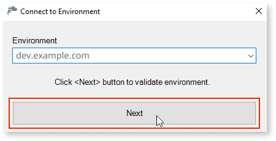

# Authentication using an external identity provider

## Logging into OutSystems management consoles

When accessing any Outsystems management console (Service Center and Lifetime) without a valid session, the user is redirected to the external IdP login screen. When the authentication flow finishes on the IdP, it redirects back to the platform and performs a successful login (if the user exists in the platform).

## Logging out from OutSystems management consoles

When a user, authenticated using the IdP, attempts to log out, the platform logs the user out and redirects to the logout flow in the IdP.

## Logging into Service Studio

When a user logs into a Service Studio environment, they are redirected to a browser to complete the login instead of entering a username and password.

To log into Service Studio using an IdP,  follow these steps:

1. Open **Service Studio**.

1. Click **Connect to Environment**.

    

1. Enter the environment URL and click **Next**.

    

    If the environment configuration to use an external IdP is correct, then the button changes to **Waiting to log in from your browser**.

    

    A new browser window opens to perform the IdP authentication flow. When the flow finishes, the browser displays a pop-up asking the user to **Open Service Studio**.

    

1. Click the **Open Service Studio** button and complete the login process.

## Logging into Integration Studio

The flow to login into an environment is similar to the old one, with the developer being redirected to a browser to complete the login instead of typing the username and password.

To log into Integration Studio using an IdP,  follow these steps:

1. Access Integration Studio.

1. Click **Connect to Environment**.

    

1. Enter the environment URL and click **Next**.

    

    A message displays informing you to **Use the Identity Service website to complete the login process**.

    

   A new browser window opens to perform the IdP authentication flow. When the flow finishes, the browser displays a pop-up asking the user to **Open Integration Studio**.

1. Click **Open Integration Studio** and complete the login process.

