# Configuring Microsoft Azure AD authentication

To configure Microsoft Azure AD authentication, follow these steps:

1. [Register an application](#register-an-application)

1. [Configure the platform - Web apps](#configure-the-platform---web-apps)

1. [Configure the platform - Mobile and desktop apps](#configure-the-platform---mobile-and-desktop-apps)

1. [Configure the client secret](#configure-the-client-secret)

1. [Configure permissions](#configure-permissions)

## Register an application

1. Access the Microsoft Azure portal.

1. Go to **Azure Active Directory** -> **App registrations**.

1. Click  **+ New registration**.

    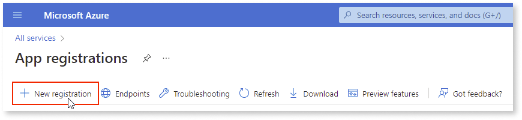

1. Enter the **Name** and **Supported account type**.

    Example:

    * **Name**: OutSystems Platform

    * **Supported account type**: Accounts in this organizational directory only

1. Click **Register**.

## Configure the platform - Web apps

1. Go to **Authentication** and click **+ Add a platform**.

    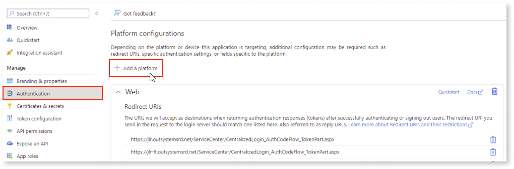

1. From the **Configure platforms** screen, click **Web**.

    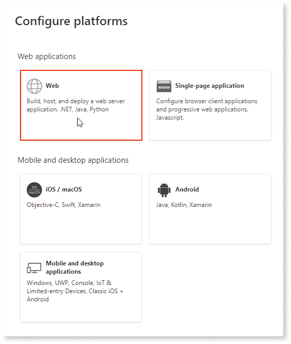

1. Set the **Redirect URI** to the Service Center login page from the LifeTime environment:

    * ``https://<LT_ENV>/ServiceCenter/CentralizedLogin_AuthCodeFlow_TokenPart.aspx``

    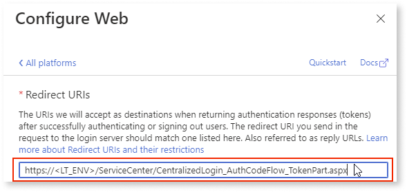

1. Set the **Front-channel logout URL** to the Lifetime logout page from the LifeTime environment:

    * ``https://<LT_ENV>/LifeTimeSDK/CentralizedLogoutPage.aspx``

    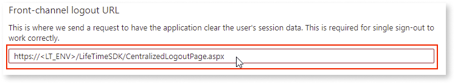

1. Click **Configure**.

1. For each of the environments in your infrastructure, add a new URI for the Service Center login page:

    * ``https://<YOUR_ENV>/ServiceCenter/CentralizedLogin_AuthCodeFlow_TokenPart.aspx``

    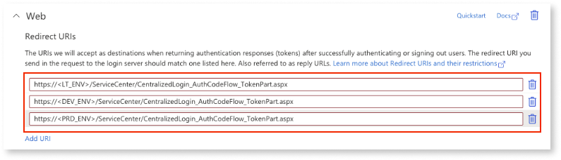

1. Click **Save**.

## Configure the platform - Mobile and desktop apps

1. Go to **Authentication** and click **+ Add a platform**.

    

1. From the **Configure platforms** screen, click **Mobile and desktop applications**.

    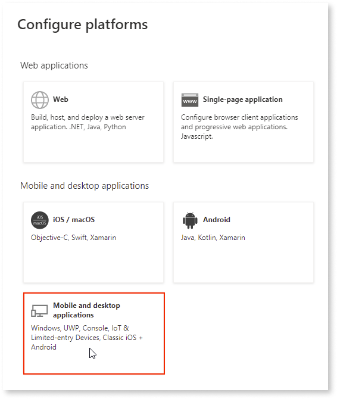

1. Set the **Custom redirect URIs** to the following Service Studio protocol:

    * ``servicestudio://auth``

    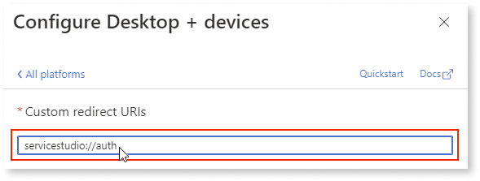

1. Click **Configure**.

1. Add the following URIs to the **Mobile and desktop applications** section:

    * ``integrationstudio://auth``

    * ``servicestudiox11://auth``

    * ``https://experiencebuilder.outsystems.com/Authentication/OIDC_Callback``

    * ``https://workflowbuilder.outsystems.com/Authentication/OIDC_Callback``

    * ``https://integrationbuilder.outsystems.com/Authentication/OIDC_Callback``

    * For each OutSystems environment in your infrastructure (excluding LifeTime), add an Integration Manager’s URI:

        * ``https://<YOUR_ENV>/OSIntegrationManager/OIDC_Callback``

1. Click **Save**.

## Configure the client secret

1. Go to the **Certificates & Secrets** > **Client  secrets** and click **+ New client secret**.

    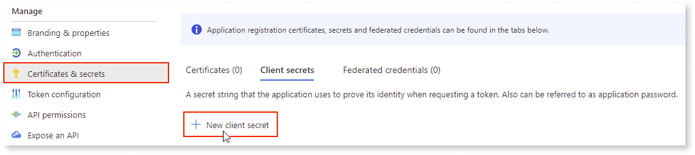

1. On the **Add a client secret** screen, enter the following details:

    * **Description**: Platform Consoles

    * **Expires**: Recommended: 6 months

    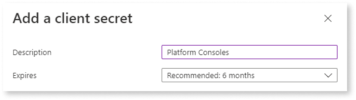

1. Click **Add**.

1. On the **Client secrets** tab, copy the secret in the **Value** column and store it somewhere safe.

    

     You need this information when configuring the provider in LifeTime. **This value won't be displayed again, so ensure you save it now.**

    

    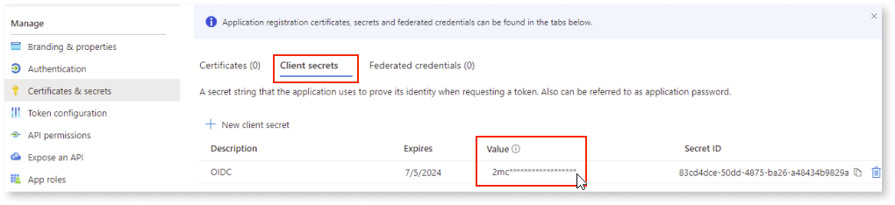

## Configure permissions

1. Go to **API Permissions** and click **+ Add a permission**.

    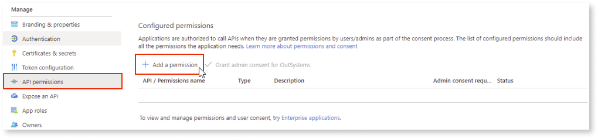

1. From the **Request API permissions** screen, go to **Microsoft APIs** and select **Microsoft Graph**.

    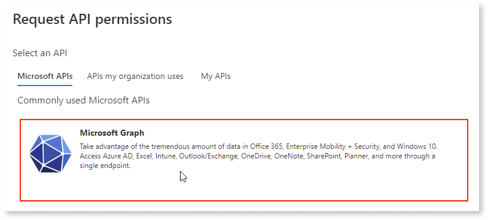

1. Select **Delegated permissions**.

    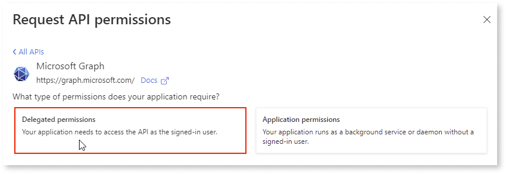

1. Select all **OpenId permissions**.

    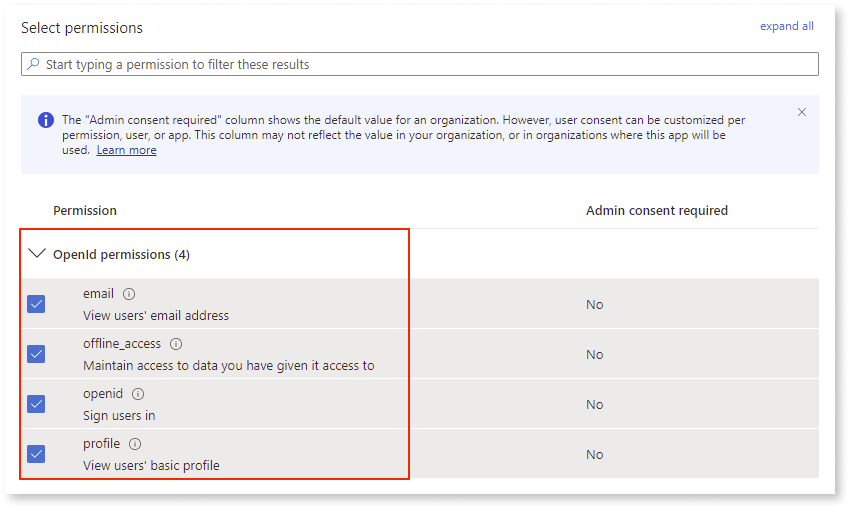

1. Click **Add Permissions**.

1. Go to the **Overview** screen and copy the **Application (client) ID.**

    **Note**: You need this information when configuring the provider in Lifetime

    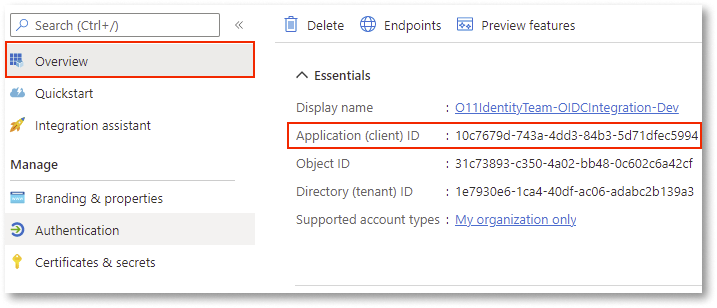

1. Go to **Endpoints** and copy the **OpenID Connect metadata document** URI.

    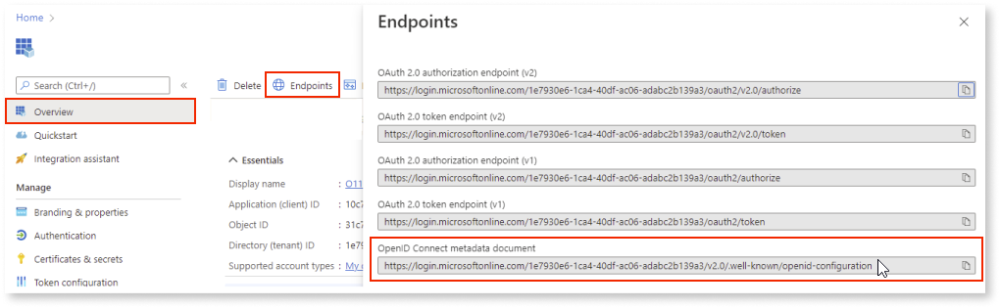

1. To configure and activate the provider, follow the steps in the [LifeTime](external-idp-lifetime.md) section using following details for the OIDC provider information:

    * **Name:** Azure AD

    * **OpenID Connect metadata document**: OpenID Connect metadata document URI

    * **Client Id**: Application (client) ID

    * **Client Secret**: Platform Consoles Client Secret

