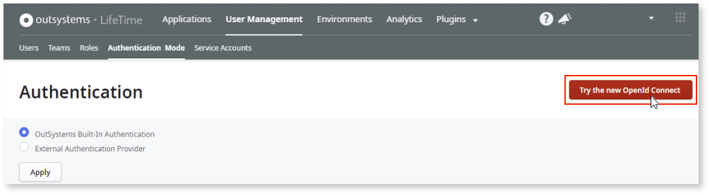
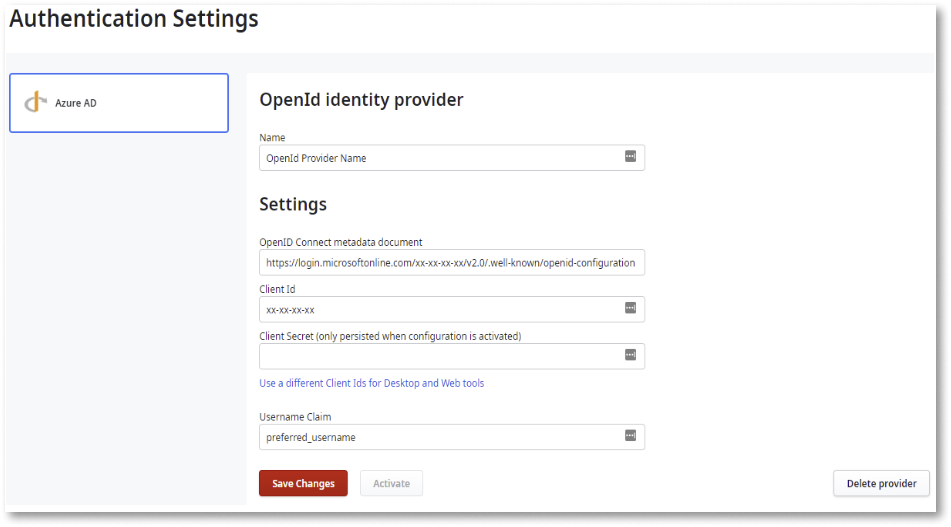
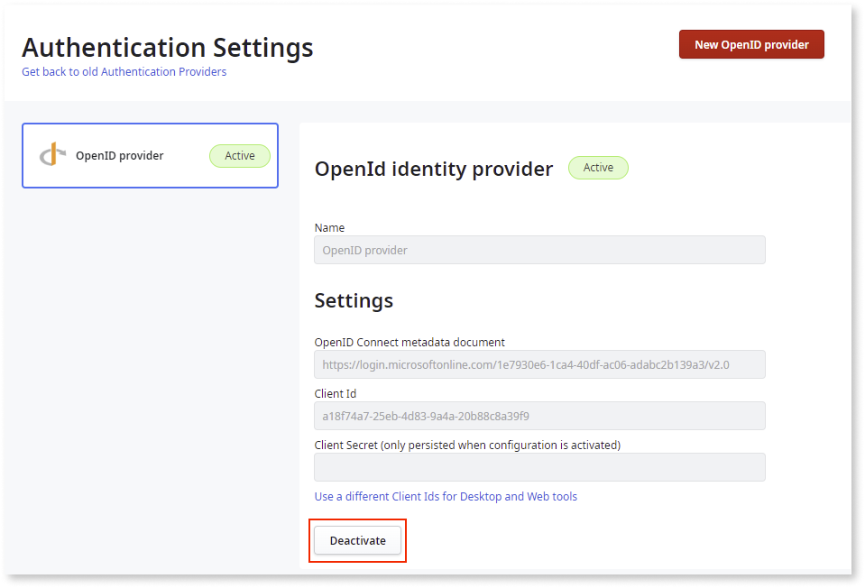
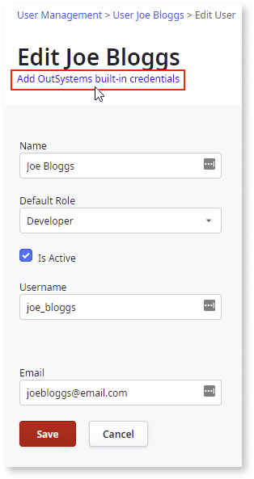
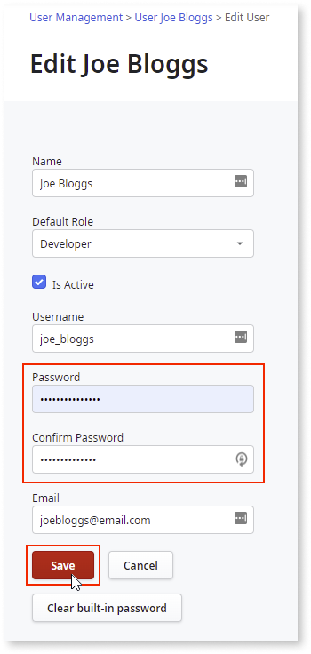
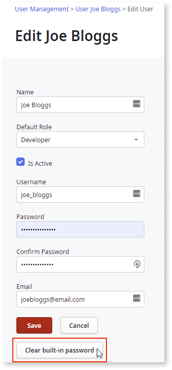

# Configuring LifeTime authentication

Before you can configure the external IdP in LifeTime, the feature must be activated. For more information on how to activate the feature, see [Technical Preview features](https://success.outsystems.com/Support/Release_Notes/Technical_Preview_features).

To configure the external provider (OIDC) in LifeTime, follow these steps:

1. Access the Lifetime console.

1. Go to **User Management** > **Authentication Mode** and click **Try the new OpenId Connect**.

    

1. On the **Authentication Settings** screen, click **New OpenID Provider**.

1. Enter the following details according to the OIDC provider you are using:
    1. **Name**: ID Provider

    1. **OpenID Connect metadata document**: OpenID Connect metadata document URI

    1. **Client Id**: Client ID

    1. If using Okta, click the **Use a different Client Ids for Desktop and Web tools** link and enter the following:

        1. **Client Id for Web tools**: Web Application’s Client ID

        1. **Client Id for Desktop tools**: Native Application’s Client ID

        1. **Username Claim**: Claim used to match the username field of the user configured in LifeTime. By default, the claim is prefered_username. For more information, see [Standard Claims](https://openid.net/specs/openid-connect-core-1_0.html#StandardClaims).

        

1. Click **Save Changes**.

1. Enter the client secret in the **Client Secret (only persisted when configuration is activated)** field.

1. Click **Activate**.

## Deactivating the external identity provider

To deactivate the external IdP, select the active IdP and click **Deactivate**.

 Before deactivating the external IdP, make sure that you have an IT user with built-in credentials (username/password) or a configured authentication plugin to avoid getting locked out of LifeTime.

By deactivating the external IdP, the **IT Users Authentication with External IdP (OIDC)** feature is unavailable and the only way to login is by using the previously configured authentication mechanism.

## Managing Users

The auto-provisioning of IT Users is not available, therefore, users must be manually created even though OIDC providers can authenticate users regardless of their presence in LifeTime. The platform still requires that users exist in LifeTime so that they can be identified correctly once they successfully login using the external IdP

When creating a new user in LifeTime, if an external IdP configuration is active, it’s not necessary to enter a password. This is because the authentication happens on the external IdP side. This way, users are forced to use the IdP authentication. Apart from basic user information,  such as name, email, and role, the user is identified by matching the LifeTime **username** with the **username claim** value of the external Idp.

### Adding built-in credentials

If the external IdP is unavailable or the **IT Users Authentication with External IdP (OIDC)** configuration has errors, you can configure a password for a user. This ensures that there is always a fallback authentication option for the user to log into the platform.

Because the **IT Users Authentication with External IdP (OIDC)** authentication mode is an add-on, you can add built-in credentials so that there is a fallback mechanism set up.

**Note**: We highly recommend that you use this approach, although it's not mandatory.

To add built-in credentials to a user, follow these steps:

1. Go to **User Management**.

1. On the **Users** screen, locate and click the user you want to update.

1. Click **Edit**.

1. On the **Edit User** screen, click the **Add OutSystems built-in credentials** link.

    

1. Enter the **Password** and **Confirm Password** details.

1. Click **Save**.

    

### Clearing built-in credentials

You can clear a user’s built-in credentials. Doing this prevents the users from using the fallback authentication.

1. Go to **User Management**.

1. On the **Users** screen, locate and click on the user you want to update.

1. Click **Clear built-in password**.

    

**Note**: If the existing [External Authentication Provider](../use-an-external-authentication-provider.md)  is not configured to use OutSystems built-in authentication, the options to set up the password are not available. However, the fallback mechanism will work with the configured provider.
