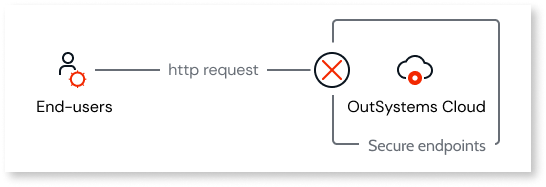

# Protecting against host header injection with secure endpoints

Host header injection is a vulnerability in which an attacker manipulates the host header of a HTTP request to deceive a server into handling the request as if it were intended for a different domain. Malicious actors can intercept a user's request and change the host header.
The following diagram shows an example of such an attack.

To safeguard against unauthorized access to sensitive data, manipulation of user sessions, and exposure to malicious content, it's crucial to mitigate this vulnerability. Implementing this configuration is essential for achieving [PCI compliance](https://www.outsystems.com/tk/redirect?g=1fcf38a0-15c1-486a-b022-a9d21dea89b6).

In the OutSystems Cloud, LifeTime provides functionality to set up secure endpoints. This feature safeguards against host header injection attacks by verifying incoming requests against your defined list of endpoints. Any request with an unauthorized host header is declined, enforcing access exclusively through the designated endpoints to enhance security.

Therefore, configuring the endpoint list according to your organization’s specific infrastructure is important to ensure your endpoints aren’t rejected.

The following are important notes regarding secure endpoints:

* Both enabling and disabling the feature require a support ticket.
* When host header injection protection is enabled, the environment's hostname is always allowed by default.
* Once enabled, you can customize the list of allowed endpoints in self-service.
* Wildcards (*.example.com) aren’t supported as secure endpoints.
* If you remove all allowlisted endpoints, your environment only allows access with its own hostname.
* [Managing the list of secure endpoints](#manage-secure-endpoints) is available for all environments except LifeTime. To manage secure endpoints for the LifeTime environment, open a support case.
* When requests are blocked, users will see an error in the browser. See [Troubleshooting error 503 - Host header does not match](https://www.outsystems.com/tk/redirect?g=c9a42528-9c9c-471c-aded-e5c2a0aef08e) for more details.

## Prerequisites { #prerequisites }

To configure additional secure endpoints for host header injection protection, you first need to ensure the following conditions:

* Your infrastructure is in the OutSystems Cloud.
* The LifeTime version is 11.17.4.0 or higher.
* To manage secure endpoints, you need to have Admin built-in role in LifeTime.

## Enabling and managing secure endpoints { #enable-secure-endpoints }

Before configuring additional secure endpoints it’s important to gather all the valid hostnames to ensure a correct configuration.

The following diagram shows an overview of the process.

### Check your endpoint configurations { #check-endpoint-configurations }

Before enabling secure endpoints you must list all the hostnames used to access your environment. You'll need this list to configure the allowed hosts. Otherwise, you'll start losing access, impacting your app’s normal operation. 

* **Check your DNS configuration:**

    You may have configured different hostnames internally that would have their address resolved to the environment’s public name. In this case, you should also allow them.

    For example, you may have `endpoint 1` and `endpoint 2` pointing to `endpoint 3` that then points to your `outsystemsenterprise.com` environment address.

    

    In this scenario, you must add all endpoints that can eventually lead to your `outsystemsenterprise.com` environment address as secure endpoints in LifeTime. In this example, you would need to add `endpoint 1`, `endpoint 2`, and `endpoint 3`.

    

    Note all the valid endpoints in your DNS configuration. You'll need them to compile the list of secure endpoints to configure in LifeTime.

    

* **Check if you have more than one FQDN (fully qualified domain name)for your domain:**

    If you have more than one FQDN or multi-domain (SAN) certificate, you must allow all corresponding domains on the list of secure endpoints for your environment.

    

    Note all your valid domains. You'll need them to compile the list of secure endpoints to configure in LifeTime.

    

### Check redirect rules in Service Center { #check-redirect-rules }

With [redirect rules](../../develop/seo/seo-friendly-url-traditional.md#redirect-rules), your environment might redirect requests to an endpoint not gathered in the section above. Make sure to verify the **Redirect Rules List**  in Service Center and allow all the destination endpoints present in the **New URL**.

Note all your redirect rules destination domains. You'll need them to compile the list of secure endpoints to configure in LifeTime.

After you’ve checked the endpoint configurations and the redirect rules, you should have a compiled list.

## Enabling secure endpoints { #enable-secure-endpoints }

To protect against host header injection, you can enable secure endpoints in any environment. OutSystems Support must perform the first configuration. Follow these steps:

1. [Open a support case](https://www.outsystems.com/support/portal/open-support-case)
1. In the support case, provide the environments to enable the feature and the compiled list of endpoints per environment. This is a fundamental step, if no list is provided, only the environment address will be allowed in the host header.
1. Wait for a confirmation in the support case.

Once OutSystems support confirms secure endpoints have been enabled for the first time, you’ll be able to manage them as needed.

When you change the endpoint configurations or redirect rules, especially when adding new values, you must accordingly manage the secure endpoints in LifeTime. Failing to do so may impact your apps.

## Managing the list of secure endpoints { #manage-secure-endpoints } 

When you enable host header injection protection, LifeTime displays **Additional Secure Endpoints**. These endpoints form the allow list for validating host headers. Any request with a host header that differs from those in the allow list will be blocked.

To manage secure endpoints follow these steps:

1. Go to **LifeTime** > **Environments** and select the environment you want to manage.
1. Under **Additional secure endpoints**, click **Change**.
1. Add or remove endpoints.
1. Confirm by clicking **Update Additional Secure Endpoints**. Your changes will be applied automatically.

