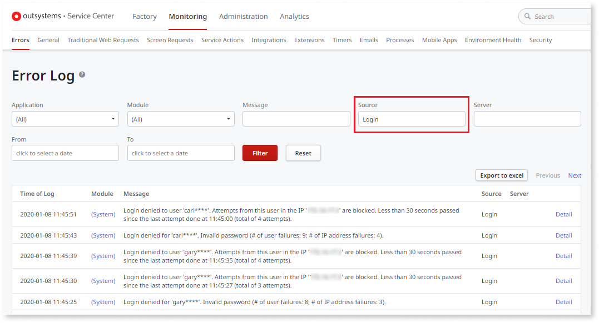

# Protection against Brute Force Attacks

Applications secured with authentication can be subject to brute force attacks that systematically try to guess user passwords. OutSystems provides a built-in protection mechanism that allows taking countermeasures against these attacks: 

User-level Attack
:   The attack is perpetrated with a user from a specific IP address. In this case, that user is blocked from logging in from the attacker IP address. The legitimate user can still login from an IP address that was not used for the attack. 

IP-level Attack
:   The attacker has a list of users and tries to guess their passwords from a specific IP address. In this case, the attacker IP address is blocked.  
    By blocking the IP address, the platform won't also allow the attacker to go through all users and flood the application with requests, which could also lead to a denial-of-service (DoS) attack.

## How the Protection Works

The provided countermeasure consists of a two-step backoff mechanism:

1. **The first backoff**  
If the number of failed login attempts reaches a limit within a period of time, the following happens:

     * **User-level attack**: The user gets blocked for that IP address and cannot log in from there for a short time (a few minutes).
     * **IP-level attack**: The IP address gets blocked and users cannot log in from there for a short time (a few minutes).

    In both cases, the error message changes from "Invalid username or password" to "Too many failed login attempts. Please try again in a few minutes."

1. **The second backoff**  
If the attack continues and a second limit is reached, the login is blocked for a long time (about an hour).  
The error message changes to: "Too many failed login attempts. Please try again in 60 minutes."

**Protecting Application Users and IT Users**

The protection against brute force attacks for **application users** (i.e. end users of your applications) described in this topic is available for all applications configured with Users as their User Provider or when using a custom User Provider cloned from Users.  
Check the [Configure Brute Force Protection for Application Users](<#configure-brute-force-protection>) section to learn how to configure this protection for application users.

The same brute force attack protection is available by default for **IT users** when logging in to Service Center and LifeTime. Check the [Configure Brute Force Protection for IT Users](#configure-brute-force-protection-it-users) section to learn how to configure this protection for IT users.

## Unblocking Application Users and IP Addresses

Users and IP addresses can get blocked even if they're legitimate, for example:

* Forgetting the password and trying too many login attempts
* A brute force attack that blocks an IP address (e.g.: an ISP) that is also used by many legitimate users

To unblock users/IP addresses and restore the normal login process you need to go to the Users management console (located at `http://<yourserver>/Users`).

To unblock a **user**, proceed as follows:

1. Log in to the Users application.
1. Go to the User details page and if login attempts are blocked for the user, a warning message is displayed on the page.
1. Go to the bottom of the page. There is a list of IP addresses for which user login attempts are blocked.
1. Click **Unblock** to restore the normal login process for the user in desired IP address(es).

To unblock an **IP address**, proceed as follows:

1. Log in to the Users application.
1. On the right-hand side of the screen, click the **Blocked Addresses** link to display the page with blocked IP addresses.
1. Click **Unblock** to restore the normal login process for all users in the desired IP address(es).

## Unblocking Administrator Users

In case an administrator user gets blocked, use one of the following ways to unblock:

* Log in as administrator from a different IP address and unblock.
* Log in with another user with permissions to manage users and teams and unblock.

## Unblocking in LifeTime and Service Center

LifeTime and Service Center are protected against brute force attacks, which means its users can get blocked. When they get blocked use LifeTime to unblock them or, if not installed, use Service Center.

### Unblock in LifeTime

To unblock IT users in LifeTime, do the following: 

1. Log in to LifeTime (with a user with permissions to manage users and teams).
1. Go to the Users & Roles section.
1. Go to the page with the details of the user. If login attempts are blocked for the user, a warning message is displayed on the page.
1. Go to the end of the page, where there is a list of IP addresses for which user login attempts are blocked.
1. Click **Unblock** to restore the normal login process for the user in desired IP address(es).

To unblock IP Addresses in LifeTime, do the following:

1. Log in to LifeTime (with a user with permissions to manage users and teams).
1. Go to Infrastructure section.
1. On the desired environment, click on the **Blocked Addresses** link to display the page with blocked IP addresses.
1. Click **Unblock** to restore the normal login process for all users in the desired IP address(es).

### Unblock in Service Center

To unblock IT users in Service Center, do the following:

1. Log in to Service Center (with a user with permissions to manage users).
1. Go to the Administration section.
1. Select the **Users** option.
1. Go to the page with the details of the user. If login attempts are blocked for the user, a warning message is displayed on the page.
1. Go to the **Blocked Addresses** tab, where there is a list of IP addresses for which user login attempts are blocked.
1. Pick the IP address(es) for which you want to unblock the user.
1. Click the **Unblock Selected** button. The user will be able to log in again from that IP address.

To unblock IP addresses in Service Center, do the following:

1. Log in to Service Center (with a user with permissions to manage users).
1. Go to the Monitoring section.
1. Select the **Security** option, where there is a list of blocked IP addresses.
1. Check the IP address(es) which you want to restore the normal login process for all users.
1. Click the **Unblock Selected** button. 

## Check for Possible Brute Force Attacks

The environment management console (Service Center) provides logs with information that can be used to monitor possible brute force attacks.

To access the log, proceed as follows:

1. Log in to Service Center and go to the Monitoring section.
1. Select the Errors option.
1. Filter by Login module.

When a user or IP address is blocked due to a possible brute force attack, the information is displayed in the following format:

* The timestamp of the login attempt
* The user who did the login attempt
* The IP address from where the login attempt was made
* The approximated time elapsed since the last login attempt
* When was the last login attempt
* The count of login attempts

If a failed login attempt does not configure an attack, the information is displayed as follows:

* The timestamp of the login attempt
* The user who did the login attempt
* The count of login attempts at user-level and IP-level

## Configure Brute Force Protection for Application Users { #configure-brute-force-protection }

The configuration in this section is only applicable to **application users** and not to IT users. Therefore, it does not affect the protection of LifeTime and Service Center.

Check the [Configure Brute Force Protection for IT Users](#configure-brute-force-protection-it-users) section to learn how to configure this protection for IT users.

The protection of OutSystems applications against brute force attacks is configurable. To change the behavior, proceed as follows:

1. Log in to Service Center.
1. Go to the Factory section and select the **Modules** option.
1. Search for the Users module and open the page with the details.
1. Select the **Site Properties** tab.
1. Configure the protection in the Site Properties described in the table below.

|Site Property                              |Description               |
|-------------------------------------------|--------------------------|
|EnableBruteForceProtection                 |Enables brute force login protection at user level.|
|MaxUsernameAttemptsFirstBackoff            |The maximum number of login attempts for a user after which the first backoff protection is triggered. The default value is 3 times.|
|MaxUsernameAttemptsSecondBackoff           |The maximum number of login attempts for a user after which the second backoff protection is triggered. The default value is 6 times.|
|UsernameAttemptsFirstBackoffDelayInSeconds |After hitting the first backoff, it's the time that login attempts are blocked for a user. The default value is 30 seconds.|
|UsernameAttemptsSecondBackoffDelayInSeconds|After hitting the second backoff, it's the time that login attempts are blocked for a user. The default value is 1800 seconds.|
|EnableBruteForceProtectionPerIP            |Enables brute force login protection at IP level.|
|MaxIPAttemptsFirstBackoff                  |The number of login attempts for an IP address after which the first backoff is triggered. The default value is 20 times.|
|MaxIPAttemptsSecondBackoff                 |The number of login attempts from an IP address after which the second backoff is triggered. The default value is 50 times.|
|IPAttemptsFirstBackoffDelayInSeconds       |After hitting the first backoff, it's the time that login attempts are blocked for an IP address. The default value is 300 seconds.|
|IPAttemptsSecondBackoffDelayInSeconds      |After hitting the second backoff, it's the time that login attempts are blocked for an IP address. The default value is 3600 seconds.|
|InvalidLoginCheckWindowInMinutes           |Time frame in minutes in which failed attempts are accounted. Default value is 60 minutes.|

## Configure Brute Force Protection for IT Users { #configure-brute-force-protection-it-users }

The protection against brute force attacks is available by default for **IT users** when logging in to Service Center and LifeTime. To change the default behavior, use the [Factory Configuration](https://www.outsystems.com/forge/component-overview/25/factory-configuration) application, available in OutSystems Forge, in **all environments**.

To configure the brute force protection for IT users, do the following in **all application environments and LifeTime environment**:

1. Download and install the [Factory Configuration](https://www.outsystems.com/forge/component-overview/25/factory-configuration) application.

1. Go to the Factory Configuration application (`https://<environment_name>/FactoryConfiguration`) and change the Brute Force Protection settings.
    
    

1. Click the **Apply** button.

Make sure the Brute Force Protection settings are **the same across all environments**.
