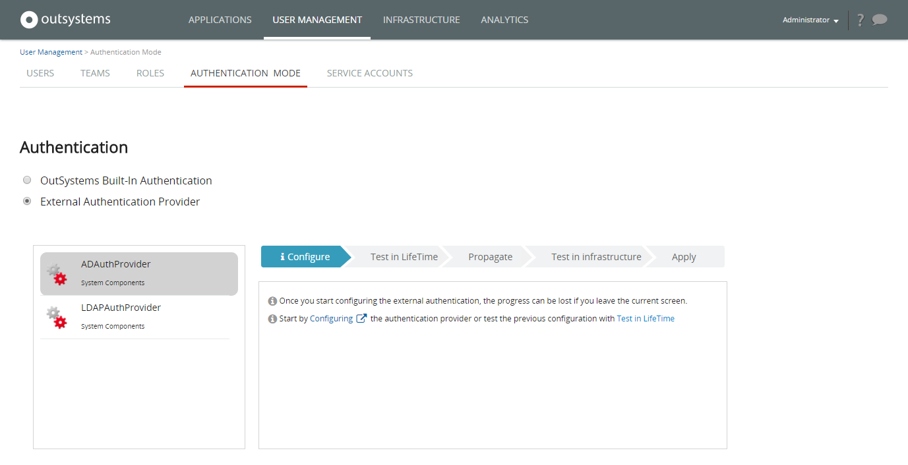

# Use an External Authentication Provider

This section applies only to the authentication of **IT users**, like Developers and IT Administrators.  
The authentication of **end users**, i.e. the users of your OutSystems applications, is [configured in the Users application](../../develop/security/end-user-manage/end-user-authentication/intro.md).  

OutSystems allows you to manage IT users (developers, testers, operators). By default, when these users access OutSystems, they're authenticated using the built-in authentication mechanism. 

Usually you have other systems and you want your users to only have one account to authenticate in all of them. OutSystems allows this by enabling you to authenticate IT users using an authentication provider of your choice.

To ensure everything is secure, only IT users with permissions to manage the infrastructure are allowed to make these changes.

 Active Directory (AD) authentication as set up in **ADAuthprovider** requires that both the AD and OutSystems are in the same domain. Therefore, it's not compatible with OutSystems Cloud. LDAP authentication can be used with OutSystems Cloud.

## How OutSystems Authenticates IT Users

When an IT user tries to access OutSystems, it checks which authentication method is configured:

* If configured to use the **built-in authentication**, the platform validates the credentials sent by the user.

* If configured to use an **external authentication provider**, the platform delegates the authentication to the plugin assigned for it. The plugin is responsible for validating the credentials, and returning a unique user identifier. That unique identifier maps the authenticated user to an OutSystems IT user.

## Change the Authentication Provider

To change the authentication provider:

1. Map users from the external system to the platform.
1. Choose the new authentication method.
1. Configure the provider in the infrastructure management console (LifeTime) environment.
1. Test your configuration settings and propagate them to all other environments.
1. Test the provider in all environments and apply your changes.

In this example we'll change the platform to authenticate IT users through Active Directory.

### Map users from the external system to OutSystems 

Before changing the authentication provider, you need to ensure that each IT user that exists on the external directory service has a corresponding OutSystems user.

You can either create the IT users manually, using the infrastructure management console, or use the [LifeTime Services API](https://success.outsystems.com/Documentation/11/Reference/OutSystems_APIs/LifeTime_API_v2).

Notice that when creating new IT users in OutSystems you'll have to specify the user password. Since you'll be using an external authentication provider, you can simply use a dummy password when creating OutSystems users, because it won't be used in the authentication process.

### Change the Authentication Plugin

To change the authentication method, in the infrastructure management console, under **User Management**, choose **Authentication Mode**. 

Out of the box, the platform provides an Active Directory (AD) and LDAP authentication providers that you can see listed. 

To choose an external authentication provider, do the following:

1. From the list on the left, choose the desired authentication provider.

    

    In the example above, we chose the AD authentication provider (`ADAuthProvider`).

1. Proceed according to the following sections to configure and test the selected provider.

After setting a new provider, when an IT user connects to a specific environment, the  authentication provider is responsible for authenticating the user on that environment.

### Configure the Authentication Plugin

After choosing the AD authentication provider, it’s time to configure the provider. You will need to provide configuration values for a single environment and then propagate those configuration values to other environments. 

To start the configuration: 

1. Click in the **Configuring** link. This will open the configuration screen of the authentication provider in the infrastructure management console environment. 

    

    In this example, the Active Directory domain was set to `OUTSYSTEMS`.

1. After entering the necessary data, click in the **Save Configuration** button. 

1. Close the current provider configuration page, returning to the **Authentication Mode** page.

### Test and Propagate Configuration Settings

After all necessary configuration settings have been defined and before propagating them to other environments, you will test if the current settings are valid for the infrastructure management console environment.

1. Click the **Test in LifeTime** link. This tests if the plugin is properly configured in the infrastructure management console environment and that it can successfully authenticate IT users.

    

1. If the test ran successfully, click the **Propagate** link to propagate the configuration settings to all the environments of your infrastructure.

    

    If you get an error while propagating your changes to all environments, it's possible that the version of the plugin you're using doesn't support the new configuration API methods yet.

    In this case, you will need to configure each environment separately by opening its configuration page:  

    `http://<environment_server_address>/<auth_provider_name>`  

    In the current example, considering an infrastructure with two environments (for Development and Production), we would need to open the following URLs and provide the configuration values for each environment:

    `http://dev-server.example.com/ADAuthProvider`  
    `http://prd-server.example.com/ADAuthProvider`

    

    To advance to the next step, click in the **Skip this step** link.

1. Test the plugin in all the environments of your infrastructure by clicking on the **Test it in all environments** link.

    

1. If all the tests succeeded, apply the configurations to all environments by clicking in the **Apply configurations** link.

As a consequence, all IT users logged in OutSystems will need to login again, now with their Active Directory credentials.

## Get or Customize an Authentication Provider

If the authentication providers that are included by default with OutSystems don't fit your needs, you can always customize them.

These providers are application modules that are included as part of the System Components application, and can be downloaded in the environment management console. Learn [how to develop your authentication provider plugin](<implement-an-authentication-plugin.md>). You can also check the OutSystems Forge for authentication providers made by the community.

The authentication provider can compromise the security of your infrastructure. Always validate the author and implementation of an authentication provider downloaded from the Forge before using it.

