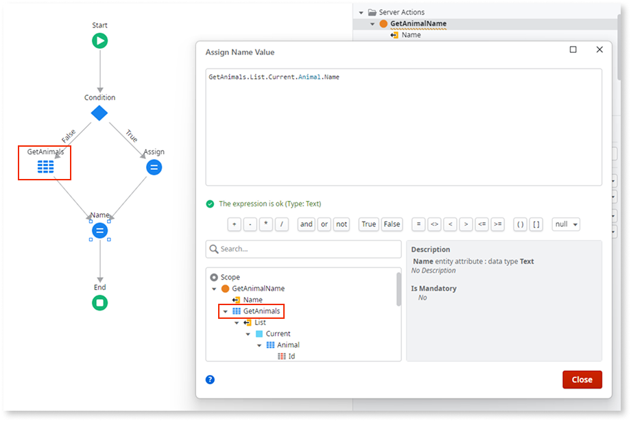
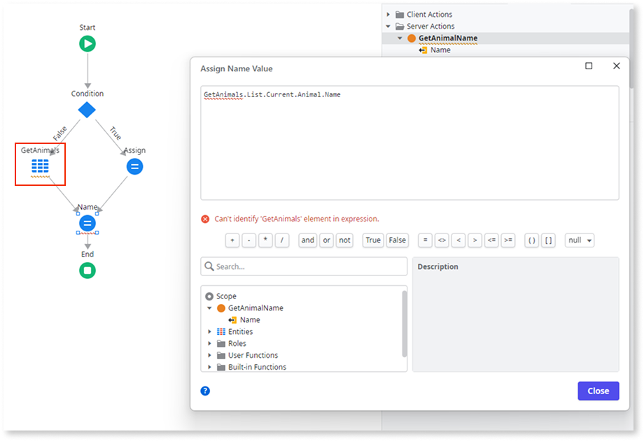
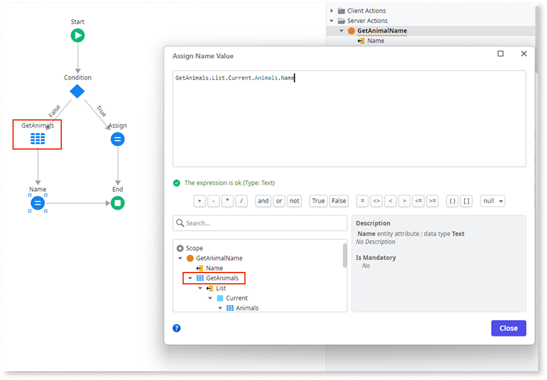

# Aggregate or SQL node referenced outside its scope

In O11, the scope of aggregates and SQL nodes in a [Service](../../building-apps/reuse-and-refactor/services.md) module is different from the scope in a Reactive Web module.

When designing the logic of a Service module's action, you can access any aggregate or SQL node outside the scope where it was declared. For example, an aggregate declared in the False branch of an **If** can be accessed outside the **If** scope, even if the False branch isn't executed during runtime. Whether the False or the True branch executes, the node after the **If** has access to the aggregate.

In ODC apps' logic, an aggregate or SQL node only exists in the scope where it was declared. In this example, an aggregate declared in the False branch of an **If** cannot be accessed outside that scope. Whether the False or the True branch executes, the node after the **If** doesn't have access to the aggregate.

Therefore, after converting to ODC an O11 Service module that uses this pattern, you'll get a TrueChange error: "Can't identify &#39;&lt;aggregate or SQL node&gt;&#39; element in expression".

## How to solve

You must solve this pattern in ODC after proceeding with the code conversion to ODC.

### Solve in ODC

After converting your app to ODC, inspect the Invalid Expression errors in TrueChange to find out where you're using aggregates or SQL nodes that cannot be identified. If you confirm your asset has those errors because it uses the pattern described on this page, adjust your logic to ensure the aggregate or SQL node runs before it is referenced. Make sure aggregates and SQL nodes are only referenced in the same scope where they're declared.

