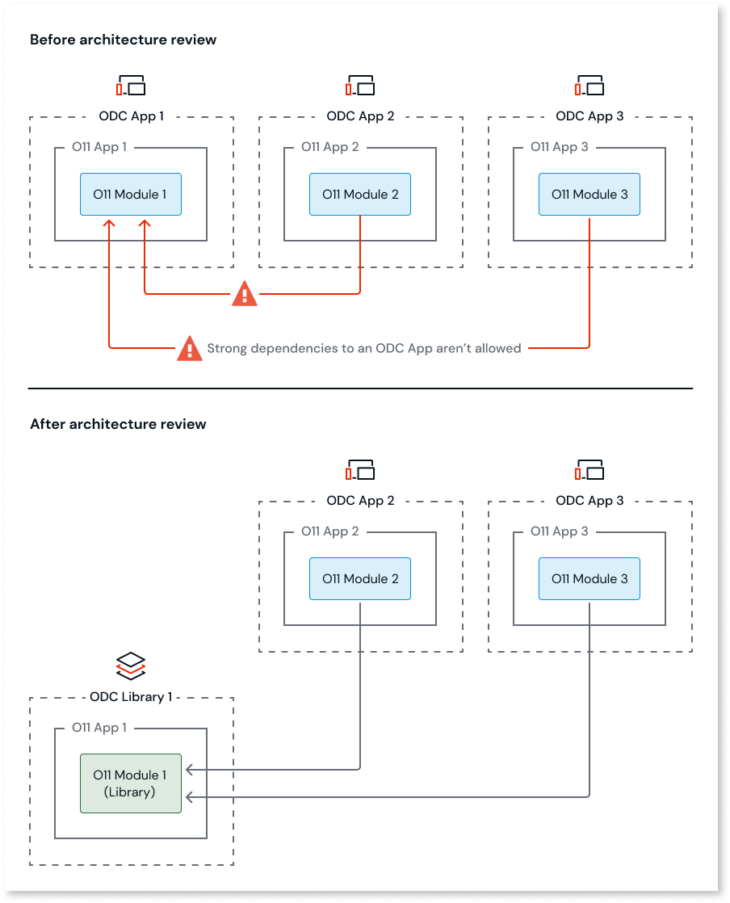

# Asset consuming an Application Theme

A dependency to a Theme is a strong dependency, and in ODC, dependencies to other Apps must be weak dependencies.
This means that the Theme must either be part of the consumer ODC asset, or the Theme must be shared by an ODC Library.

## How to solve

You must solve this pattern in O11, before proceeding with the code migration to ODC.

### Solve in O11

To solve this pattern, review the O11 to ODC architecture mapping by converting the O11 Module with the Theme to an O11 Library module, move that O11 Module to a new O11 App, then map that new O11 app to an ODC Library.

