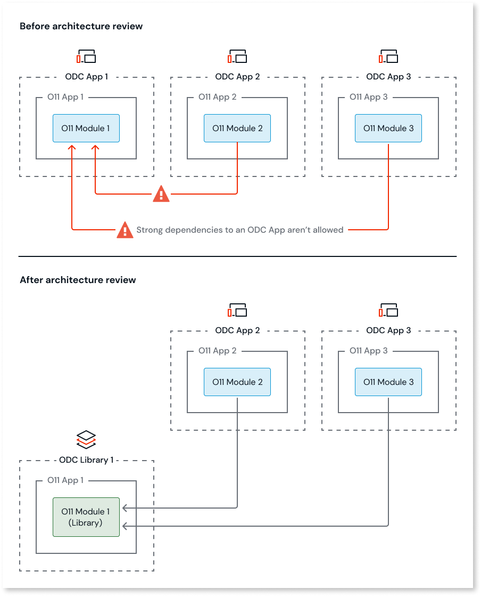

# Asset consuming an ODC application Block

Your ODC asset consumes a Block from another asset. This creates a strong dependency between apps, which isn't supported in ODC.

In OutSystems 11 (O11), Blocks can be consumed across different apps. In ODC, however, dependencies between apps must be weak. This means that the Block must either be part of the consumer ODC asset, or the Block must be shared by an ODC library.

## How to solve

You must solve this pattern in O11, before proceeding with the code conversion to ODC.

### Solve in O11

To solve this pattern, review the O11 to ODC architecture mapping. Consider the following scenarios:

#### Single consumer

If only one ODC app or library consumes the Block, move the Block into the consumer ODC asset:

1. Create a new O11 app.
1. Move the O11 module that contains the Block to the new O11 app.
1. Map the new O11 app to the ODC asset that consumes the Block.

The Block is now part of the consumer ODC asset, thus there's no longer a strong dependency between apps.

#### Multiple consumers

If several ODC apps or libraries consume the Block, share the Block through an ODC library:

1. Convert the O11 module that contains the Block to an O11 library module.
1. Create a new O11 app.
1. Move the O11 library module to the new O11 app.
1. Map the new O11 app to an ODC library.

The Block is now shared by a library, which is deployed in the context of consumer apps only. Thus, there's no longer a strong dependency between apps.

