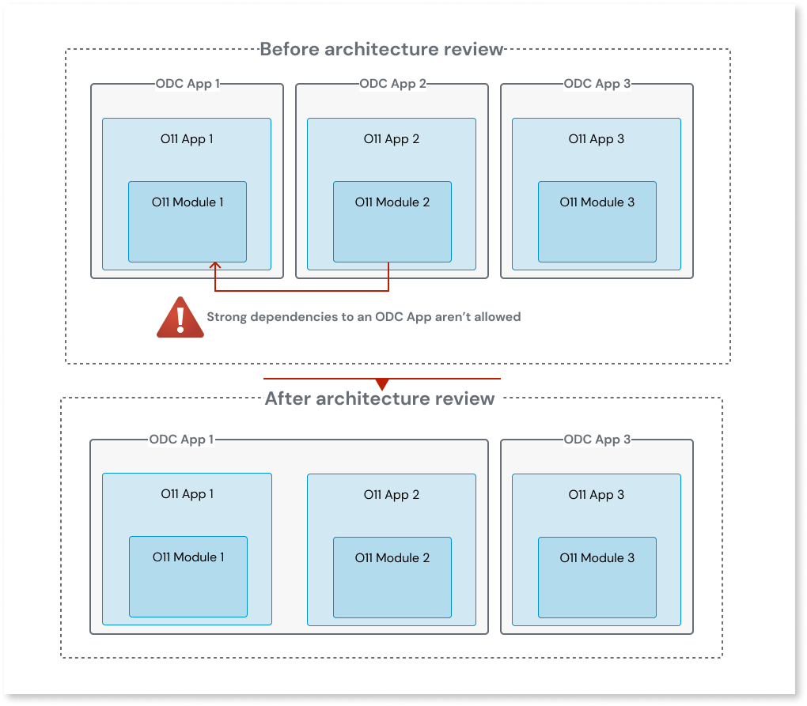
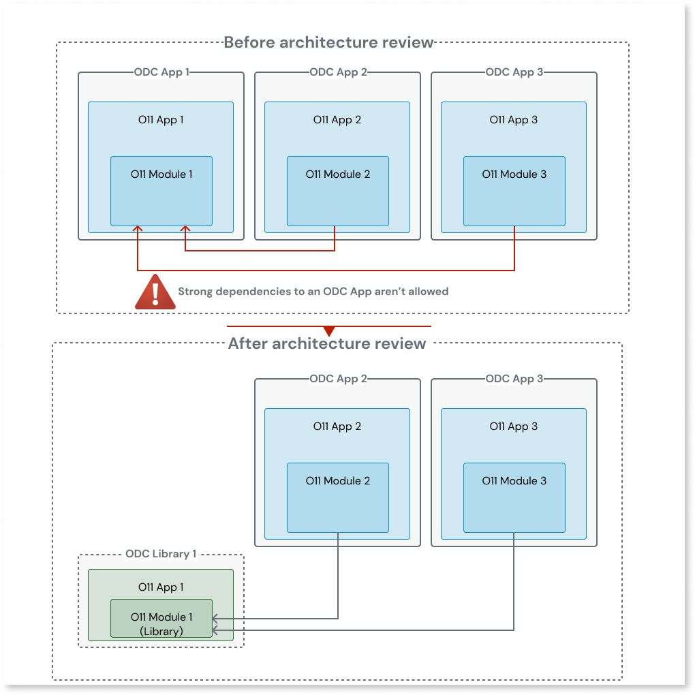

# Asset consuming an ODC application Client Action

A dependency to a Client Action is a strong dependency, and in ODC, dependencies to other Apps must be weak dependencies.
This means that the Client Action must either be part of the consumer ODC asset, or the Client Action must be shared by an ODC Library.

## How to solve

You must solve this pattern in O11, before proceeding with the code migration to ODC.

### Solve in O11

To solve this pattern, review the O11 to ODC architecture mapping considering the following options:

* If only one ODC App or Library consumes the Client Action, move the O11 Module with the Client Action to a new O11 App, then map that O11 App to the ODC consumer.

    

* If several ODC Apps or Libraries consume the Client Action, convert the O11 Module with the Client Action to an O11 Library Module, move that O11 Module to a new O11 Ap, and then map that O11 App to an ODC Library.

    
