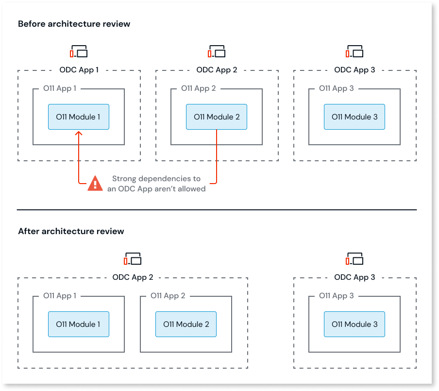

# Application consuming a non-read only Entity

In ODC, only Apps can expose Entities. Furthermore, Apps can only expose weak dependencies. These restrictions mean that Entities can only be exposed as read-only.

## How to solve

You must solve this pattern in O11, before proceeding with the code conversion to ODC.

### Solve in O11

Depending on your scenario, solve this pattern in one of the following ways:

* Change the Entity to read-only. To allow Entity data manipulation in consumer apps, wrap the entity actions in Service Actions in the producer app. Then, in the consumer apps, replace the consumed entity actions with these CRUD service actions.

* If only one ODC App consumes the Entity, review the O11 to ODC architecture mapping and move the O11 module with the Entity to a new O11 App, then map that O11 App to the ODC consumer.

    
