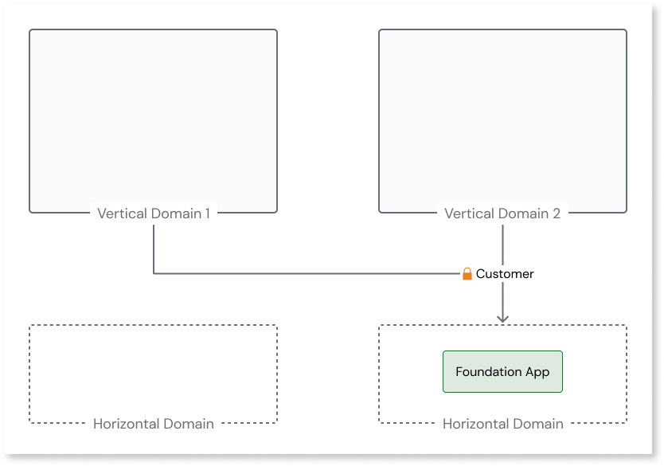
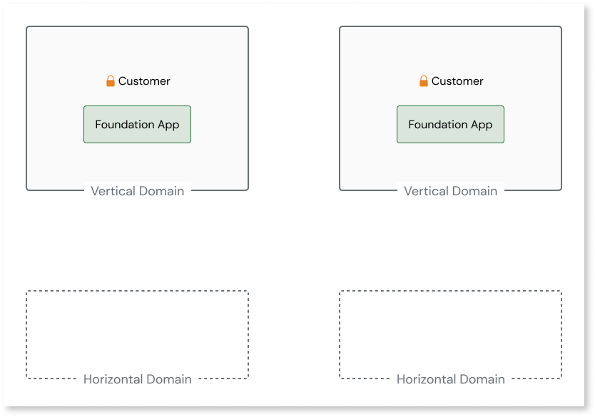

# Asset consuming a Role

In ODC, Assets can't have dependencies to Roles from other Assets.
This means that each App must define its own Roles and can't share them with other Apps.

Public roles are available in ODC since November 2024. OutSystems is working on updating this documentation page. 

## How to solve

You must solve this pattern in O11, before proceeding with the code migration to ODC.

### Solve in O11

In O11, you can have public roles shared across domains. However, in ODC, public roles are not allowed.

This can cause issues when converting the horizontal domain with the foundation app to an ODC library since public roles are not allowed. To configure a public role in ODC, follow these steps:

1. Create a role in each vertical domain and ensure it's only consumed inside the domain.

    

1. Map your end users to both roles in the domain. For more information, refer to [End User Management](https://success.outsystems.com/documentation/outsystems_developer_cloud/user_management/roles/).
