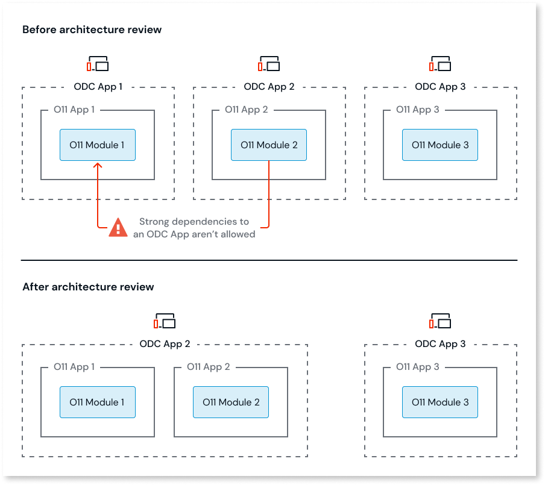

# Asset consuming a Script

In ODC, Assets can't have dependencies to Scripts from other Assets.
This means that each Asset must define its own Script and can't share them with other Assets.

## How to solve

You must solve this pattern in O11, before proceeding with the code migration to ODC.

### Solve in O11

Depending on your scenario, solve this pattern in one of the following ways:

* If several ODC App or Library consume the Script, replicate the Script in each of the ODC consumers.

* If only one ODC Asset consumes the Script, review the O11 to ODC architecture mapping and move the O11 Module with the Script to a new O11 App then map that O11 App to the ODC consumer.

    
