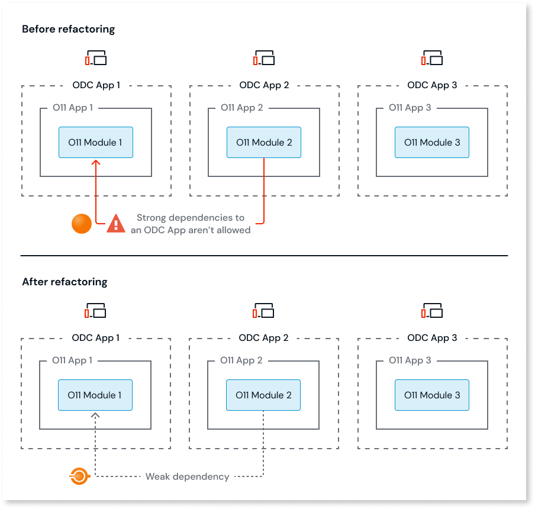

# Asset consuming an ODC application Server Action

A dependency to a Server Action is a strong dependency, and in ODC, dependencies to other Apps must be weak dependencies.
This means that it isn't possible to consume Server Actions from other Apps, only from Libraries.

## How to solve

You must solve this pattern in O11, before proceeding with the code migration to ODC.

### Solve in O11

Depending on your scenario, solve this pattern in one of the following ways:

* If the Server Action includes business logic, change the strong dependency to a weak dependency by [converting the server action to a service action](../../building-apps/reuse-and-refactor/services.md). Unlike Server Actions, Service Actions don't share the same process and transaction with the consumers, so make sure you account for [distributed transactions](../../building-apps/reuse-and-refactor/services.md#dealing-with-transactionality-and-networking) while refactoring your code.

    

* If the Server Action includes business agnostic logic to implement patterns like a an integration wrapper or logic utilities (for example for XML parsing), review the O11 to ODC architecture mapping. Converting the O11 Module with the Theme to an O11 Library module, move that O11 Module to a new O11 App, then map that new O11 app to an ODC Library.

    
