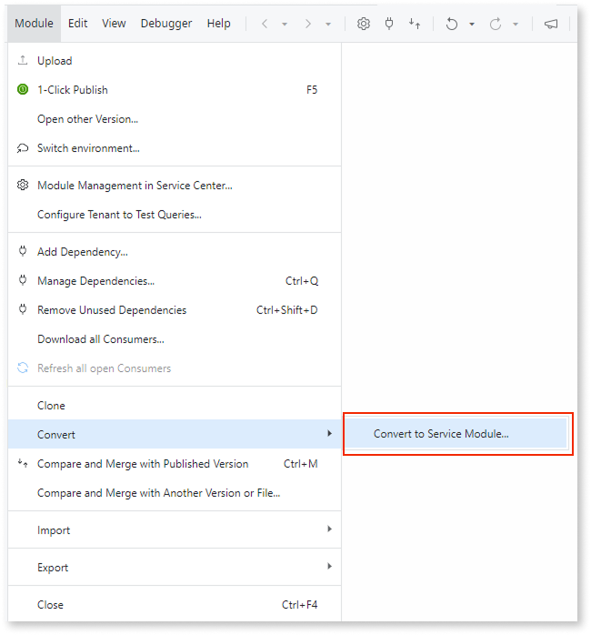

# Asset consuming a Traditional Web module

In ODC, all Web apps are reactive. Traditional Web apps aren't supported. This means that if your app/module is consuming a dependency from a Traditional Web module, you must convert it to a Reactive Web module.

## How to solve

Depending on your scenario, you can solve this pattern in O11 or in ODC:

* If you already have an ODC component that provides the same functionality provided by the Traditional Web module your asset consumes, you can choose to [solve this pattern in ODC](#solve-in-odc).

* Otherwise, you should [solve this pattern in O11](#solve-in-o11).

### Solve in ODC

To solve this pattern in ODC, follow these steps:

1. Proceed with the migration.

    If you have access to the Migration Kit, you must set the **Where To Fix** for this finding as **ODC** in the Migration Assessment Tool.

1. Once the consumer asset is migrated to ODC, update it in ODC Studio to consume the ODC component that offers the same functionality.

### Solve in O11

Depending on your scenario, solve this pattern in one of the following ways:

* Traditional Web modules that only contain logic can be [converted to Service modules](../../building-apps/reuse-and-refactor/convert-to-service.md) as follows:

    1. In Service Studio, open the module you want to convert.

    1. Convert the Traditional Web module to a Service module.

        

    1. Move the Service module to a Reactive Web app in Service Studio.

    1. Map your module to an ODC asset.

* For Traditional Web modules that contain UI elements, the entire module must be converted into a Reactive Web module. For more information on how to do this, refer to [Introduction to migrating Traditional Web to Reactive Web Apps](https://www.outsystems.com/tk/redirect?g=6fd52b69-653d-4384-b9fe-7e30b698609b).
