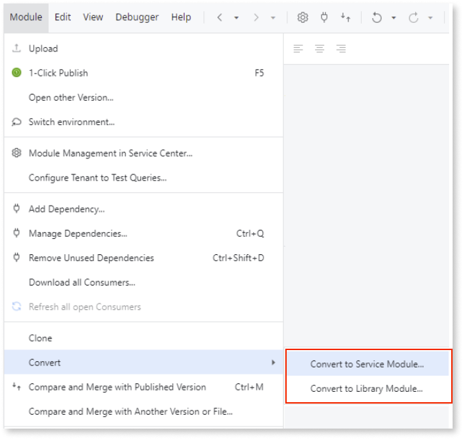

# Asset consuming a reference to a Traditional Web element

In ODC, all Web apps are reactive. Traditional Web apps aren't supported. This means that if your app/module is consuming a dependency from a Traditional Web app/module, you must convert it to a Reactive Web app/module 

## How to solve

You must solve this pattern in O11 before proceeding with the code migration to ODC.

### **Solve in O11**

Depending on your scenario, solve this pattern in one of the following ways:

* Traditional web app modules that only contain logic can be converted to Service or Library modules as follows:

    1. In Service Studio, open the module you want to convert.

    1. Convert the Traditional Web app module to a Service or Library module.

        

    1. Move the Service module to a Reactive Web app in Service Studio.

    1. Map your module to an ODC asset.

* For Traditional Web app modules that contain UI elements, the entire module must be converted into a Reactive Web module. For more information on how to do this, refer to  [Introduction to migrating Traditional Web to Reactive Web Apps](https://success.outsystems.com/documentation/how_to_guides/development/introduction_to_migrating_traditional_web_to_reactive_web_apps/)
