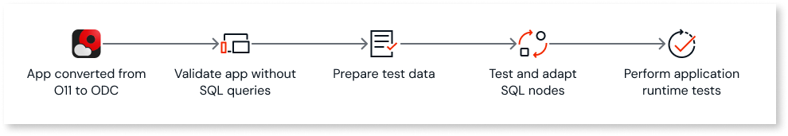
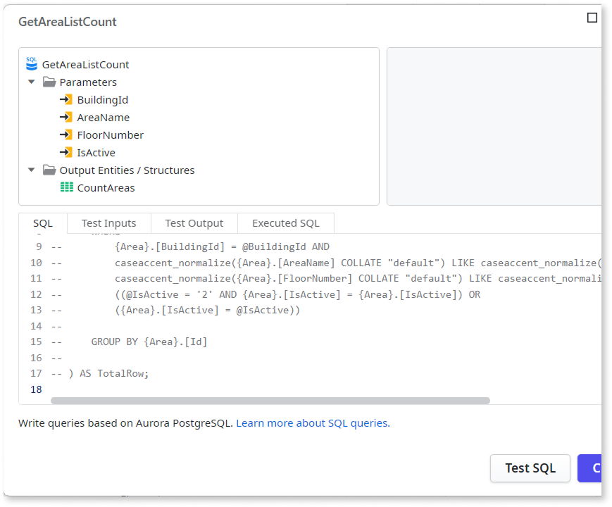

# Application with SQL node

While OutSystems 11 (O11) supports SQL Server, Azure SQL, and Oracle as the underlying database engine, OutSystems Developer Cloud (ODC) uses **Aurora PostgreSQL**.

Due to this shift, SQL nodes in ODC use two distinct syntaxes that differ from O11:

* **PostgreSQL syntax:** Used when the query includes only internal entities (created in ODC Studio).

* **ANSI-92 based syntax:** Used when the query includes external entities, or a mix of internal and external entities.

These differences mean that after converting your assets from O11 to ODC, you must review and potentially adapt all SQL queries to ensure compatibility with the ODC syntax. You must also run thorough tests to each converted SQL node to ensure the expected app behavior.

If you have access to the [O11 to ODC App Conversion Kit EAP](https://www.outsystems.com/o11-odc-migration/), the tool automatically converts into ODC PostgreSQL syntax most of your O11 SQL nodes for internal entities.

## How to solve

You must solve this pattern in ODC, after proceeding with the code conversion to ODC.

### Solve in ODC

After converting your app to ODC, you must ensure that all SQL queries are compatible with Aurora PostgreSQL. The main differences between O11 and ODC SQL syntax depend on the data sources:

* If the SQL query includes only internal entities, see [SQL queries compared to OutSystems 11](https://www.outsystems.com/tk/redirect?g=db4685f5-477f-436a-b4cc-92af8e347c02).

* If the SQL query includes external entities, or a mix of internal and external entities, see [Understand ANSI-92 syntax in SQL nodes](https://www.outsystems.com/tk/redirect?g=4d569b71-1430-4801-96da-cce2e9984174).

Follow these steps to ensure a smooth conversion and the correct behavior of your converted SQL nodes and apps:

* [Step 1. Validate app without SQL queries](#step-1)

* [Step 2. Prepare test data](#step-2)

* [Step 3. Test and adapt SQL nodes individually](#step-3)

* [Step 4. Perform application runtime tests](#step-4)

#### Step 1. Validate app without SQL queries {#step-1}

First, let's ensure the rest of the application logic works correctly before troubleshooting SQL nodes. Follow these steps to have a first app version that you can publish without SQL-related errors:

1. Open your converted app in ODC Studio.

1. Comment out the SQL commands within all your SQL nodes.

    

    If you have access to the [O11 to ODC App Conversion Kit EAP](https://www.outsystems.com/o11-odc-migration/), the tool automatically comments out the converted SQL nodes, leaving the original nodes disabled by its side for comparison.

    

    

1. Fix all the TrueChange errors, so we can reach a version that you can publish.

1. Perform a 1-Click Publish.

1. Make sure that the app logic not related to SQL nodes is functional at runtime.

At this point, you'll have a first app version published that enables you to proceed with data migration and start adjusting your converted SQL nodes.

#### Step 2. Prepare test data {#step-2}

Having test data in place before you uncomment and test your converted SQL nodes one by one makes validation more effective. You can run queries with realistic inputs and compare ODC results with O11, reducing the risk of overlooking incorrect or empty results.

1. Migrate a representative subset of data from your O11 environment to ODC, or create sample test data in your ODC entities.

    

    If you have access to the [O11 to ODC App Conversion Kit EAP](https://www.outsystems.com/o11-odc-migration/), you can use the tool to perform the data and users migration from your O11 environment.

    

1. Ensure the data covers edge cases referenced by your SQL nodes, such as null values, empty strings, or specific date ranges.

#### Step 3. Test and adapt SQL nodes individually {#step-3}

Testing and adapting one SQL node at a time reduces the risk of overlooking errors and makes it easier to pinpoint and fix issues. Follow these steps for each converted SQL node:

Consider maintaining a checklist to track the status (Pending, In Progress, Validated) of all SQL nodes in the module.

1. Uncomment the SQL code.

1. Adapt the syntax to be compatible with Aurora PostgreSQL, and save the changes.

    

    If you have access to the [O11 to ODC App Conversion Kit EAP](https://www.outsystems.com/o11-odc-migration/), the tool automatically converts into ODC PostgreSQL syntax most of your O11 SQL nodes for internal entities.

    

1. Use the **Test SQL** button within the SQL node editor to execute the query with specific input parameters.

1. Run the same query with the same input parameters in both O11 and ODC.

1. Compare the result sets. Verify that:

    * The result sets are identical or semantically equivalent.

    * Data types and formats match.

    * There are no unexpected nulls, duplicates, or missing rows in ODC.

1. Document any differences and resolve them before proceeding.

Once validated, move to the next SQL node and repeat the process.

#### Step 4. Perform application runtime tests {#step-4}

Performing runtime tests uncovers issues that may not be visible when testing SQL nodes individually, such as unexpected behavior in user flows, performance differences, transaction behavior, or integration points.

Execute a full round of application runtime tests, such as end-to-end, integration, or user acceptance tests, considering the following:

* Make sure you exercise all features that use SQL nodes, including edge cases and error paths.

* Compare application behavior between O11 and ODC for the same user flows and inputs.

Fix any behavior discrepancies before considering the SQL node conversion complete.
