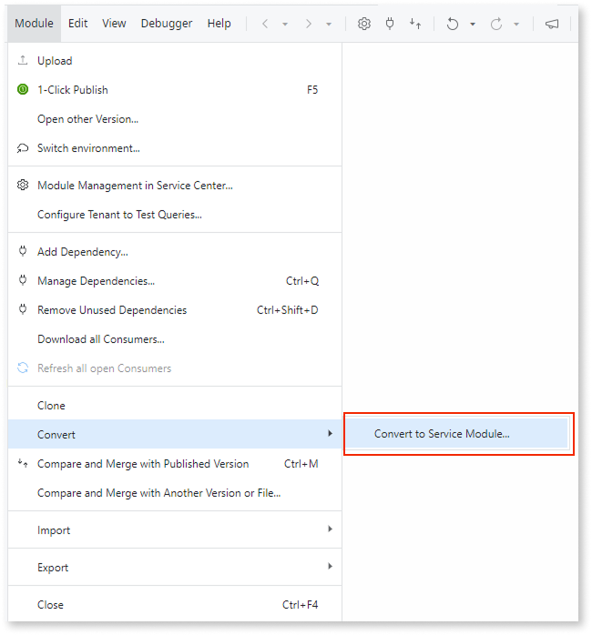

# Asset cannot contain Traditional Web modules

In ODC, all Web apps are reactive. Traditional Web apps aren't supported. This means that if your ODC asset is mapped to one or more O11 apps that include Traditional Web modules, you must convert these modules to Reactive Web modules.

## How to solve

You must solve this pattern in O11 before proceeding with the code conversion to ODC.

### Solve in O11

Depending on your scenario, solve this pattern in one of the following ways:

* Traditional Web modules that only contain logic can be [converted to Service modules](../../building-apps/reuse-and-refactor/convert-to-service.md) as follows:

    1. In Service Studio, open the module you want to convert.

    1. Convert the Traditional Web module to a Service module.

        

* For Traditional Web modules that contain UI elements, the entire module must be converted into a Reactive Web module. For more information on how to do this, refer to [Introduction to migrating Traditional Web to Reactive Web Apps](https://www.outsystems.com/tk/redirect?g=6fd52b69-653d-4384-b9fe-7e30b698609b).
