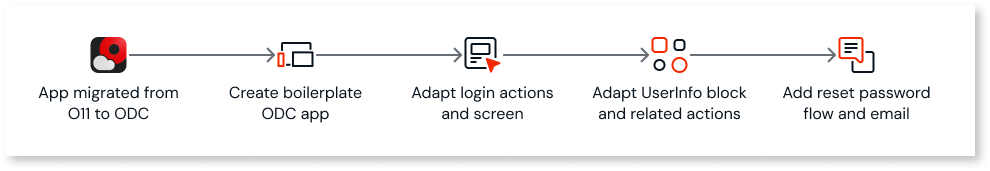
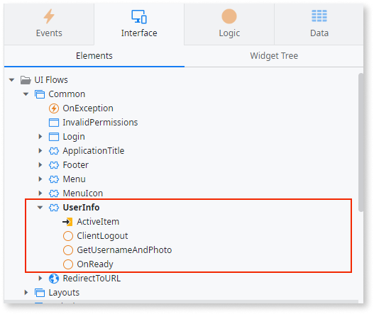
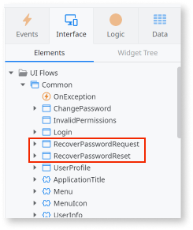
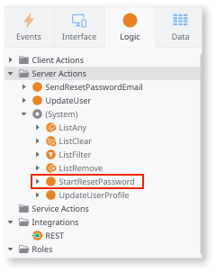

# Adapt login and logout flow of converted apps

The built-in authentication flow of apps is different in O11 and ODC, including the following:

* The **Login** screen, the **Login** action, and the **UserInfo** block and its actions are different. Learn more about [these authentication flow elements in ODC](https://www.outsystems.com/tk/redirect?g=49853077-9937-4865-8183-3f1f9ff224c2).
* By default, O11 apps don't include a built-in [reset password flow](https://success.outsystems.com/documentation/outsystems_developer_cloud/user_management/passwords/#reset) and email. If you intend to migrate user data, you shouldn't migrate user passwords. This means you must allow end users to set a new password before their first login in the converted app.

## How to solve

You must solve this pattern in ODC, after proceeding with the code conversion to ODC.

### Solve in ODC

The following steps apply only to converted apps that use the built-in authentication flow.

The steps use non-customized O11 Login actions and non-customized UserInfo block and actions as a basis. Make sure to check for differences in your app, and that you include your customizations after completing these steps.

After converting your app to ODC, adapt the login and logout flows by following these steps:

* [Step 1. Create a boilerplate ODC app](#step-1)

* [Step 2. Adapt Login screen and actions](#step-2)

* [Step 3. Adapt UserInfo block and related actions](#step-3)

* [Step 4. Add reset password flow and email](#step-4)

#### Step 1. Create boilerplate ODC app { #step-1 }

To create a boilerplate ODC app to get the ODC elements you need, follow these steps:

1. Create a new ODC app of the same type as your converted app.

1. Ensure both the converted app and this new boilerplate ODC app are open in ODC Studio.

#### Step 2. Adapt Login screen and actions { #step-2 }

To adapt the Login actions and Login screen of your converted app, follow these steps:

In your **converted app**, change the following:

1. In **converted app** > **Logic** > **Client Actions** folder, paste the **DoLogin** action from **boilerplate app** > **Logic** > **Client Actions**.

    

1. In **converted app** > **Logic** > **Server Actions** folder, delete the **Authentication** folder.

1. In **converted app** > **Interface** > **UI Flows** > **Common** > **Login** screen, do the following:

    1. Replace the **Login** action with the **LoginOnClick** action from **boilerplate app** > **Interface** > **UI Flows** > **Common** > **Login**.

    1. Replace the **OnInitialize** action with the **OnInitialize** action from **boilerplate app** > **Interface** > **UI Flows** > **Common** > **Login**.

    1. Rename the **LoginOnClick** action to `Login`.
        This helps ODC Studio auto-heal some TrueChange errors.

    1. Rename the **Username** local variable to `UserEmail`.
        This helps ODC Studio auto-heal some TrueChange errors.

    

1. In **converted app** > **Interface** > **UI Flows** > **Common** UI flow, replace the **OnException** exception action with the **OnException** from **boilerplate app** > **Interface** > **UI Flows** > **Common** .

#### Step 3. Adapt UserInfo block and related actions { #step-3 }

To change the UserInfo block, follow these steps in your **converted app**:

1. In **converted app** > **Interface** > **UI Flows** > **Common** > **UserInfo** block, change the following:

    1. Delete **GetUserNameFromServer** or **GetUserDataFromServer**, **ClientLogin**,  **ClientLogout**, **GetUsername**, and **OnInitialize** actions.

    1. Add **ClientLogout** , **GetUsernameAndPhoto** , **OnReady** actions from **boilerplate app** > **Interface** > **UI Flows** > **Common** > **UserInfo**.

        

    1. In the block properties, set the **On Initialize** event handler to `(None)`.

         event")

    1. In the block properties, add the **On Ready** event. Ensure the event handler is set as the **OnReady** action.

        

    1. On the canvas, select the **Link** of the Login text. Then, in the Link properties, change the **OnClick** event handler to the `Common\Login` screen.

        

1. In **converted app** > **Data** > **Client Variables** folder, paste the **UserPhotoURL** client variable from **boilerplate app** > **Data** > **Client Variables**.

#### Step 4. Add reset password flow and email { #step-4 }

To add the reset password flow and email, follow these steps in your **converted app**:

1. In **converted app** > **Interface** > **UI Flows** > **Common** UI flow, paste the **RecoverPasswordRequest** and **RecoverPasswordReset** screens from **boilerplate app** > **Interface** > **UI Flows** > **Common**. For more information about these screens, refer to [Custom authentication flows](https://success.outsystems.com/documentation/outsystems_developer_cloud/building_apps/user_interface/custom_authentication_flows/).

    

1. Add the **StartResetPassword** system server action, by selecting **Add public elements**.  

   This action sends the verification code to the email address entered by the user in the **RecoverPasswordRequest** screen. For more information about the system server and client actions, refer to [User system actions](https://success.outsystems.com/documentation/outsystems_developer_cloud/outsystems_language_and_elements/system_actions/user/).

    

1. In **converted app** > **Logic** > **Server Actions** folder, add the **SendResetPasswordEmail** action from **boilerplate app** > **Logic** > **Server Actions**.

1. In **converted app** > **Interface** > **UI Flows** folder, paste the **Email** UI flow, including the **ResetPassword** email, from **boilerplate app** > **Interface** > **UI Flows**.

Once you adapt the login flows for the converted app, the end-users can reset the password on their first login and then log into the app.
