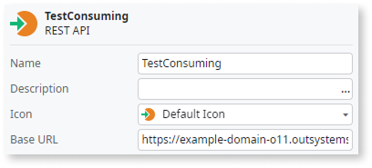
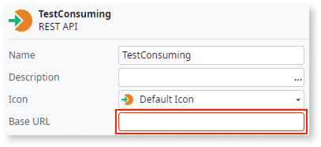
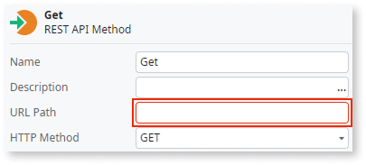

# Update the URLs of consumed REST API endpoints

When converting simultaneously O11 modules that expose and consume REST API endpoints between themselves, the URL of the exposed endpoint automatically updates to reflect the converted asset's name. However, the Base URL of the consumed endpoint and the URL Path of consumed methods aren't automatically updated to reflect the name change in the converted assets.

This behavior applies both to modules of the same app and modules of different apps that are converted to ODC at the same time.

## How to solve

You must solve this in ODC after proceeding with the code conversion.

### Solve in ODC

After converting your assets to ODC, check the properties of the consumed REST API and its methods in ODC Studio:

1. Update the **Base URL** of the consumed REST API to reflect the exposed REST API after conversion.

    

    Note that the Base URL you define in ODC Studio is the default URL. To learn how to define the actual Base URL for each stage, refer to [Configure API base URL and basic authentication](https://success.outsystems.com/documentation/outsystems_developer_cloud/integration_with_external_systems/use_rest_apis_in_your_app/consume_one_or_more_rest_api_methods/#configure-api-base-url-and-basic-authentication).

1. For each consumed method, update also the **URL Path** to reflect that change.

    

In ODC, the best practice is to use an ODC library to implement the communication with the REST API and then consume that library instead. Library encapsulation facilitates reusing the REST integration in multiple ODC apps and allows version management.

