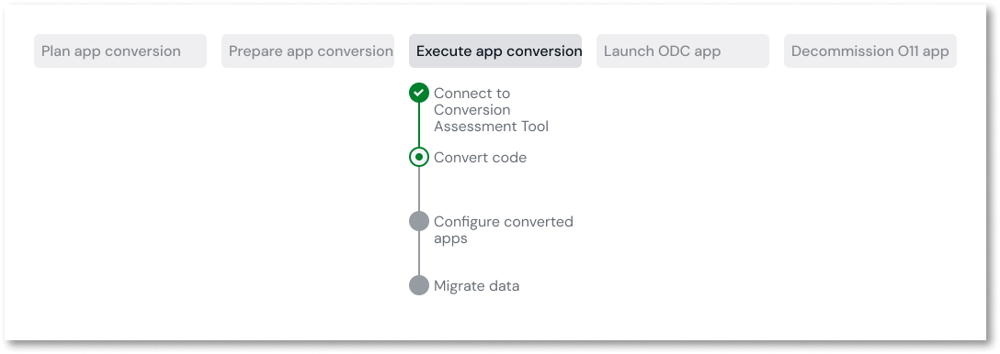

# Migrate code

This article only applies to customers with access to the Migration Kit.

Once the O11 apps in your [migration plan](../plan/plan-define-migration-plans.md) are [prepared for ODC](../prepare/prep-intro.md), you are ready to migrate their O11 code using the migration console in ODC Portal.

The migration console enables you to:

* Automatically convert and merge your O11 modules into ODC apps and libraries based on the [mapping defined in the Migration Assessment tool](../plan/plan-map-apps.md).

* Download the migrated ODC apps so you can edit them in ODC Studio to fix the identified issues and get them ready to publish.

For detailed information about how to migrate code using the tool, refer to [Code migration using the tool](execute-how-to-migrate-code.md).

## Tagging your apps

When migrating apps from O11 to ODC, the latest tagged version of the app is fetched from the source environment. This is the version that's migrated to ODC.

After you've made all the changes to your app and before you start the code migration process, ensure that you have tagged your app in the environment from where you want to migrate the app.

For more information about tagging your apps, refer to [Tag a Version](../../deploying-apps/tag-a-version.md).
