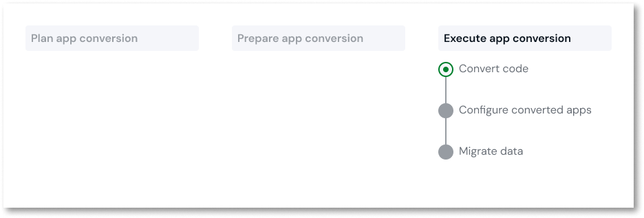

# Convert code

Once the O11 apps in your [conversion plan](https://www.outsystems.com/tk/redirect?g=ab447daa-dffc-4374-8ae6-986c8f3d63c4) are [prepared for ODC](https://www.outsystems.com/tk/redirect?g=14a67d54-aa12-45bc-8262-48c9f2a2780c), you are ready to convert their O11 code using the app conversion console in ODC Portal.

The app conversion console enables you to:

* Automatically convert and merge your O11 modules into ODC apps and libraries based on the [mapping defined in the Conversion Assessment tool](https://www.outsystems.com/tk/redirect?g=6901e523-4fa3-42bd-b37e-880e06d5cb62).

* Download the converted ODC apps so you can edit them in ODC Studio to fix the identified issues and get them ready to publish.

For detailed information about how to convert code using the tool, refer to [Code conversion using the tool](execute-how-to-migrate-code.md).

## Tagging your apps

When converting apps from O11 to ODC, the latest tagged version of the app is fetched from the **source environment**. This is the version that will be converted to ODC.

Thus, after you've made all the changes to your app, tag it in the source environment. Do this before starting the code conversion process.

For more information about tagging your apps, refer to [Tag a Version](https://www.outsystems.com/tk/redirect?g=d97b99fb-75a2-453c-a20d-d4270e09c8ed).
