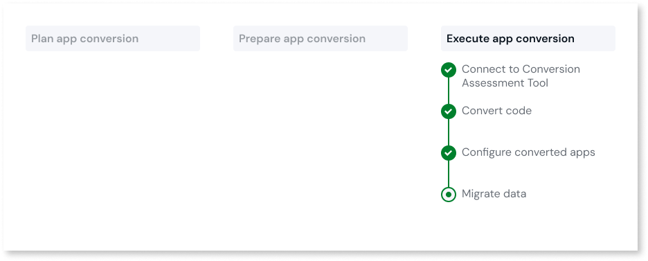
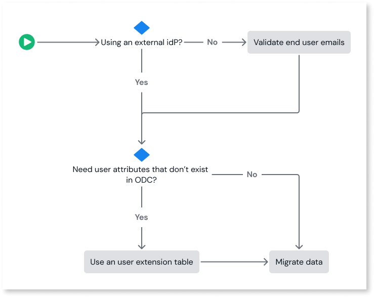
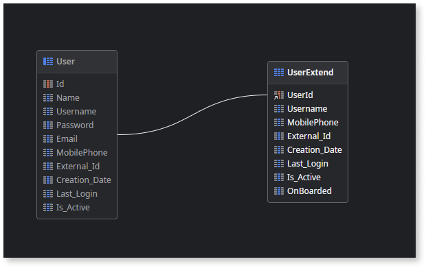

# Migrate data

This article only applies to customers with access to the App Conversion Kit. 

After converting the code of the O11 apps in your [conversion plan](../plan/plan-define-migration-plans.md) to ODC and publishing those ODC apps and libraries in the ODC target stage, you are ready to migrate the corresponding O11 app data and end users to ODC.

The scope of a data migration from the source O11 environment to the target ODC stage includes the following:

* The entire volume of data within all entities of the O11 apps in your [conversion plan](../plan/plan-define-migration-plans.md).
* The end users of the default user provider **Users**. See [About migrating end users](#end-users) for further details.

* Only data stored within the O11 platform is migrated to ODC. If you are using external databases, you must configure the external database connection in ODC.

* During data migration, foreign keys to Static Entity records that were deleted in O11 will be set to null.

You can perform data migration multiple times at each stage. Each time you execute a data migration for the O11 apps in a plan:

* The application data of those apps overwrites the existing app data in ODC.

    

    Except the [removal of foreign keys to O11 system entities](../code-patterns/arch-system-element.md#system-entities) that are no longer available in ODC, any other change to the entities definition in your O11 apps after executing a data migration requires the execution of a new **code conversion** before you can perform another data migration.

    

* The end users already migrated to ODC are updated. The migration doesn't overwrite existing users in ODC.

    

    While testing and performing data migration multiple times, don't delete migrated end users in ODC. If you delete migrated end users from the ODC tenant, those deleted users won't be migrated again, which might cause application issues.

    

On successful data migration:

* The ODC apps can use the migrated app data without further adjustments.
* The end users can log in to the ODC app using their existing O11 email address. However, they must first set a new password.

## Types of data migration

You can choose a different type of data migration depending on your migration phase. For example, when your are still testing the migration, you probably don't need to ensure data consistency. However, if you are executing the final data migration to production, you might want to enforce app downtime to prevent changes to the data while the migration runs, ensuring data consistency.

You can choose one of the following data migration types:

* **Non-Production** or **Test production** - No app downtime. Keeps the O11 apps available to end users during the data migration and they may use the app to change data. These changes aren't migrated if they are done during the data migration.

* **Production final** - Includes app downtime. Makes the O11 and ODC apps in the [conversion plan](../plan/plan-define-migration-plans.md) inaccessible to end users. This prevents changes to the app data during the data migration. This option increases the duration of the data migration.

    

    The **Production final** option is only recommended in case you are doing your last data migration, to the Production stage, right before sunsetting your O11 app. As such, after the data migration ends, the O11 app isn't automatically enabled.

    

## About migrating end users { #end-users }

Along with app data, the migration process includes the end users of the default user provider **Users**, and [their roles](#roles).

During data migration, foreign keys to users from other user providers different than **Users** will be set to null.

In O11, you can authenticate end users using:

* Built-in authentication - The end users login with any username and password. The username in O11 can be a name, an acronym, or an email address.

* An external identity provider (IdP).

However, in ODC the end users can login only with their email address.

During data migration, only the end users' email addresses are migrated to ODC. Due to security reasons, their passwords are not migrated. Therefore, the end user must set a new password and then use their email address instead of their O11 username to login to the ODC app.

### Getting ready to migrate end users { #ready }

The data migration process migrates all active and inactive end users stored in the **User** system entity with a valid and unique email set on the **Email** attribute.

Before data migration, follow these steps to ensure your end users are properly migrated:

1. If you are using built-in authentication, ensure all active and inactive end users stored in the O11 **User** system entity have a valid and unique email set on the **Email** attribute. See [how to validate the end users email](../code-patterns/data-user-email-validation.md).

    You can skip this step if you use an external IdP to authenticate users in O11.

1. If you use end-user attributes that aren't available in the ODC users table, [create a new user extension table](#create-and-populate-user-extension-table) to store the additional user details you want to migrate to ODC.

#### Create and populate user extension table

In ODC, by default the user table consists of **Id**, **Name**, **Email**, and **PhotoUrl**. In O11, the end user table includes extra fields.

You can skip this section if you don't want to migrate any additional user details from O11 to ODC.

To migrate additional user details such as MobilePhone, CreationDate, follow these steps:

1. Create a new user extension table in O11. OutSystems recommends creating a dedicated app to hold the user extension table.
1. Expose the user extension table for read and write operations using Service or Server actions.
1. Populate the user extension table with data from the O11 Users table.
1. [Map the app](../plan/plan-map-apps.md) that holds the user extension table in the assessment tool and convert it to ODC.

OutSystems recommends creating the following new field in the user extension table:

* **Is_Active**: This boolean or other data type field checks if the user can request the password reset mechanism on the ODC side. Inactive users cannot reset their passwords. This field is useful since, unlike the usual ODC behavior, migrated O11 inactive users still appear in the ODC Users table.

### How are users and roles migrated { #roles }

When you migrate end users to ODC, you also migrate their roles with permissions and access levels. The end users are assigned the same roles they had in O11. However, if you migrate data from a different environment later, the roles of the existing end users in ODC are updated to match those from the new environment.

The migration of the group roles from O11 to ODC is not supported.

When setting up user groups, create them manually in ODC and add the roles migrated from O11. You can manage roles in ODC Portal > **End-user groups**. For more information, see [Roles in ODC](https://success.outsystems.com/documentation/outsystems_developer_cloud/user_management/roles/).

## Next step

[Migrate data using the tool](execute-how-to-migrate-data.md)
