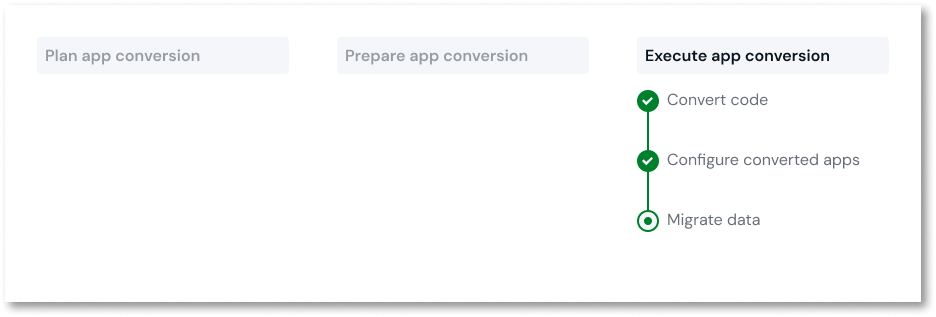
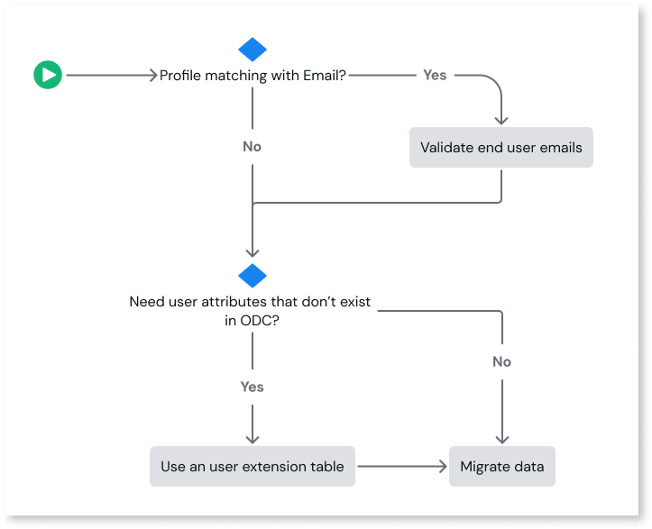
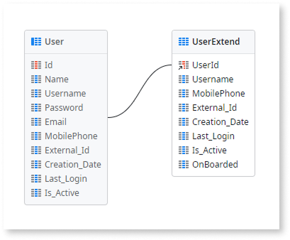

# Migrate data

After converting the code of the O11 apps in your [conversion plan](https://www.outsystems.com/tk/redirect?g=ab447daa-dffc-4374-8ae6-986c8f3d63c4) to ODC and publishing those ODC apps and libraries in the ODC target stage, you are ready to migrate the corresponding O11 app data and end-user information to ODC.

The scope of a data migration from a **source O11 environment** to a **target ODC stage** includes the following:

* The entire volume of data within all entities of the O11 apps in your [conversion plan](https://www.outsystems.com/tk/redirect?g=ab447daa-dffc-4374-8ae6-986c8f3d63c4).

    

    During data migration:

    * Only data stored within the O11 platform is migrated to ODC. If you are using external databases, you must configure the external database connection in ODC.

    * Foreign keys to end users from a user provider other than **Users** are set to null.

    * Foreign keys to Static Entity records that were deleted in O11 will be set to null.

    

* The end-user profile records linked to the ODC identity provider configured for the source O11 environment. Refer to [About migrating end users](#end-users) for further details.

    While testing the data migration, you can [skip the end-user migration](#skip-end-users).

You can perform data migration multiple times at each stage. Each time you execute another data migration for the O11 apps in a plan:

* The application data of those apps overwrites the existing app data in ODC.

* The end-user profiles already migrated to ODC are updated.

Before each data migration, the tool compares the data model of the latest app version tagged in **O11 source environment** with the data model of the converted app in the **ODC target stage**. If they don't match, you need to do the necessary adjustments in the O11 source environment, and execute a new **code conversion** before performing another data migration. For further details, see [Data model inconsistencies detected between O11 and ODC](execute-troubleshooting.md#data-model-inconsistencies).

After executing a code conversion, you need to remove the dependencies to [O11 system entities that are no longer available in ODC](https://success.outsystems.com/documentation/11/outsystems_11_to_odc_conversion/o11_to_odc_conversion_patterns/asset_consuming_o11_platform_system_elements/#system-entities) from your converted ODC apps. The absence of those foreign keys is the only data model mismatch accepted for the data migration process.

On successful data migration:

* The ODC apps can use the migrated app data without further adjustments.
* The end users can log in to the converted ODC apps.

If needed, you have the option to [cancel a data migration](#cancel-migration).

## Types of data migration

You can choose a different type of data migration depending on your migration phase. For example, when you are still testing the migration, you probably don't need to ensure data consistency. However, if you are executing the final data migration to production, you might want to enforce app downtime to prevent changes to the data while the migration runs, ensuring data consistency.

You can choose one of the following data migration types:

* **Non-Production** or **Test production** - No app downtime. Keeps the O11 apps available to end users during the data migration and they may use the app to change data. This might cause inconsistent migrated data to ODC entities. The **Non-Production** type also provides the option to [skip the end-user migration](#skip-end-users).

* **Production final** - Includes app downtime. Makes the O11 apps in the [conversion plan](https://www.outsystems.com/tk/redirect?g=ab447daa-dffc-4374-8ae6-986c8f3d63c4) inaccessible to end users. This prevents changes to the app data during the data migration. This option increases the duration of the data migration.

    

    The **Production final** option is only recommended in case you are doing your last data migration, to the Production stage, right before sunsetting your O11 app. As such, after the data migration ends, the O11 app isn't automatically enabled.

    

## About migrating end users {#end-users}

End-user migration relies on an identity provider (IdP) to match each O11 end user to its ODC profile record. For this reason, you must create an [ODC identity provider for each O11 source environment](#idp-per-env) before you migrate end users.

OutSystems is working on capabilities that enable the transition of your end users to ODC built-in authentication, after you finalize the conversion of all your O11 apps to ODC. These capabilities will be released at a future date.

The identity provider you configure depends on how your O11 apps [authenticate end users](https://www.outsystems.com/tk/redirect?g=eaa92f05-a00d-4e75-a937-8c100b81d6df):

* If your O11 apps use the **internal built-in authentication**, configure your O11 environments as identity providers for your ODC organization.

* If your O11 apps use an **external identity provider**, configure the same IdP in ODC.

Refer to [Configure end-user migration settings](execute-connect-to-tool.md#end-user) for the configuration details.

Along with app data, the migration process creates in ODC the **profile records** for the end users of the default user provider **Users**, and [their roles](#roles). These profile records serve two purposes:

* Let the data migration remap the O11 user IDs referenced in your application data to ODC user IDs.

* Enable your O11 end users to authenticate in the converted ODC apps using the same credentials they use in O11.

The end-user profile migrated to ODC includes only the necessary details to match your O11 end users to ODC user profiles. The remaining details, such as passwords or other sensitive attributes, are kept in your O11 authentication provider. For example, the email is only migrated if the [user profile matching](https://www.outsystems.com/tk/redirect?g=bf560c9c-82b5-4c8a-ba11-09939bcc8d87) is set to **Email** on the identity provider.

If you already executed a data migration that included end-user migration before identity providers were required, set the user profile matching to **Email** for the corresponding identity provider. This keeps consistency with your previously migrated end-user profiles and prevents ODC from creating duplicate profiles for the same end users.

### One ODC identity provider per O11 environment {#idp-per-env}

ODC stores all users in a single shared pool, while O11 stores users in a separate database per environment. For this reason, you must:

* Configure one identity provider in ODC for each O11 environment.

* Set a **username prefix** for each non-production source environments (for example, `dev_` or `qa_`). The prefix scopes each O11 environment's users in the shared ODC pool, preventing username collision when creating the end users from different environments in ODC. It will also be enable the transition of end users to ODC built-in authentication, at a later phase.

Make sure you create unique identity providers and prefixes for each O11 environment. This applies to environments within an O11 infrastructure or across infrastructures, in case you are converting apps from multiple O11 infrastructures.

### Getting ready to migrate end users {#ready}

The data migration process migrates the end-user profile in the default user provider **Users** for all active and inactive end users.

Before data migration, follow these steps to ensure your end users are properly migrated:

1. If you use the **email** for [user profile matching](https://www.outsystems.com/tk/redirect?g=bf560c9c-82b5-4c8a-ba11-09939bcc8d87), ensure all active and inactive end users stored in the O11 **User** system entity have a valid and unique email set on the **Email** attribute. See [how to validate the end users email](https://www.outsystems.com/tk/redirect?g=a77ed222-6660-413d-b16d-b399acb6bc82).

1. If you use end-user attributes that aren't available in the ODC users table, [create a new user extension table](#create-and-populate-user-extension-table) to store the additional user details you want to migrate to ODC.

#### Create and populate user extension table

In ODC, by default the user table consists of **Id**, **Name**, **Email**, and **PhotoUrl**. In O11, the end user table includes extra fields.

You can skip this section if you don't want to migrate any additional user details from O11 to ODC.

To migrate additional user details such as MobilePhone, CreationDate, follow these steps:

1. Create a new user extension table in O11. OutSystems recommends creating a dedicated app to hold the user extension table.
1. Expose the user extension table for read and write operations using Service or Server actions.
1. Populate the user extension table with data from the O11 Users table.
1. [Map the app](https://www.outsystems.com/tk/redirect?g=6901e523-4fa3-42bd-b37e-880e06d5cb62) that holds the user extension table in the assessment tool and convert it to ODC.

OutSystems recommends creating the following new field in the user extension table:

* **Is_Active**: This boolean or other data type field checks if the user can request the password reset mechanism on the ODC side. Inactive users cannot reset their passwords. This field is useful since, unlike the usual ODC behavior, migrated O11 inactive users still appear in the ODC Users table.

### How are users and roles migrated {#roles}

When you migrate end-user profiles to ODC, you also migrate the end-user roles with permissions and access levels. The end users are assigned the same roles they had in O11. However, if you migrate data from a different environment later, the roles of the existing end users in ODC are updated to match those from the new environment.

The migration of group roles from O11 to ODC is not supported.

When setting up user groups, create them manually in ODC and add the roles migrated from O11. You can manage roles in ODC Portal > **End-user groups**. For more information, refer to [Roles in ODC](https://www.outsystems.com/tk/redirect?g=766ab743-31f2-4f58-ad91-a4cd0db8ab93).

### Skip end-user migration {#skip-end-users}

When performing a **Non-Production** migration, you have the option to skip the end-user migration step. This is useful for:

* Reducing overhead when you only need to migrate sample application data from O11 to ODC.

* Preventing irrelevant end-user data from accumulating in the target stage.

When skipping the end-user migration, the O11 to ODC data migration tool doesn't perform any end-user validation or migration. This means that:

* Users that were previously migrated remain in ODC without any further changes, and attributes with references to these users are correctly mapped on the ODC side.

* Newly created users in O11 are not migrated to ODC, and attributes with references to these new users are set to an `Empty GUID`.

When there are relations between users and other entities in an app, data migration without end users always results in data inconsistencies with end-user data. Thus, ensure to attempt a full migration, including end-user migration, at least once before performing the **Production final** migration.

## Canceling a data migration {#cancel-migration}

You can cancel a data migration that is still running, if needed. Common reasons include the following:

* You selected the wrong data migration options by mistake, such as the conversion plan, apps, or ODC stage.

* Your entities or apps were changed in O11 after the migration started, requiring a new **code conversion** before you migrate the data again.

* You found an issue in your O11 data or setup after the migration started, requiring a fix before you migrate the data again.

* Your plans changed and you no longer need to complete the running data migration.

Data migration includes a preparation phase that sets up the necessary resources and connections, followed by the transfer of users and application data to ODC, and some final validations at the end. The impact of canceling a migration depends on which phase is running at the moment you cancel:

* If you cancel the migration **during the preparation phase**, all end users and application data from a previous migration remain in ODC without further changes from the current canceled migration.

* If you cancel the migration **while users are transferred to ODC**:

    * End users already migrated to ODC in a previous data migration remain in ODC without further changes from the current canceled migration.

    * End users already transferred to ODC by the current canceled migration remain in ODC.

    * End users not yet transferred to ODC only exist in O11. They will be created in ODC only when you run another migration that includes end-user migration.

    * Application data from a previous migration remains in ODC without further changes from the current canceled migration.

* If you cancel the migration **while the application data is transferred to ODC**:

    * The application data for the apps in the plan is deleted from ODC. This prevents any data inconsistency.

    * End users transferred to ODC by the current canceled migration remain in ODC.

* If you cancel the migration **during the final validation phase**, all end users and application data already transferred remain in ODC.

Depending on the phase that you cancel the migration, your ODC application data and users might not match O11. Thus, after canceling a data migration, verify the application data and end-user state in ODC before using the target stage for testing or go-live. If needed, [execute a new data migration](execute-how-to-migrate-data.md) and make sure it finishes successfully.

For step-by-step instructions, refer to [Cancel a data migration](execute-how-to-migrate-data.md#cancel-migration).

## Next step

[Migrate data using the tool](execute-how-to-migrate-data.md)
