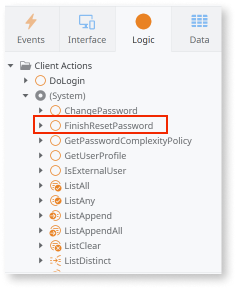

# Adapt login flow

After migrating the O11 code to ODC, you must modify the login flow for ODC. During data migration, only the end users' email addresses are migrated to ODC, but their passwords are not. Therefore, you must adapt the login process to allow end users to set a new password. Once the end users have set a new password, they can log in to the ODC app using their email address and the new password.

For detailed information about password reset, refer to [Password reset in ODC](password-reset-in-odc.md).

## Prerequisites

Before modifying the login flow, ensure that you:

* [Migrate code](execute-how-to-migrate-code.md)

## Adapt login flow

To adapt the login flow for the migrated ODC app, follow these steps:

1. Login to ODC Studio.

1. Create a new ODC app. Copy the following from the new ODC app to the migrated ODC app:

    1. Under **Interface > UI Flows > Common,** copy the **RecoverPasswordRequest,** and **RecoverPasswordReset** screens. For detailed information about these screens, refer to [Custom authentication flows](https://success.outsystems.com/documentation/outsystems_developer_cloud/building_apps/user_interface/custom_authentication_flows/).

    

    1. Copy the **StartResetPassword** server action which sends the verification code to the email address entered by the user in the **RecoverPasswordRequest** screen.

    

    1. Copy the **FinishResetPassword** system client action, which sets the email, verification code, and new password for the end-user in the Identity server. 

    

    For detailed information about the system server and client actions, refer to[ User system actions](https://success.outsystems.com/documentation/outsystems_developer_cloud/outsystems_language_and_elements/system_actions/user/).

1. Set the **OnBoarded** field in User extension table for the corresponding user to **True**.

Once you adapt the login flows for the migrated app, the end-users can reset the password on their first login.

## See also

[Password reset in ODC](password-reset-in-odc.md)
