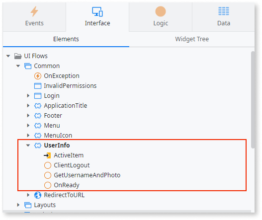
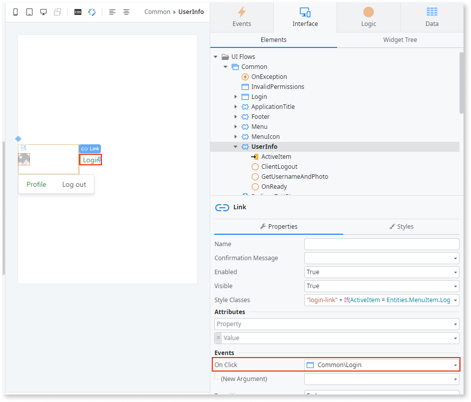

# Adapt login and logout flow of migrated apps

After migrating the O11 code to ODC, you must modify the login and logout flow for ODC:

* During code migration, the login and logout actions of your migrated apps aren't automatically converted to ODC login and logout actions. This means you must manually replace the O11 login and logout flows with ODC flows in your migrated app. To do this, follow these steps:

    * Adapt the Login actions and Login screen.

    * Adapt the UserInfo block and associated actions, like the Logout action.

* During data migration, only the end users' email addresses are migrated to ODC, but their passwords are not. Therefore, you must adapt the login process to allow end users to set a new password. To do this, follow these steps:

    * Add or replace the reset password actions, ensuring they're linked to the Login screen, and add the password reset email.

Once the end users have set a new password, they can log in to the ODC app using their email address and the new password. For detailed information about password reset, refer to [Password reset in ODC](password-reset-in-odc.md).

The following steps guide you in adapting your migrated app's login and logout flows. The steps use non-customized O11 Login actions and non-customized UserInfo block and actions as a basis.
Make sure to check for differences in your app, and that you include your customizations after completing these steps.

## Prerequisites

Before modifying the login and logout flows, ensure the following:

* You have [migrated code from O11 to ODC](execute-how-to-migrate-code.md).

* Your migrated app uses the built-in authentication.

## Adapt login and logout flows

After migrating your app to ODC, you can adapt the login and logout flows by following these steps:

1. [Create a boilerplate ODC app](#step-0). 

1. [Adapt Login screen and actions](#step-1).

1. [Adapt UserInfo block and related actions](#step-2).

1. [Add reset password flow and email](#step-3).

### Create boilerplate ODC app { #step-0 }

To create a boilerplate ODC app to get the ODC elements you need, follow these steps:

1. Create a new ODC app of the same type as your migrated app.

2. Ensure both the migrated app and this new boilerplate ODC app are open in ODC Studio.

### Adapt Login screen and actions { #step-1 }

To adapt the Login actions and Login screen of your migrated app, follow these steps:

In your **migrated app**, change the following:

1. In **migrated app** > **Logic** > **Client Actions** folder, paste the **DoLogin** action from **boilerplate app** > **Logic** > **Client Actions**.

    

1. In **migrated app** > **Logic** > **Server Actions** folder, delete the **Authentication** folder.

1. In **migrated app** > **Interface** > **UI Flows** > **Common** > **Login** screen, do the following:

    1. Replace the **Login** action with the **LoginOnClick** action from **boilerplate app** > **Interface** > **UI Flows** > **Common** > **Login**.

    1. Replace the **OnInitialize** action with the **OnInitialize** action from **boilerplate app** > **Interface** > **UI Flows** > **Common** > **Login**.

    1. Rename the **LoginOnClick** action to `Login`. 
        This helps ODC Studio auto-heal some TrueChange errors.

    1. Rename the **Username** local variable to `UserEmail`. 
        This helps ODC Studio auto-heal some TrueChange errors.

    

1. In **migrated app** > **Interface** > **UI Flows** > **Common** UI flow, replace the **OnException** exception action with the **OnException** from **boilerplate app** > **Interface** > **UI Flows** > **Common** .

### Adapt UserInfo block and related actions { #step-2 }

To change the UserInfo block, follow these steps in your **migrated app**:

1. In **migrated app** > **Interface** > **UI Flows** > **Common** > **UserInfo** block, change the following:

    1. Delete **GetUserNameFromServer** or **GetUserDataFromServer**, **ClientLogin**,  **ClientLogout**, **GetUsername**, and **OnInitialize** actions.

    1. Add **ClientLogout** , **GetUsernameAndPhoto** , **OnReady** actions from **boilerplate app** > **Interface** > **UI Flows** > **Common** > **UserInfo**.

        

    1. In the block properties, set the **On Initialize** event handler to `(None)`.

         event")

    1. In the block properties, add the **On Ready** event. Ensure the event handler is set as the **OnReady** action.

        

    1. On the canvas, select the **Link** of the Login text. Then, in the Link properties, change the **OnClick** event handler to the `Common\Login` screen.

        

1. In **migrated app** > **Data** > **Client Variables** folder, paste the **UserPhotoURL** client variable from **boilerplate app** > **Data** > **Client Variables**.

### Add reset password flow and email { #step-3 }

To add the reset password flow and email, follow these steps in your **migrated app**:

1. In **migrated app** > **Interface** > **UI Flows** > **Common** UI flow, paste the **RecoverPasswordRequest** and **RecoverPasswordReset** screens from **boilerplate app** > **Interface** > **UI Flows** > **Common**. For more information about these screens, refer to [Custom authentication flows](https://success.outsystems.com/documentation/outsystems_developer_cloud/building_apps/user_interface/custom_authentication_flows/).

    

1. Add the **StartResetPassword** system server action, by selecting **Add public elements**.  

   This action sends the verification code to the email address entered by the user in the **RecoverPasswordRequest** screen. For more information about the system server and client actions, refer to[ User system actions](https://success.outsystems.com/documentation/outsystems_developer_cloud/outsystems_language_and_elements/system_actions/user/).

    

1. In **migrated app** > **Logic** > **Server Actions** folder, add the **SendResetPasswordEmail** action from **boilerplate app** > **Logic** > **Server Actions**.

1. In **migrated app** > **Interface** > **UI Flows** folder, paste the **Email** UI flow, including the **ResetPassword** email, from **boilerplate app** > **Interface** > **UI Flows**.

Once you adapt the login flows for the migrated app, the end-users can reset the password on their first login and then log into the app.

