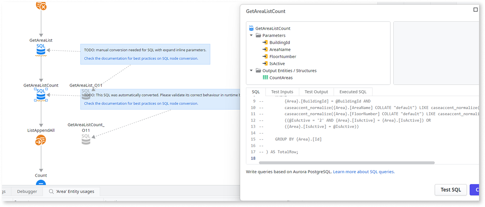

# Adjust converted code

After [converting your O11 apps to ODC](execute-how-to-migrate-code.md#code-conversion), you need to adjust the converted code for certain patterns that aren't handled automatically by the code conversion tool or require additional validation.

## Validate and adapt SQL queries {adapt-sql-queries}

If your apps use SQL nodes, you need to validate and potentially adapt the SQL queries to ensure they are compatible with Aurora PostgreSQL and work as expected.

The conversion tool automatically converts most of the standard queries that involve only [internal entities](https://www.outsystems.com/tk/redirect?g=5a13a09e-6e8f-40b2-8ca3-eb7af13e3b40) into their PostgreSQL-compatible syntax, as described in [SQL queries compared to OutSystems 11](https://www.outsystems.com/tk/redirect?g=db4685f5-477f-436a-b4cc-92af8e347c02). For technical details on the SQL queries conversion, see [O11 to ODC SQL node conversion details](./execute-sql-node-conversion-details.md).

For the remaining [scenarios that are not automatically converted](#sql-limitations), you need to adapt the SQL queries manually.

Because SQL patterns can be highly complex, the conversion tool cannot guarantee 100% accuracy. Make sure you review and test all converted SQL nodes to ensure it behaves as expected in the new environment. See [these guidelines](https://www.outsystems.com/tk/redirect?g=42375e2b-c9a9-4a53-a7a6-910481be7547) for further details.

To ensure a safe conversion, the tool performs the following actions:

* Comments out the SQL code within the converted SQL node, so you can carefully review and test it.

* Preserves the original O11 SQL node disabled alongside the converted version for comparison.

* Adds a comment to each SQL node in the app as a reminder to review a converted node, or to manually adapt a node that wasn't automatically converted.

Follow [these guidelines](https://www.outsystems.com/tk/redirect?g=42375e2b-c9a9-4a53-a7a6-910481be7547) to ensure that all the SQL nodes of your converted app work as expected.

### SQL nodes conversion limitations {#sql-limitations}

O11 SQL nodes with the following scenarios **aren't automatically converted** and require manual intervention:

* SQL nodes that use parameters with the **Expand Inline** property set to **Yes**

* SQL queries that reference **external entities** from extensions (XIF)

* SQL queries containing `BEGIN-END` blocks or complex procedural logic

## Adapt login and logout flows {#login-logout}

The code conversion tool doesn't change the login and logout flows of the converted apps, it keeps the O11 app's flows.

To enable your end users to authenticate in the converted ODC apps with their existing O11 credentials, you must manually [adapt the login and logout flows](https://www.outsystems.com/tk/redirect?g=08ed0f80-3e5c-4a5d-9955-7658ea3aa344) of the converted apps.

Refer to [About migrating end users](execute-about-migrate-data.md#end-users) for further details on how end users login to the converted apps.

## Review On Application Ready and On Application Resume

The code conversion tool merges multiple O11 modules into a single ODC app. During that merging process, only one instance of the [On Application Ready](https://www.outsystems.com/tk/redirect?g=393ee8f0-dede-42fe-b5fb-ecd4ed0ec534) and the [On Application Resume](https://www.outsystems.com/tk/redirect?g=96c703ae-d97e-4ceb-b511-6524da0b7cf3) actions is preserved in the converted ODC app. The instance is chosen from one of the O11 modules. All other instances from the remaining O11 modules are deleted during the conversion.

Thus, you need to review the **On Application Ready** and the **On Application Resume** system event actions of the converted ODC app to ensure it works as expected.

## Review app and library properties

The code conversion tool merges multiple O11 modules into a single ODC app or library. During that merging process, most properties are inherited from the main O11 module into which the others are merged. However, there isn't a deterministic way to decide which O11 module's properties should take precedence in the resulting ODC app or library.

Thus, you need to review the [ODC app and library properties](https://www.outsystems.com/tk/redirect?g=5923266e-a350-4775-a6ea-8c6882b8755c) to ensure your converted ODC apps and libraries work as expected.

## Next steps

* Fix any remaining TrueChange error so you can [publish the converted ODC app or library](execute-how-to-migrate-code.md#publish).
