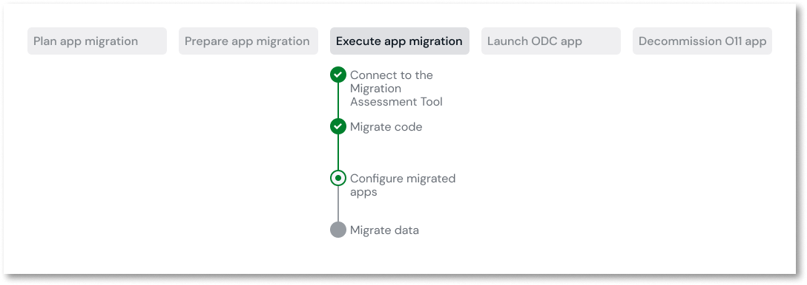

# Configure migrated apps

This article only applies to customers with access to the Migration Kit.

After migrating your apps, you may need to configure some settings to ensure the apps work correctly.

You must have [migrated your apps](execute-about-migrate-code.md).

You may need to configure the following:

* If the O11 apps used Site Properties (Settings in ODC) and Timers, configure them in Portal, refer to [Configuration management](https://success.outsystems.com/documentation/outsystems_developer_cloud/managing_outsystems_platform_and_apps/configuration_management/).

* In O11, Site Properties that are set as **secret** are migrated as non-secret values. You must set these values as Settings in ODC and manually set them as Secret. To set app Configurations as secrets, refer to [Set as a secret](https://success.outsystems.com/documentation/outsystems_developer_cloud/security_of_outsystems_developer_cloud/set_as_secret/).

* To configure custom domains, refer to [Configure custom domains](https://success.outsystems.com/documentation/outsystems_developer_cloud/managing_outsystems_platform_and_apps/configure_custom_domains_for_apps/). 

* Configure the access to external databases by referring to [Integrate with external data sources](https://success.outsystems.com/documentation/outsystems_developer_cloud/integration_with_external_systems/integrate_with_external_data_sources/).

* In ODC Portal, configure the endpoint of consumed REST services across the stages.

* If your apps need to access resources that aren't publicly accessible, like private REST endpoints or private external databases, [configure the private gateways](https://success.outsystems.com/documentation/outsystems_developer_cloud/managing_outsystems_platform_and_apps/configure_a_private_gateway_to_your_network/).

* If your migrated apps use emails, configure the SMTP server in Portal, refer to [Configure emails](https://success.outsystems.com/documentation/outsystems_developer_cloud/managing_outsystems_platform_and_apps/configure_emails/).

## Next steps

* Test your apps before deploying them to the QA and Production stages.
* Deploy your apps to the stages where you want to migrate data to.
* Delete any testing app data you added to the migrated ODC apps.
* [Migrate data](execute-how-to-migrate-data.md).

