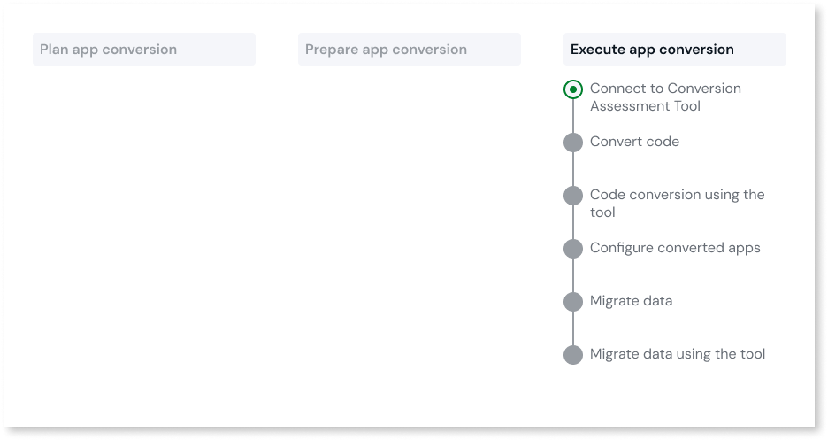

# Connect to Conversion Assessment Tool

This article only applies to customers with access to the App Conversion Kit.

Before you can start converting your O11 apps and data to ODC, you must connect to the Conversion Assessment Tool. By doing this, the [conversion plans](../plan/plan-define-migration-plans.md) you've defined in the Conversion Assessment Tool are available in the ODC app conversion console.

## Prerequisites

* You must have the **OutSystems 11** > **Manage O11 configurations** permission in your ODC tenant.

* The [Conversion Assessment Tool has been set up in O11](../setup-assessement-tool.md).

## Connect to Conversion Assessment Tool

To connect to the Conversion Assessment Tool, follow these steps:

1. Log in to the ODC Portal.

1. Under **OUTSYSTEMS 11**, click **Configurations**.

1. Click **Configure conversions**.

1. Enter the following values for **O11 LifeTime**:

    * **URL**: The URL of the LifeTime environment where you installed the Conversion Assessment Tool engine.

    * **Authentication Token**: The authentication token of the service account used to access the LifeTime environment.

    For more information about the Conversion Assessment Tool and these values, refer to [Set up the Conversion Assessment Tool](../setup-assessement-tool.md).

1. Click **Save**.

## Next steps

* Ensure the IT users converting the code have the **OutSystems 11** > **Convert O11 code** permission in the ODC tenant.

* [Convert code](execute-about-migrate-code.md).
