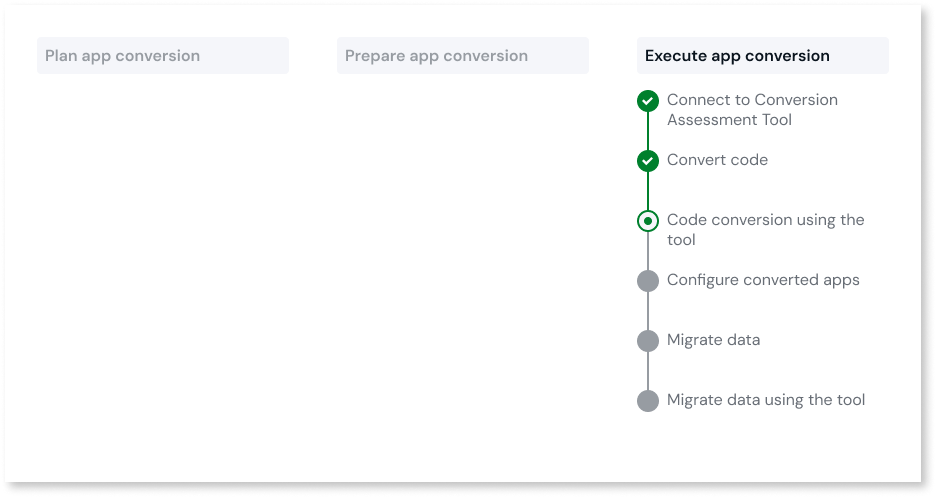
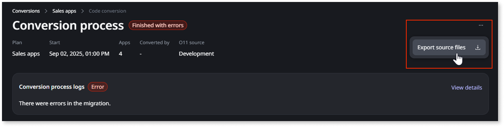

# Code conversion using the tool

This article only applies to customers with access to the App Conversion Kit.

This article explains how to convert O11 code to ODC using the app conversion console available in the ODC portal.

## Prerequisites

Before you convert the code of the O11 apps in a [conversion plan](../plan/plan-define-migration-plans.md), ensure the following:

* The O11 apps in the plan are [prepared for ODC](../prepare/prep-intro.md).

* The app conversion console is [connected to the Conversion Assessment Tool](execute-connect-to-tool.md).

* The source environment for code conversion is correctly configured on the **Conversion Assessment Tool > Maintenance** tab.

* The O11 apps to convert have a [tag in LifeTime](execute-about-migrate-code.md#tagging-your-apps).

* You have the **OutSystems 11** > **Convert O11 code** permission in ODC.

## Code conversion

To convert O11 code to ODC, follow these steps:

1. Log in to the ODC portal.

1. Under **OUTSYSTEMS 11**, click **App Conversion**.

1. Select the plan you want to convert. Validate the status of the **Last assessment** to ensure that all O11 apps in the plan are [prepared for ODC](../prepare/prep-intro.md).

    You cannot convert until the status of all Assets in the plan is **Change in ODC**.

1. Click **Convert code**.

    A list of O11 apps is displayed. You can click each app to review its corresponding modules and their revision number.

1. To confirm the conversion, click **Convert**.

    The code conversion process begins, and the status of apps moves to **Converting**.

If the conversion is successful, the process ends with **Finished** status. The O11 apps mapped in the Assessment tool are converted to ODC apps and libraries. These ODC apps and libraries are still **Unpublished**.

Now, in ODC, you must [publish the ODC apps and libraries](#publish-odc-apps-and-libraries).

If the conversion is unsuccessful, the process ends with a **Finished with errors** status, and you cannot open the app or the library in ODC Studio. See how to [troubleshoot conversion issues](#troubleshooting).

### Publish ODC apps and libraries

The tool displays a list of apps and libraries, with producers at the top and consumers at the bottom. To prevent dependency errors in ODC, you must publish the apps and libraries in the order they appear.

To publish an ODC app or a library, follow these steps:

1. Following the order in the list, Select an app or library with the **Unpublished** status and click **Download**. The file is downloaded to your local machine.

1. Open the file in **ODC Studio**.

1. Select **App** > **Check for dependency updates**.

1. Fix all the TrueChange errors.

1. Publish the app or library to the target ODC stage.

1. If it's a library, [release that library](https://success.outsystems.com/documentation/outsystems_developer_cloud/building_apps/libraries/#release-library).

1. Repeat steps 1 to 6 until all apps and libraries are published in ODC.

## Troubleshooting

To check the logs and identify code conversion issues, follow these steps:

1. Under **OUTSYSTEMS 11**, click **App Conversion**.

1. Select a plan and click the conversion row that you want to troubleshoot in the **Code conversion** history.

1. Select an app and open the corresponding **Logs** tab.

If you are unable to fix the issue, contact OutSystems Support for guidelines. Make sure you include the following information in your support request:

* The troubleshooting data file, **troubleshooting.zip**, that you can obtain by clicking the ellipsis menu (**...**) > **Export source files** on the conversion details page:

    

    

    The **troubleshooting.zip** file is generated after the code conversion finishes, and you can export it some moments later. The file will be available for 60 days, and should be used exclusively for troubleshooting purposes.

    

## Next steps

* If your apps use SQL queries, make sure you [adapt those SQL queries](../code-patterns/elem-sql-adapt.md).
* You must [adapt login flow of your apps](../code-patterns/execute-adapt-login-flow.md):
    * During code conversion, the login and logout actions of your converted apps aren't automatically converted to ODC login and logout actions. This means you must manually replace the O11 login and logout flows with ODC flows in your converted app.
    * During data migration, only the end users' email addresses are migrated to ODC, but their passwords are not. Therefore, you must adapt the login process to allow end users to set a new password.
* You may need to [configure some settings to ensure the apps work correctly](execute-configure-migrated-apps.md).
