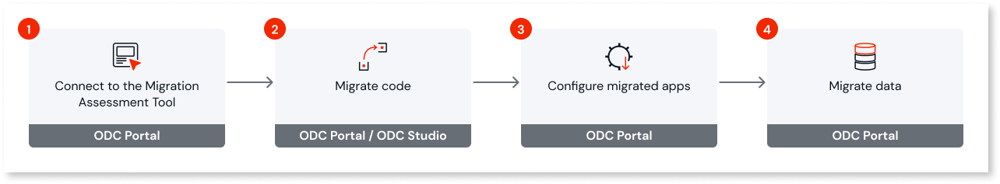

# Execute one shot migration

This article only applies to customers with access to the Migration Kit. 

One-shot migration is ideal for smaller, low-code projects with two or fewer business apps and up to 300 application objects. After completing the one-shot migration, you should have your:

* O11 app code, data, and end users migrated to ODC.

* O11 entities mapped to their ODC counterparts.

* Migrated, tested, and published ODC apps.

## Prerequisites

Before you start migrating apps, ensure the following:

* [The Migration Assessment Tool is set up](../setup-assessement-tool.md).

* [The O11 to ODC architecture mapping has been defined in the tool](../plan/plan-map-apps.md).

* [The O11 to ODC architecture has been validated](../plan/plan-assess-refactor.md).

* [The compatibility of your O11 apps with ODC ](../prepare/prep-refactor-o11-apps.md)

## Step-by-step migration process

The following diagram shows the steps involved in the one-shot migration process.

To migrate your apps, follow these steps:

1. [Connect to the Migration Assessment Tool](execute-connect-to-tool.md).

1. [Migrate code](execute-how-to-migrate-code.md).

1. [Configure migrated apps](execute-configure-migrated-apps.md).

1. [Migrate data](execute-about-migrate-data.md).
