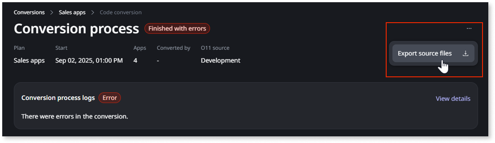

# Troubleshooting O11 to ODC conversion issues

This page describes how to obtain troubleshooting details for O11 to ODC [code conversion](execute-how-to-migrate-code.md) issues, and how to solve some issues you may encounter during the [data migration](execute-how-to-migrate-data.md) step.

## Identifying code conversion issues {#code-issues}

When the **code conversion** process ends with a **Finished with errors** status, you can check the logs and obtain a troubleshooting data file to help you identify the issue. Follow these steps:

1. Under the **Management** menu, go to **OUTSYSTEMS 11 > App Conversion**.

1. Select a plan and click the conversion row that you want to troubleshoot in the **Code conversion** history.

1. Select an app and open the corresponding **Logs** tab.

If you are unable to fix the issue, contact OutSystems Support for guidelines. Include the following information in your support request:

* The troubleshooting data file, **troubleshooting.zip**, obtained by clicking the ellipsis menu (**...**) > **Export source files** on the conversion details page:

    

    <div class="info" markdown="1">

    The **troubleshooting.zip** file is generated after the code conversion finishes, and you can export it some moments later. The file is available for 60 days, and should be used exclusively for troubleshooting purposes.

    </div>

## Troubleshooting data migration issues {#data-issues}

This section describes some issues you may encounter during the data migration step when converting your O11 app to ODC, and how to solve them.

### Data model inconsistencies detected between O11 and ODC {#data-model-inconsistencies}

When you start a data migration, the tool compares the app data model between the **O11 source environment** and the **ODC target stage**. If there's an inconsistency, the migration stops with the following message:

```
Data migration failed. Data model inconsistencies detected between O11 and ODC.
Review and apply the changes needed, and run the data migration again.
```

The app conversion tool detects the following data model inconsistencies:

* An entity or attribute exists in O11 but is **missing** in ODC
* An entity attribute has **different properties** in O11 and ODC
* A **reference attribute** defines a **different entity relationship** in O11 and ODC

See below how to solve each of these inconsistencies.

#### Missing entities or attributes {#missing}

This error means that an entity or attribute exists in the O11 app but isn't present in the converted ODC app.

##### Recommended action

<div class="warning" markdown="1">

Don't create the missing entity or attribute manually in ODC. A manually created entity or attribute generates a different internal identifier than the original O11 entity, thus the data migration fails even if the structure looks correct.

</div>

To solve this error, follow these steps:

1. Ensure that the **O11 environment used for code conversion** has the same entities and attributes as the **O11 environment set as the data migration source**.

    Use LifeTime to stage the application from the code conversion environment to the data migration source environment. This ensures both O11 environments have the same app version, thus the same entities and attributes.

1. Once the O11 environments are in sync, [run a new code conversion](execute-how-to-migrate-code.md).

1. Merge the new converted ODC app into the existing ODC app. During the merge, bring in the new attributes, and the root element from the freshly converted version.

1. Deploy the updated ODC app to the ODC stage set as the data migration target.

1. Retry the data migration.

#### Attribute property mismatch {#property-mismatch}

This error means that an entity exists in both O11 and ODC, but one or more attributes have different properties, such as:

* Different data types
* Different maximum length of a text attribute
* Different precision or scale of a decimal attribute
* Optional attribute in O11 but mandatory in ODC

##### Recommended action

To solve this error, follow these steps:

1. Update the property that differs so both attributes match in the **O11 source environment** and the **ODC target stage**:

    * Make the change in O11 or in ODC, depending on which side holds the correct value.

    * If an attribute is optional in O11 but required in ODC, make it optional in ODC. Existing O11 records may contain empty values that would violate the requirement on the ODC side.

1. Retry the data migration.

#### Reference attribute mismatch {#reference-mismatch}

This error means that the way an attribute references another entity differs between O11 and ODC, such as:

* An attribute references an entity in O11, but not in ODC, or vice versa
* An attribute references different entities in O11 and ODC
* An attribute references the same entity in O11 and ODC, but a different attribute

##### Recommended action

To solve this error, follow these steps:

1. Ensure that the **O11 environment used for code conversion** have the same reference attributes than the **O11 environment set as the data migration source**.

    Use LifeTime to stage the application from the code conversion environment to the data migration source environment. This ensures both O11 environments have the same app version, thus the same entities and attributes.

1. Once the O11 environments are in sync, [run a new code conversion](execute-how-to-migrate-code.md).

1. Merge the new converted ODC app into the existing ODC app. During the merge, bring in the new attributes, and the root element from the freshly converted version.

1. Deploy the updated ODC app to the ODC stage set as the data migration target.

1. Retry the data migration.
