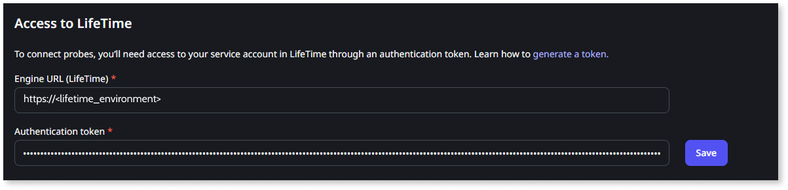

# Manual setup of the Conversion Assessment Tool

For a faster and more streamlined setup of the Conversion Assessment Tool, start by [using the Conversion Assessment Tool Installer](setup-assessement-tool.md). Use this manual setup process only if you encounter any limitation or issue while using the installer.

## Set up the tool manually

To set up the Conversion Assessment Tool manually, your IT User must have the **Administrator** [role](../manage-platform-app-lifecycle/manage-it-teams/about-permission-levels.md#roles).

Ensure the [necessary requirements](setup-assessement-tool.md#prerequisites) are met before setting up the Conversion Assessment Tool.

To set up the Conversion Assessment Tool, follow these steps:

* [Step 1. Download the solution packs for the tool components](#download)

* [Step 2. Install the Engine in the LifeTime environment](#engine)

* [Step 3. Install the Console in the Development environment](#console)

* [Step 4. Install the development Probe in the Development environment](#probe-dev)

* [Step 5. Install the Probe in other environments](#probe-other-env)

* [Step 6. Configure the Conversion Assessment Tool](#configure)

### Step 1. Download the solution packs for the tool components { #download }

Download the solution packs for the tool components from the [Conversion Assessment Tool Installer](setup-assessement-tool.md#cat-installer):

1. Open the Conversion Assessment Tool Installer app (`https://<dev_environment>/ConversionAssessmentInstaller/`).

1. Log in using your IT User credentials.

1. Click the download link to get the `*.zip` file containing the solution packs for each component:

    * `Conversion_Assessment_Engine_v*.osp`
    * `Conversion_Assessment_Console_v*.osp`
    * `Conversion_Assessment_Probe_v*.osp`

    Ignore the remaining `*.manifest` files.

    

### Step 2. Install the Engine in the LifeTime environment { #engine }

Follow these instructions to install the [Engine](setup-assessement-tool.md#engine) in the LifeTime environment:

1. Go to the Service Center console of your LifeTime environment (`https://<lifetime_environment>/ServiceCenter`).

1. [Upload and publish](https://success.outsystems.com/support/troubleshooting/application_lifecycle/deploy_applications_through_service_center/#step-2.upload-and-publish-the-solution-in-the-target-environment) the `Conversion_Assessment_Engine_v*.osp` solution pack that you downloaded in Step 1.

### Step 3. Install the Console in the Development environment { #console }

Follow these instructions to install the [Console](setup-assessement-tool.md#console) in the Development environment:

1. Go to the Service Center console of your Development environment (`https://<dev_environment>/ServiceCenter`).

1. [Upload and publish](https://success.outsystems.com/support/troubleshooting/application_lifecycle/deploy_applications_through_service_center/#step-2.upload-and-publish-the-solution-in-the-target-environment) the `Conversion_Assessment_Console_v*.osp` solution pack that you downloaded in Step 1.

### Step 4. Install the development Probe in the Development environment { #probe-dev }

Follow these instructions to install the [Probe](setup-assessement-tool.md#probe) in the Development environment:

1. Go to the Service Center console of your Development environment (`https://<dev_environment>/ServiceCenter`).

1. [Upload and publish](https://success.outsystems.com/support/troubleshooting/application_lifecycle/deploy_applications_through_service_center/#step-2.upload-and-publish-the-solution-in-the-target-environment) the `Conversion_Assessment_Probe_v*.osp` solution pack that you downloaded in Step 1.

### Step 5. Install the Probe in other environments { #probe-other-env }

Optionally, you can install additional probes in the environments where you also want to assess the ODC-readiness of your apps (for example, the QA environment), or the environments that you will later select as the source for code conversion or data migration (for example, the Production environment).

Don’t install the Probe in the LifeTime environment.

1. Go to the Service Center console of the environment where you want to install an additional probe (`https://<environment>/ServiceCenter`).

1. [Upload and publish](https://success.outsystems.com/support/troubleshooting/application_lifecycle/deploy_applications_through_service_center/#step-2.upload-and-publish-the-solution-in-the-target-environment) the `Conversion_Assessment_Probe_v*.osp` solution pack that you downloaded in Step 1.

Installing extra probes is important not only for assessing ODC readiness but also for converting code and migrating data from those environments.

### Step 6. Configure the Conversion Assessment Tool { #configure }

1. Go to the LifeTime management console (`https://<lifetime_environment>/lifetime`).

1. [Create a service account](../ref/apis/lifetime-deployment/rest-api-authentication.md) with the [Administrator role](../manage-platform-app-lifecycle/manage-it-teams/about-permission-levels.md#roles).

1. Copy the authentication token.

1. Go to the Migration Assessment console (`https://<cat_console_environment>/ConversionAssessment/`).

1. Log in using your IT User credentials.

1. Go to the **Maintenance** tab.

1. Configure the **Access to LifeTime** where the Engine component is installed:

   * Set the **Engine URL (LifeTime)** field to the LifeTime address.
   * Paste the authentication token for the LifeTime Service Account into the **Authentication token** field.

1. Click **Save** to save and test the connection to LifeTime.

    

1. To configure access to the development probe, in the **Probe connection** area, set the **O11 environment URL** to your Development environment address, and click **Connect**.

    

    It's mandatory to configure access to the **Development** probe.

    

    

1. If you installed the Probe component in other environments, configure the connection to those environment probes.

After configuring the Conversion Assessment Tool, you can start [mapping your O11 apps to ODC assets](plan/plan-map-apps.md).
