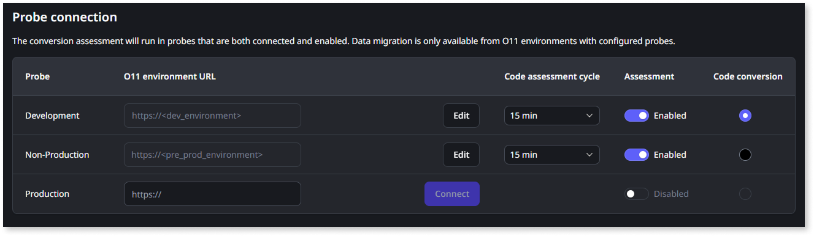

# Manual setup of the Migration Assessment Tool

This article only applies to customers with access to the Migration Kit.

This article describes the manual setup process for the Migration Assessment Tool.

For most environments, we recommend [using the Migration Assessment Tool Installer](setup-assessement-tool.md) for a faster and more streamlined setup. Use this manual setup process only if you encounter any limitation or issue while using the Migration Assessment Tool Installer.

## Set up the tool manually

To set up the Migration Assessment Tool manually, your IT User must have the **Administrator** [role](../manage-platform-app-lifecycle/manage-it-teams/about-permission-levels.md#roles).

Ensure the [necessary requirements](setup-assessement-tool.md#prerequisites) are met before setting up the Migration Assessment Tool.

To set up the Migration Assessment Tool, follow these steps:

* [Step 1. Install the Engine in the LifeTime environment](#engine)

* [Step 2. Install the Console in the Development environment](#console)

* [Step 3. Install the development Probe in the Development environment](#probe-dev)

* [Step 4. Install the Probe in other environments](#probe-other-env)

* [Step 5. Configure the Migration Assessment Tool](#configure)

### Step 1. Install the Engine in the LifeTime environment { #engine }

1. Download the [Migration Assessment Tool Engine solution pack](resources/Migration_Assessment_Engine_v1_7_3_2.osp).

1. Go to the Service Center console of your LifeTime environment (`https://<lifetime_environment>/ServiceCenter`).

1. [Upload and publish the Migration Assessment Engine solution pack](https://success.outsystems.com/support/troubleshooting/application_lifecycle/deploy_applications_through_service_center/#step-2.upload-and-publish-the-solution-in-the-target-environment).

### Step 2. Install the Console in the Development environment { #console }

1. Download the [Migration Assessment Tool Console solution pack](resources/Migration_Assessment_Console_v1_7_3_2.osp).

1. Go to the Service Center console of your Development environment (`https://<dev_environment>/ServiceCenter`).

1. [Upload and publish](https://success.outsystems.com/support/troubleshooting/application_lifecycle/deploy_applications_through_service_center/#step-2.upload-and-publish-the-solution-in-the-target-environment) the Migration Assessment Console solution pack.

1. Still in the Service Center console, ensure [Single Sign-On Between App Types](../security/configure-authentication.md) is enabled.

### Step 3. Install the development Probe in the Development environment { #probe-dev }

1. Download the [Migration Assessment Tool Probe solution pack](resources/Migration_Assessment_Probe_v1_7_3_2.osp).

1. Go to the Service Center console of your Development environment (`https://<dev_environment>/ServiceCenter`).

1. [Upload and publish](https://success.outsystems.com/support/troubleshooting/application_lifecycle/deploy_applications_through_service_center/#step-2.upload-and-publish-the-solution-in-the-target-environment) the Migration Assessment Probe solution pack.

### Step 4. Install the Probe in other environments { #probe-other-env }

Optionally, you can install additional probes in the environments where you also want to assess the ODC-readiness of your apps (for example, the QA environment), or the environments that you will later select as the source for code or data migration (for example, the Production environment).

Don’t install the Probe in the LifeTime environment.

1. Go to the Service Center console of the environment where you want to install an additional probe (`https://<environment>/ServiceCenter`).

1. [Upload and publish](https://success.outsystems.com/support/troubleshooting/application_lifecycle/deploy_applications_through_service_center/#step-2.upload-and-publish-the-solution-in-the-target-environment) the Migration Assessment Probe solution pack you downloaded in the previous step.

Installing extra probes is important not only for assessing ODC readiness but also for migrating code and data from those environments.

### Step 5. Configure the Migration Assessment Tool { #configure }

1. Go to the LifeTime management console (`https://<lifetime_environment>/lifetime`).

1. [Create a service account](../ref/apis/lifetime-deployment/rest-api-authentication.md) with the [Administrator role](../manage-platform-app-lifecycle/manage-it-teams/about-permission-levels.md#roles).

1. Copy the authentication token.

1. Go to the Migration Assessment console (`https://<mat_console_environment>/MigrationAssessment/`).

1. Log in using your IT User credentials.

1. Go to the **Maintenance** tab.

1. Configure the **Access to LifeTime** where the Engine component is installed:

   * Set the **Engine URL (LifeTime)** field to the LifeTime address.
   * Paste the authentication token for the LifeTime Service Account into the **Authentication token** field.

1. Click **Save** to save and test the connection to LifeTime.

    

1. To configure access to the development probe, in the **Probe connection** area, set the **Analysis environment URL** to your Development environment address, and click **Connect**.

    

    It's mandatory to configure access to the **Development** probe.

    

    

1. If you installed the Probe component in other environments, configure the connection to those environment probes.

After configuring the Migration Assessment Tool, you can start [mapping your O11 apps to ODC assets](plan/plan-map-apps.md).
