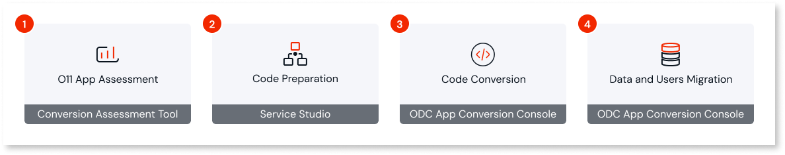

# OutSystems 11 to ODC conversion

The O11 to ODC App Conversion Kit provides the required guidance and tooling to assess the ODC-readiness of the O11 apps you want to convert, prepare them for ODC architecture, and execute a self-paced conversion.

## Conversion stages

This section gives an overview of the process to convert an O11 app to ODC.

### Stage 1: Plan for the O11 app conversion

ODC apps are designed to take advantage of cloud-native architecture and microservices design, which promote application-independent lifecycle and ownership. To take full advantage of ODC capabilities, you must ensure your O11 app architecture is aligned with ODC architecture best practices, and assess the ODC-readiness by identifying code patterns that may require refactoring.

Outcomes:

* Visibility over necessary adjustments to convert O11 apps to ODC-compatible apps.  
* Guidance on how to map existing O11 patterns into ODC constructs.  
* Overview of the applicational domains, understanding boundaries and app domain prioritization.

### Stage 2: Prepare for O11 app conversion

Once you’ve completed the assessment of your O11 app and identified the patterns that are inconsistent with ODC, you must refactor your O11 app in Service Studio to make them ODC compatible, and test the refactored O11 app. This ensures a smooth conversion to ODC:

Outcomes:

* Implementation of O11 app refactorings to be ODC-compatible.  
* Testing of your refactored O11 app.

### Stage 3: Execute the code conversion

Once you’ve prepared your O11 app to align with ODC architecture, you can convert the O11 code to ODC-native code, and publish the converted code to your ODC tenant.

Outcomes:

* Your O11 app code is converted to ODC.  
* The app’s O11 entities are mapped into ODC counterparts.  
* The converted ODC app is published and tested in an ODC development stage.

### Stage 4: Execute the data and users migration

After testing and ensuring your app is running as expected in ODC, you can migrate your O11 data and end users to ODC.

Outcomes:

* The O11 business data is migrated to the corresponding ODC entities.  
* The O11 end users are migrated alongside business data.

## Next steps

Start by [planning your apps conversion](plan/plan-intro.md).
