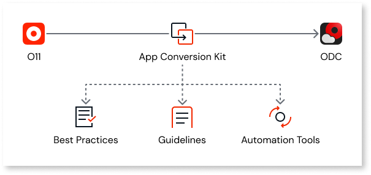

# OutSystems 11 to ODC migration

Our goal is to enable you to convert your current O11 app portfolio into native ODC apps. Once converted and published on ODC, these apps can leverage all current and future ODC capabilities, such as cloud-native architecture, limitless scaling, and new AI features for businesses and developers.

OutSystems provides documentation and migration tools to ease and automate the process of migrating from O11 to ODC code and data.

With that in mind, the following topics help you understand the migration process.

## How to plan for migration

OutSystems is committed to making sure that you have an easy migration process and one that fits smoothly into your development team's schedule. You can migrate on a timeline that takes into account your app portfolio and business demand.

Depending on the size of your app portfolio, you may follow different migration journeys. 

* **One-shot migration** is suitable for smaller app portfolios (infrastructures with less than 2 business apps) with up to 300 application objects. You can choose to migrate the entire portfolio at once and have it ported to ODC in a short timeframe.

    

* **Coexistence**  is suitable for larger app portfolios (infrastructures with more than 2 apps) where it is essential to continue providing business value and, at the same time, work on the migration activities. With this migration journey, new apps can be created in ODC while you independently migrate apps from O11.

    * **Start using ODC**: ODC tenant for new apps, ability to leverage existing O11 components such as integrations and master data.

    * **Prepare and progressively migrate O11 apps**: Assess and migrate O11 apps that will benefit most from ODC capabilities.

    * **Complete migration of all apps**: Assess and migrate more complex O11 apps.

    

## How migration capabilities will be delivered

Migration capabilities will be delivered incrementally, addressing the most common use cases first, then progressing to more complex ones, and finally aligning with all ODC capabilities. 

## Migration stages

### Stage 1: Plan for the O11 app migration

ODC applications are designed to take advantage of cloud-native architecture and microservices design, which promote application-independent lifecycle and ownership.
To take full advantage of ODC capabilities, you must first adjust the O11 app architecture to align with ODC architecture best practices and identify code patterns that require refactoring. 

As you plan for the O11 app migration, you must:

1. Identify the O11 apps to be migrated to ODC, and depending on the complexity of your infrastructure and your team capacity,  choose either one of the migration journeys:
    * One-shot migration approach
    * O11-ODC app coexistence approach

1. Design the to-be ODC architecture blueprint.

1. Map the O11 apps to ODC assets.

1. Identify any architectural inconsistencies in your O11 app and adjust the architecture.

1. Estimate the effort required to refactor your O11 app to be ODC compatible. 

#### Outcomes

* Visibility over necessary code adjustments to convert O11 code to ODC-compatible code.

* Guidance on how to map existing O11 code patterns into ODC constructs.

* Overview of the entire factory applicational domains, understanding boundaries and domain prioritization.

### Stage 2: Prepare for O11 app migration

Once you have completed the assessment of your O11 apps and identified the inconsistencies in code patterns, you must:

1. Refactor your O11 app in Service Studio to make it ODC compatible. This ensures smooth migration of your O11 app to ODC. 

1. Deploy the refactored app to QA.

1. Test your refactored O11 app.

1. Adjust your development sprints to include O11 app refactoring and O11 app testing, prioritizing them according to your migration timelines.

#### Outcomes

* Implementation of O11 code refactorings to be ODC-compatible

* Testing of your refactored O11 app.

### Stage 3: Execute the O11 app migration

Once you’ve completed the assessment and refactoring of your O11 app, you must:

1. Migrate the O11 code to ODC-compatible code.

1. Upload the migrated code to an ODC tenant.

1. Perform additional refactoring of the migrated ODC app.

1. Test and publish the migrated app.

1. Migrate the O11 data to ODC-compatible data.

1. Migrate the O11 end-users.

1. Configure the migrated ODC app.

#### Outcomes

* O11 app code and data are migrated to ODC.

* O11 entities are mapped into ODC counterparts.

* O11 end-users are migrated to ODC end-users.

* The migrated ODC app is tested and published.

### Stage 4: Launch the ODC app

After migrating the O11 code, data, and end-users and publishing it on ODC, you can test the ODC app and finally launch the migrated ODC app for your end-users.

#### Outcomes

* Migrated ODC app is tested and published.

* The migrated ODC app is launched in Production.

## Starting your migration journey

Start by [planning your apps migration](plan/plan-intro.md).
