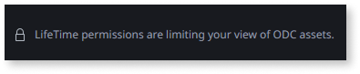

# Understand the permission model for Migration Assessment Tool

This article only applies to customers with access to the Migration Kit.

The permissions that IT users have while using the **Migration Assessment Tool** depend on their [permissions set in LifeTime](../../manage-platform-app-lifecycle/manage-it-teams/about-permission-levels.md#permissions) for the O11 environment where the [development probe](../setup-assessement-tool.md#probe) is installed.

The set of permissions that an IT user has over the **development probe environment** and the applications is determined by [the several roles that the user is assigned](../../manage-platform-app-lifecycle/manage-it-teams/about-permission-levels.md#assigning-roles-to-it-users).

While navigating through the Migration Assessment Tool, logged in users only get the information they have permission to, and they are notified whenever the visible information is limited due to lack of permissions.

## Permissions by tool operation

To log in the Migration Assessment Tool, users must have **Access** permission at least for one O11 app in the environment.

The tables below describe the required permissions to perform the main operations in the Migration Assessment Tool. Each permission level is cumulative with the permissions of the previous levels.

### Mapping O11 apps to ODC assets { #map }

<table>
  <thead>
    <tr>
      <th>LifeTime permissions</th>
      <th>Assigned as <strong>Default role</strong></th>
      <th>Assigned for a <strong>Team</strong></th>
      <th>Assigned for an <strong>App</strong></th>
    </tr>
  </thead>
  <tbody>
    <tr>
      <td>Access</td>
      <td colspan="3">The user can’t see any ODC asset on the ODC Blueprint screen nor any O11 apps and modules in the Map O11 apps list.</td>
    </tr>
    <tr>
      <td>List Application</td>
      <td rowspan="2">
        
The user can:

        <ul>
          <li>See all ODC assets on the ODC Blueprint screen.</li>
          <li>See all the <strong>environment’s O11 apps</strong> and modules in the Map O11 apps list.</li>
        </ul>
      </td>
      <td rowspan="2">
        
The user can:

        <ul>
          <li>See on the ODC Blueprint screen the ODC assets that include at least one of the <strong>Team’s O11 apps</strong>.</li>
          <li>See in the Map O11 apps list the <strong>Team’s O11 apps</strong> and modules.</li>
        </ul>
      </td>
      <td rowspan="2">
        
The user can:

        <ul>
          <li>See on the ODC Blueprint screen the ODC asset that includes the <strong>O11 app</strong>.</li>
          <li>See in the Map O11 apps list the <strong>O11 app</strong> and modules.</li>
        </ul>
      </td>
    </tr>
    <tr>
      <td>Monitor and Add Dependencies</td>
    </tr>
    <tr>
      <td>Open and Debug applications</td>
      <td rowspan="2">
        
The user can:

        <ul>
          <li>Create, edit and delete ODC assets and map the <strong>environment’s O11 apps</strong>.</li>
        </ul>
      </td>
      <td rowspan="2">
        
The user can:

        <ul>
          <li>Create ODC assets and map the <strong>Team’s O11 apps</strong>.</li>
          <li>Edit ODC assets that include the <strong>Team’s O11 apps</strong> and update the mapping for the <strong>Team’s O11 apps</strong>.</li>
          <li>Delete ODC assets that include the <strong>Team’s O11 apps</strong>, only when having the same or higher permission over all apps in the ODC asset.</li>
        </ul>
      </td>
      <td rowspan="2">
        
The user can:

        <ul>
          <li>Create an ODC asset and map the <strong>O11 app</strong>.</li>
          <li>Edit the ODC asset that includes the <strong>O11 app</strong> and remove the mapping for the <strong>O11 app</strong>.</li>
          <li>Delete the ODC asset that includes the <strong>O11 app</strong>, only when having the same or higher permission over all apps in the ODC asset.</li>
        </ul>
      </td>
    </tr>
    <tr>
      <td>Change and Deploy Applications</td>
    </tr>
  </tbody>
</table>

### Assessment and findings { #assessment-findings }

<table>
  <thead>
    <tr>
      <th>LifeTime permissions</th>
      <th>Assigned as <strong>Default role</strong></th>
      <th>Assigned for a <strong>Team</strong></th>
      <th>Assigned for an <strong>App</strong></th>
    </tr>
  </thead>
  <tbody>
    <tr>
      <td>Access</td>
      <td colspan="3">
        
The user can:

        <ul>
          <li>See data patterns that apply across all applications (for example, end-user related patterns) and export their findings.</li>
          <li>See and export infrastructure findings.</li>
          <li>Run code, data, and infrastructure assessment for the environment.</li>
        </ul>
      </td>
    </tr>
    <tr>
      <td>List Application</td>
      <td rowspan="2">
        
The user can:

        <ul>
          <li>See the assessment status and total number for all ODC assets on the ODC Blueprint screen.</li>
          <li>See the code and data patterns, total number of findings, and all findings for the <strong>environment’s ODC assets</strong>.</li>
          <li>Change the <strong>Where To Fix</strong> setting of the findings for the <strong>environment’s ODC assets</strong>, when applicable.</li>
        </ul>
      </td>
      <td rowspan="2">
        
The user can:

        <ul>
          <li>See on the ODC Blueprint screen the assessment status and total number of findings for the ODC assets that include the <strong>Team’s O11 apps</strong>.</li>
          <li>See the code and data patterns and total number of findings for the ODC assets that include the <strong>Team’s O11 apps</strong>.</li>
          <li>See the code and data findings for the <strong>Team’s O11 apps</strong>.</li>
          <li>Change the <strong>Where To Fix</strong> setting of the findings for the <strong>Team’s O11 apps</strong>, when applicable.</li>
        </ul>
      </td>
      <td rowspan="2">
        
The user can:

        <ul>
          <li>See on the ODC Blueprint screen the assessment status and total number of findings for the ODC asset that includes the <strong>O11 app</strong>.</li>
          <li>See the code and data patterns and total number of findings for the ODC asset that includes the <strong>O11 app</strong>.</li>
          <li>See the code and data findings for the <strong>O11 app</strong>.</li>
          <li>Change the <strong>Where To Fix</strong> setting of the findings for the <strong>O11 app</strong>, when applicable.</li>
        </ul>
      </td>
    </tr>
    <tr>
      <td>Monitor and Add Dependencies</td>
    </tr>
    <tr>
      <td>Open and Debug applications</td>
      <td rowspan="2">
        
The user can:

        <ul>
          <li>Run a code assessment for each <strong>environment’s ODC asset</strong> on the ODC Blueprint screen.</li>
          <li>Export code findings for the <strong>environment’s ODC assets</strong>.</li>
        </ul>
      </td>
      <td rowspan="2">
        
The user can:

        <ul>
          <li>Run a code assessment for each ODC asset that includes the <strong>Team’s O11 apps</strong> on the ODC Blueprint screen.</li>
          <li>Export code findings for the <strong>Team’s O11 apps</strong>.</li>
        </ul>
      </td>
      <td rowspan="2">
        
The user can:

        <ul>
          <li>Run a code assessment for the ODC asset that includes the <strong>O11 app</strong> on the ODC Blueprint screen.</li>
          <li>Export code findings for the <strong>O11 app</strong>.</li>
        </ul>
      </td>
    </tr>
    <tr>
      <td>Change and Deploy Applications</td>
    </tr>
  </tbody>
</table>

### Migration plans { #plans }

<table>
  <thead>
    <tr>
      <th>LifeTime permissions</th>
      <th>Assigned as <strong>Default role</strong></th>
      <th>Assigned for a <strong>Team</strong></th>
      <th>Assigned for an <strong>App</strong></th>
    </tr>
  </thead>
  <tbody>
    <tr>
      <td>Access</td>
      <td colspan="3">The user can’t see any migration plan.</td>
    </tr>
    <tr>
      <td>List Application</td>
      <td rowspan="2">
        
The user can:

        <ul>
          <li>See all the migration plans, the number of ODC assets in the plan and the assessment status.</li>
        </ul>
      </td>
      <td rowspan="2">
        
The user can:

        <ul>
          <li>See in the Migration plans list the plans with ODC assets that include the <strong>Team’s O11 apps</strong>.</li>
          <li>See, in the details of those plans, the number of ODC assets in the plan and the assessment status.</li>
        </ul>
      </td>
      <td rowspan="2">
        
The user can:

        <ul>
          <li>See in the Migration plans list the plan with the ODC asset that includes the <strong>O11 app</strong>.</li>
          <li>See, in the details of that plan, the number of ODC assets in the plan and the assessment status.</li>
        </ul>
      </td>
    </tr>
    <tr>
      <td>Monitor and Add Dependencies</td>
    </tr>
    <tr>
      <td>Open and Debug applications</td>
      <td rowspan="2">
        
The user can:

        <ul>
          <li>See the dependencies of the <strong>environment’s migration plans</strong>.</li>
          <li>Create, edit and delete migration plans with ODC assets that include any <strong>environment’s O11 app</strong>.</li>
        </ul>
      </td>
      <td rowspan="2">
        
The user can:

        <ul>
          <li>See the dependencies of migration plans with ODC assets that include the <strong>Team’s O11 apps</strong>.</li>
          <li>Create migration plans with ODC assets that include the <strong>Team’s O11 apps</strong>.</li>
          <li>Edit migration plans with ODC assets that include the <strong>Team’s O11 apps</strong> and add/remove ODC assets to/from the plan, only when having the same or higher permission over all apps in the ODC asset.</li>
          <li>Delete migration plans with ODC assets that include the <strong>Team’s O11 apps</strong>, only when having the same or higher permission over all apps in the ODC assets in the plan.</li>
        </ul>
      </td>
      <td rowspan="2">
        
The user can:

        <ul>
          <li>See the dependencies of the migration plan with the ODC asset that includes the <strong>O11 app</strong>.</li>
          <li>Create a migration plan with the ODC asset that includes the <strong>O11 app</strong>.</li>
          <li>Edit the migration plan with the ODC asset that includes the <strong>O11 app</strong> and remove the ODC asset from the plan, only when having the same or higher permission over all apps in the ODC asset.</li>
          <li>Delete the migration plan with the ODC asset that includes the <strong>O11 app</strong>, only when having the same or higher permission over all apps in the ODC assets in the plan.</li>
        </ul>
      </td>
    </tr>
    <tr>
      <td>Change and Deploy Applications</td>
    </tr>
  </tbody>
</table>

### Maintenance and configuration { #maintenance }

| LifeTime permissions | Assigned as **Default role** | Assigned for a **Team** | Assigned for an **App** |
| :--- | :--- | :--- | :--- |
| **Full Control** | The user can see and update the configuration settings on the Maintenance screen. | - | - |

### Setup and update { #setup-update }

| LifeTime permissions/Roles | Assigned as **Default role** | Assigned for a **Team** | Assigned for an **App** |
| :--- | :--- | :--- | :--- |
| **Create Applications** and **Change and Deploy Applications** permissions | The user can install the Migration Assessment Tool Installer app in the environment. | - | - |
| **Administrator** [role](../../manage-platform-app-lifecycle/manage-it-teams/about-permission-levels.md#roles) | The user can [setup and update the Migration Assessment Tool](../setup-assessement-tool.md) using the Migration Assessment Tool Installer app. | - | - |
