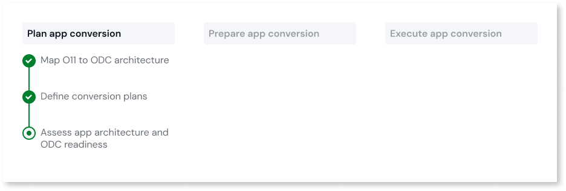

# Assess app architecture and ODC readiness

This article only applies to customers with access to the Migration Kit.

After [mapping a set of O11 apps into ODC assets](plan-map-apps.md), the Migration Assessment Tool automatically queues the assessment for those assets to run. A new assessment is also queued when there are application changes in the environment or when you choose to run a new assessment manually on the console.

When an analysis finishes, you can [go through the assessment report](#report) to assess the app architecture and ODC readiness for the mapped ODC assets.

The assessment report helps you plan your migration to ODC, by supporting you with the following:

* Adjust the mapping of your O11 apps to ODC architecture.

* Understand and decide on what adjustments your team needs to make in O11 before migrating the apps to ODC. This information is important for your development team, so they can estimate the refactoring effort and [prepare for the app migration](../prepare/prep-refactor-o11-apps.md).

The assessment operations and findings available to you through the Migration Assessment Tool depend on your [LifeTime permissions for the Development environment](mat-permissions.md#assessment-findings).

## View the assessment report { #report }

To view the assessment report of an [ODC asset already mapped from your O11 apps](plan-map-apps.md), follow these steps:

1. Log into the Migration Assessment Tool console (`https://<mat_console_environment>/MigrationAssessment/`) using your IT User credentials.

1. Go to the **ODC Blueprint** tab.

1. Click on the ODC asset you want to assess to navigate to its assessment report.

If you already created [migration plans](plan-define-migration-plans.md), follow these steps to view the assessment report of a specific plan:

1. In the Migration Assessment Tool console, go to the **Assessment** tab.

1. Select the plan you want to assess from the **Migration plans** filter.

## Validate findings { #validate-findings }

Go through the assessment report to validate its findings:

1. Select a pattern from the **Code**, **Data**, or **Infrastructure** patterns lists.

    The list of findings of that pattern displays on the right side. 

1. Select **Learn more** to access the code pattern documentation that guides you on how to solve it.

1. As you make the changes to solve each finding, rerun the assessment, to ensure you resolved the issue.

    If you don’t run a new assessment manually, the Migration Assessment Tool automatically queues a new assessment to check for changes based on the defined [code assessment cycle](../setup-assessement-tool.md#cycles).

Repeat these steps for each pattern, assessing the refactoring effort to [prepare for the app migration](../prepare/prep-refactor-o11-apps.md).
