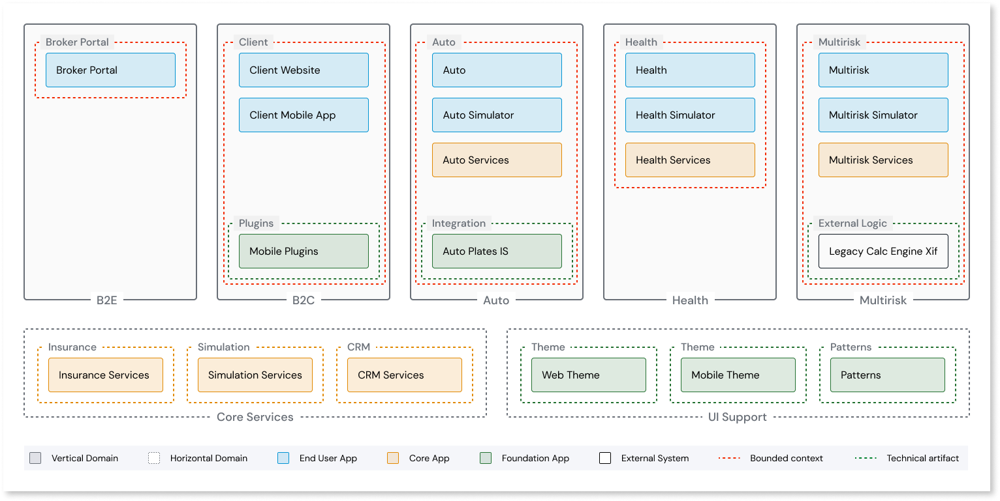
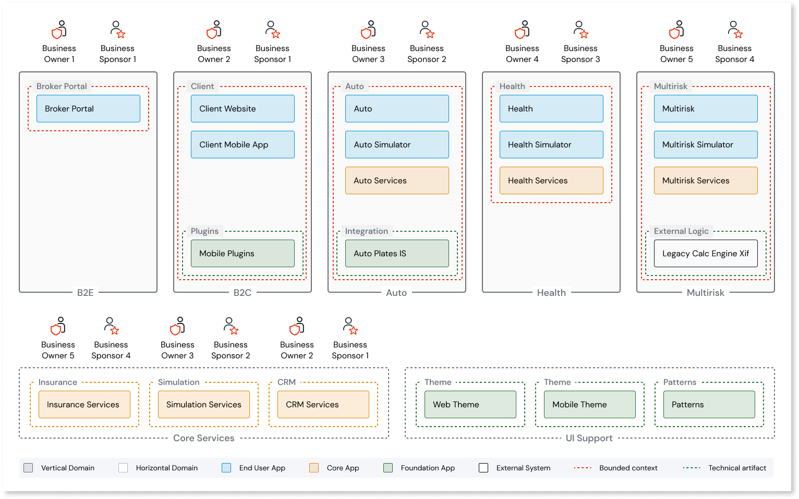
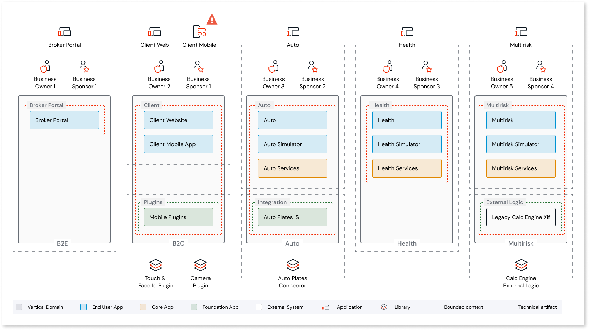
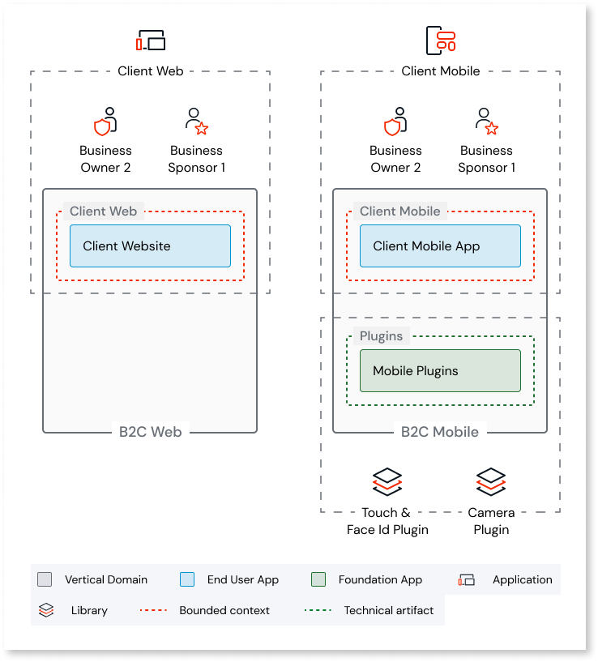
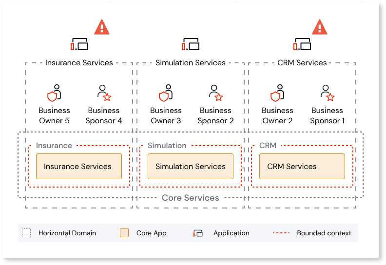
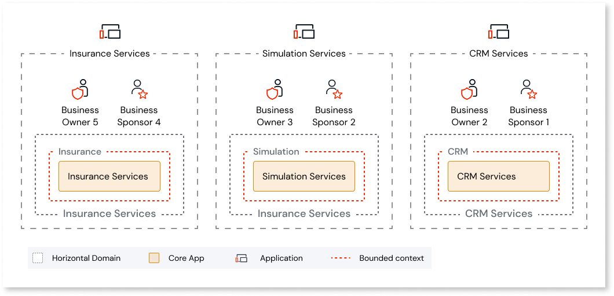
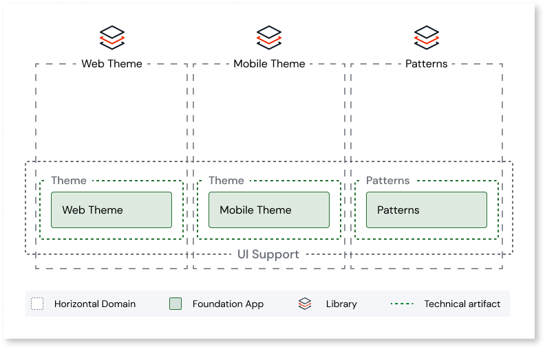
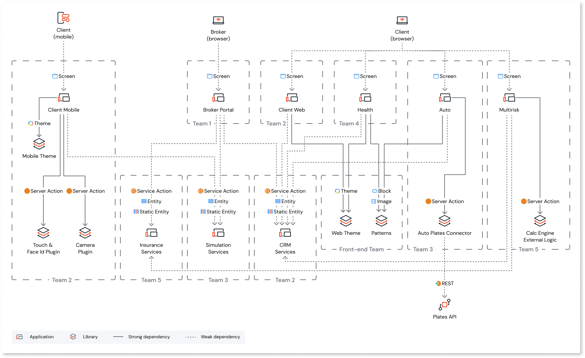

# Convert O11 architecture to ODC architecture

To map the existing O11 architecture to ODC architecture, OutSystems recommends that you analyze your existing O11 app architecture blueprint and perform additional refactoring and modifications. Keep iterating the architecture until you arrive at the final ODC architecture blueprint.

Targeting an ODC architecture ensures that once the O11 app is converted to ODC apps and libraries, you can immediately benefit from ODC cloud-native capabilities.

You can follow these steps as you analyze and map your existing O11 app architecture to the ODC architecture blueprint:

The diagrams in these steps use an example use case to demonstrate how to map your O11 app architecture to ODC architecture.

Step 1: Identify application concepts

After interviewing your stakeholders to understand their requirements, you can identify your app's critical business concepts. For more information, refer to [discover the app business concepts](https://success.outsystems.com/documentation/outsystems_developer_cloud/building_apps/app_architecture/building_a_well_architected_app/#step-1-discover-the-app-business-concepts).

Step 2: Identify bounded contexts

Identify your application's bounded contexts by grouping related business concepts. You can group the business concepts based on:

* Domain expert boundaries
* Business process steps, data flow, and ownership
* Concepts cohesion or clustering due to dependencies between concepts
* Common language of concepts

You must also identify reusable components and integration with external components.

In the above example, only one bounded context exists in each domain. However, if you find multiple bounded contexts in each domain of your app, it might suggest that the domain granularity is large. Consider breaking down the domain into smaller ones and further refining the architecture.

For more information on identifying bounded contexts from business concepts, refer to [identify bounded contexts](https://success.outsystems.com/documentation/outsystems_developer_cloud/building_apps/app_architecture/building_a_well_architected_app/#step-2-identify-bounded-contexts-by-grouping-the-business-concepts).

Step 3: Identify business owners and sponsors

Before building your architecture, you must understand your organizational structure to:

* establish clear ownership of the code,
* ensure release cycle independence for different teams, and
* reduce complexity for developers, reducing cognitive load.

Follow these best practices as you build your ODC app architecture:

* Ensure you have a single business owner for an app to ensure clear ownership.
* Ensure you have a single sponsor for your app to ensure release cycle independence.
* Ensure you assign a single product team to an app.

Choose the single or distributed app approach depending on the granularity of the domain. If your organization has one sponsor, business owner, and development team, choose a single-app approach and avoid splitting the architecture into multiple apps for the same domain.

If your organization has multiple teams working in parallel with different owners and sponsors, choose a distributed multiple-app approach to ensure that the ownership is well established, and the apps have independent release cycles.

In some scenarios, if your domain needs to be more granular, split it into smaller domains to adhere to the best practices of domain-driven ODC architecture. Alternatively, there could be instances where combining domains might make sense, especially if they have the same team ownership and sponsorship. For more information, refer to [define a clear ownership](https://success.outsystems.com/documentation/outsystems_developer_cloud/building_apps/app_architecture/building_a_well_architected_app/#step-3-define-a-clear-ownership).

Step 4: Map bounded contexts to apps and libraries

Next, you map the bounded contexts to ODC apps and libraries.

In this use case, the B2C domain must be mapped to two ODC apps due to the presence of a mobile app. Hence, further decoupling of the architecture is required.

For mapping the core services to libraries, you must decouple the architecture further as different bounded contexts have different business owners and sponsors, and the domains are strongly coupled together.

Now, redesign the architecture so that the domains are loosely coupled.

Next, map the foundation apps web theme, mobile theme, and patterns to libraries.

Step 5: Design the ODC architecture blueprint

Here's the final ODC architecture blueprint where the bounded contexts are mapped to apps and libraries:

## Additional resources

* [ODC architecture Design process training](https://learn.outsystems.com/training/journeys/architecture-fundamentals-559/architecture-design-process/odc/9)
* [Building well-architected app in ODC](https://success.outsystems.com/documentation/outsystems_developer_cloud/building_apps/app_architecture/building_a_well_architected_app/)
