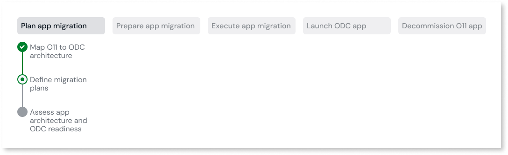
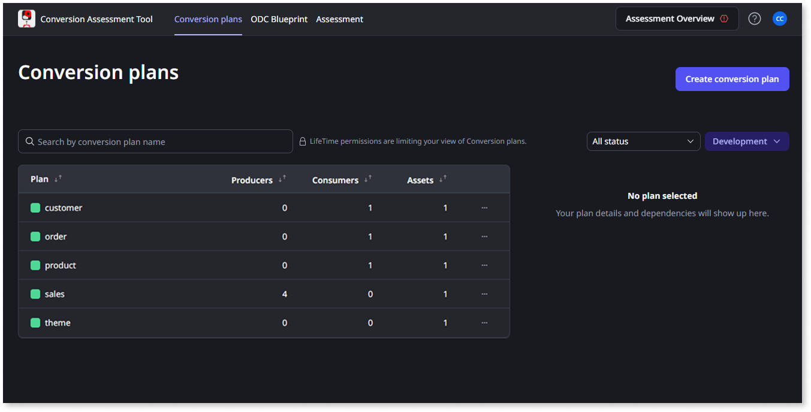
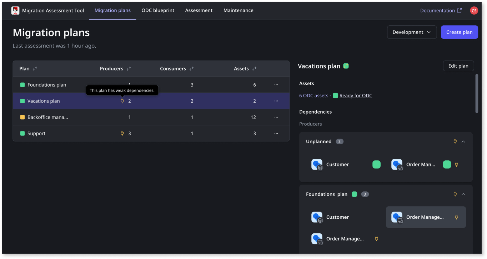
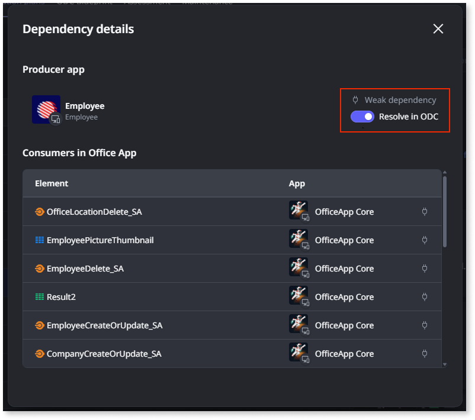

# Define migration plans

This article only applies to customers with access to the Migration Kit.

The Migration Assessment Tool enables you to plan the migration of small sets of apps based on your different app domains and your teams' development lifecycle.

After [mapping a set of O11 apps into ODC assets](plan-map-apps.md), you can group those ODC assets in migration plans. With migration plans, you can:

* Identify the dependencies between apps included in different migration plans.

* Have different development teams focusing only on the [preparation of their own apps](../prepare/prep-intro.md)

The migration plan operations and ODC assets available to you through the Migration Assessment Tool depend on your [LifeTime permissions for the Development environment](mat-permissions.md#plans).

## Create a migration plan

To create a migration plan, follow these steps:

1. Log into the Migration Assessment Tool console (`https://<mat_console_environment>/MigrationAssessment`) using your IT User credentials.

1. In the **Migration plans** tab, click **Create plan**.

1. Enter a **Name** for your migration plan.

1. Select the **ODC assets** to include in the plan. 

    You can only select assets that aren’t included in other migration plans yet.

1. Click **Save plan**.

After creating the migration plan, you can validate if the assets in the plan [have dependencies](#dependencies) on assets in other plans.

## Identify dependencies between apps { #dependencies }

In the **Migration plans** list, you can identify the following:

* If an asset in the migration plan has dependencies on producer or consumer assets that are not in the same plan. This helps you understand which plans must be migrated first. For example, you must first migrate the plans that don't have dependencies on producers or the producer's assets were already migrated to ODC.

* If an asset has a [weak dependency](../../building-apps/reuse-and-refactor/strong-weak-dependencies.md#weak-dependencies) on a producer asset that is not in the same plan.

To validate the dependencies of a migration plan, follow these steps:

1. In the Migration Assessment Tool console, go to the **Migration plans** tab to view the list of plans already created.

1. Select a migration plan from the list.

    The following details of the plan are displayed:

      * The number of assets.
      * The overall ODC readiness status of the assets.
      * The list of different plans including producer assets. Under **Unplanned**, you also find the producer assets not included in any plan yet.
      * The list of different plans including consumer assets. Under **Unplanned**, you also find the consumer assets not included in any plan yet.

1. Expand a plan in the list of **Producers** or **Consumers** to view the list of producer or consumer assets.

1. Select an asset from the list to open the **Dependency details**.

If you are validating an identified weak dependency on a producer asset in a different plan, you can decide to ignore the warning and manage the dependency after migration. To do that, switch the **Resolve in ODC** toggle on.

The **Resolve in ODC** option is only available when validating producer assets, and is not available when validating consumer assets.
