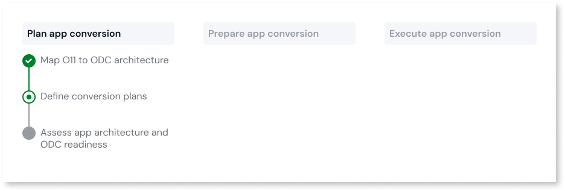
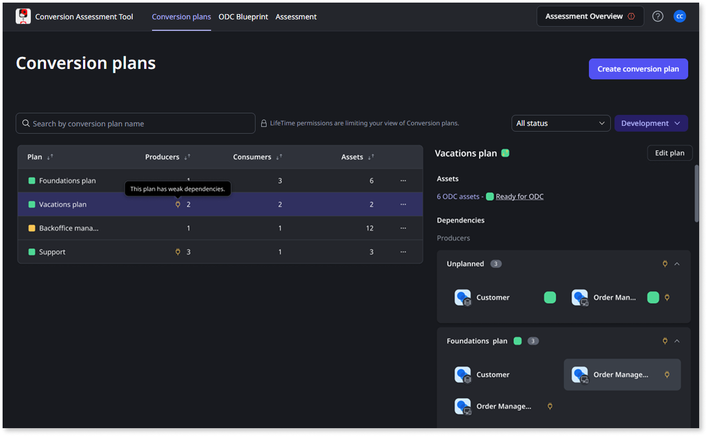

# Define conversion plans

The Conversion Assessment Tool enables you to plan the conversion of sets of apps based on your different app domains and your teams' development lifecycle.

After [mapping a set of O11 apps into ODC assets](plan-map-apps.md), you can group those ODC assets in conversion plans. With conversion plans, you can:

* Identify the dependencies between apps included in different conversion plans.

* Decide on the best preparation sequence and the eventual conversion order of your conversion plans.

* Have different development teams focusing only on the [preparation of their own apps](../prepare/prep-intro.md).

Your [LifeTime permissions for the Development environment](mat-permissions.md#plans) determine which conversion plan operations and ODC assets are available to you in the Conversion Assessment Tool.

## Create a conversion plan

To create a conversion plan, follow these steps:

1. Log into the Conversion Assessment Tool console (`https://<cat_console_environment>/ConversionAssessment`) using your IT User credentials.

1. In the **Conversion plans** tab, click **Create plan**.

1. Enter a **Name** for your conversion plan.

1. Select the **ODC assets** to include in the plan.

    You can only select assets that aren’t included in other conversion plans yet.

1. Click **Save plan**.

After creating the conversion plan, you can validate if the assets in the plan [have dependencies](#dependencies) on assets in other plans and then [decide on the order your team should tackle the several plans](#decide-order).

## Identify dependencies between apps {#dependencies}

In the **Conversion plans** list, you can identify the following:

* If an asset in the conversion plan has dependencies on producer or consumer assets that are not in the same plan.

* If an asset has a [weak dependency](../../building-apps/reuse-and-refactor/strong-weak-dependencies.md#weak-dependencies) on a producer asset that is not in the same plan.

To validate the dependencies of a conversion plan, follow these steps:

1. In the Conversion Assessment Tool console, go to the **Conversion plans** tab to view the plans already created.

    You can use the toggle to switch between the table and the diagram view. The diagram view helps you [decide the best preparation and conversion order for your plans](#decide-order).

    

1. Select a conversion plan.

    The following details of the plan are displayed:

    * The number of assets.
    * The overall ODC readiness status of the Assets.
    * The different plans that include **Producer** assets consumed by assets in the current plan. Under **Unplanned**, you also find the producer assets not included in any plan yet.
    * The different plans that include **Consumer** assets that have dependencies to assets in the current plan. Under **Unplanned**, you also find the consumer assets not included in any plan yet.

1. Expand a plan in the list of **Producers** or **Consumers** to view the list of producer or consumer assets.

1. Select an asset from the list to open the **Dependency details**.

If you are validating an identified weak dependency on a producer asset in a different plan, you can decide to ignore the warning and manage the dependency after conversion. To do that, switch the **Resolve in ODC** toggle on.

The **Resolve in ODC** option is only available when validating producer assets, and is not available when validating consumer assets.

## Decide preparation order of conversion plans {#decide-order}

The dependency diagram view shows the consumer-producer relationships across all your conversion plans, allowing you to establish a logical [preparation](../prepare/prep-intro.md) sequence and the eventual conversion order of each plan.

To access the diagram view, in the **Conversion plans** tab use the toggle switch between the table View and the diagram view.

The arrows point from consumers to producers, which means they point from plans with assets that have dependencies to assets in other plans.

When you select a plan, the diagram visually highlights only the arrows leading to or from that plan, instantly filtering relationships.

The diagram organizes conversion plans by tiers based on the nature of their dependencies. Producer plans and plans without dependencies appear at the bottom, and consumers appear above them.

To reduce risk and complexity during the conversion phase, start by preparing and converting the plans at the bottom of the diagram (producers), before moving to plans above them.

For example, if the Vacation plan has an arrow pointing to the Foundations plan, it means the Vacation plan consumes assets from Foundations, and therefore the Foundations plan should be prepared first.
