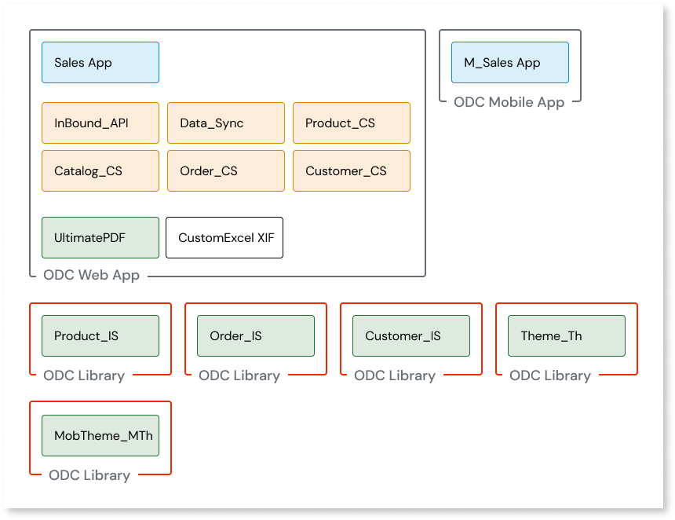

# Design your ODC architecture

To [map O11 to ODC architecture](plan-map-apps.md), you first need to fit your existing O11 app architecture into the ODC architecture. For this, you must design the **future** ODC apps that map your existing O11 apps and modules.

This section describes how to design your ODC architecture for a small set of apps in one business domain. If your O11 factory has more than two business apps, follow the best practices for [adapting your O11 architecture and creating an ODC blueprint](plan-incremental.md).

The following steps help you with that mapping:

1. Identify the O11 apps and modules belonging to a business app and group them together. This group represents a future ODC app.

    

    In the example, there's a single business app, the Sales app. This means that at this stage, there's one future ODC app.

1. Next, check if the future ODC app you defined in the previous step includes both Reactive Web apps and Mobile apps. If the future ODC app includes both types of apps, move the Mobile app to a new future ODC app.

    

    In the example, the future Sales ODC app includes both types of apps, so let’s move the mobile app to a new app. There are now two new future ODC apps: the Sales Web app and the Sales Mobile app.

1. For your future ODC app, identify the O11 apps and modules that can become ODC libraries, and move each of these into new future ODC libraries. Examples of these are integration wrappers, themes, and reusable UI or logic patterns.

    

    In the example, there's three integration wrappers (Product_IS, Order_IS, and Customer_IS), and two themes (MobTheme_MTh and Theme_Th). Now, in addition to the two future ODC apps, there are five new future ODC libraries.

1. For your future ODC app, identify Forge components. These need to exist in ODC or be ported to ODC before you conclude your conversion, so make sure you plan for that. Move each Forge component to its own future ODC library.

    

    In the example, the future ODC Sales app includes a Forge component, UltimatePDF. Now, there's two future ODC apps, and six future ODC libraries, including one Forge component.

1. For your future ODC app, identify extensions and move each one to separate future ODC libraries.

    

    In the example, the future ODC Sales app includes an extension, CustomExcel_XIF. Now, there's two future ODC apps, and seven future ODC libraries, including one Forge component and one extension.

1. Review each future ODC library that isn't a Forge component or extension, and consider if you can merge any of them into the same future ODC library. For example, if two integration wrappers connect to the same external system, group them into a single future ODC library.

    

    In the example, both Product_IS and Order_IS connect to the same external system (ERP), so they can be grouped together in the same future ODC library. Customer_IS connects to a different external system (CRM), so it stays in a separate future ODC library.

1. Start adapting your O11 architecture, while ensuring the following:

    * No future ODC app or library (future ODC assets) includes O11 modules that belong to different O11 apps. This means that if two O11 modules belong to the same O11 app, but are mapped to two different future ODC assets, you must move one of them to a new O11 app or merge the two future ODC assets into a single one.

    * For O11 apps mapped to **ODC libraries**, make sure you convert all O11 modules of that O11 app to O11 library modules.

    

    OutSystems recommends you make these changes in the Development environment.

    

After adapting your O11 architecture, you are ready to start [using the Conversion Assessment Tool to map](plan-map-in-tool.md) it to your future ODC architecture.
