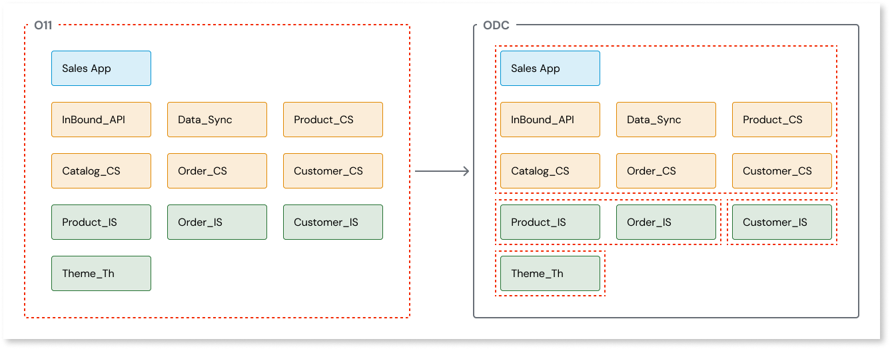

# Adapting O11 architecture and creating an ODC blueprint

Preparing your apps for migration to OutSystems Developer Cloud (ODC) is essential to benefit the cloud-native architecture of ODC. ODC offers a modular, scalable environment that enhances app performance and resilience. Planning the migration early can ensure a smoother transition, minimize business disruption, and position your apps for long-term success in a modern, cloud-native infrastructure.

The migration process consists of phases, including creating the ODC blueprint, mapping it from O11 apps, and preparing the O11 architecture.

The ODC blueprint results from planning and focusing on your business goals and development team independence. It contains an overview of the future ODC architecture and the list of changes required for ODC. The blueprint evolves as you adapt your O11 apps for the migration and their mirroring functionalities in ODC. It captures all the necessary changes apps need during migration, especially once the code is in ODC. However, you do not need an ODC tenant in this preparatory phase.

Adapting the O11 apps means implementing best practices to prepare the apps for the ODC migration. This ensures that your future app portfolio benefits from ODC features like app-independent lifecycles, high scalability, library versions, and more. The migration process can automatically apply some best practices, especially code-related ones. However, app architecture best practices require thoughtful planning before the migration. This is because the architecture depends on each customer's app portfolio.

This document is intended for architects, leads, and developers planning and preparing the existing O11 application architecture to enable efficient migration to ODC in the future. You will learn what you need to create an ODC blueprint to help you plan your development work. Since architecture adjustments may take some time, OutSystems recommends that development teams start incorporating them into their regular sprint activities as technical debt reduction.

## Requirements

The requirements for adapting O11 architecture and creating an ODC blueprint:

* Discovery Tool. This is a Forge component to analyze and understand how to improve the O11 factory architecture and enable the instantiation and validation of domain-driven design architecture
* AI Mentor Studio. OutSystems AI tool that helps you reduce the technical dept and implement best practices.

## Step 1: Map O11 domains to ODC apps and libraries

The first step in preparing your apps for migration is creating your ODC blueprint. According to your business needs, select the factory you want to move to ODC and create a plan to prepare the apps for the next steps of the migration process.

On the higher level, this entails understanding how O11 apps and modules map to the apps, libraries, and workflows in ODC. For more information refer to [Map O11 domains to ODC apps and libraries](plan-map-incremental.md).

On a more granular level, creating an ODC blueprint entails analyzing your existing O11 app architecture blueprint. To finalize your blueprint, you need to:

* Identify application concepts
* Identify bounded contexts
* Identify business owners and sponsors
* Map bounded contexts to apps and libraries

More information is available in [Convert O11 architecture to ODC architecture](plan-convert-arch-incrementale.md).

## Step 2: Apply domain-driven architecture principles

[Domain-driven design](https://success.outsystems.com/documentation/best_practices/architecture/outsystems_domain_driven_architecture/domain_driven_design/) supports cloud-native app development by breaking down apps into loosely coupled and independently deployable components or services. This approach aligns with the cloud-native architecture of ODC, where apps are designed to solve specific business problems or automate processes. Domain-driven architecture in O11 enables your business apps to become closer to the ODC architecture, creating a migration path into the ODC loosely coupled architecture.

In ODC, each app can function as a standalone component, a microservice exposing APIs, or a single web or mobile user interface. This modularity enables independent scaling of each app, reducing the time and cost associated with scaling. It also ensures life-cycle independence among teams, enabling parallel development and deployment.

Adopting domain-driven design requires an iterative process between:

* Validating the architecture
* Modifying the O11 apps

More resources:

* For detailed information on ODC app architecture, refer to [App architecture](https://success.outsystems.com/documentation/outsystems_developer_cloud/app_architecture/).
* For information on types of domains and domain architecture rules, refer to [Domain-driven design with OutSystems](https://success.outsystems.com/documentation/best_practices/architecture/outsystems_domain_driven_architecture/domain_driven_design_with_outsystems/).
* [Architecture fundamentals training](https://learn.outsystems.com/training/journeys/architecture-fundamentals-559/apps/odc/1)
* [Architecture patterns training](https://learn.outsystems.com/training/journeys/architecture-patterns-581/odc)

### Validate the app architecture

If you're not part of the Early Access Program, you can use the [Discovery Tool](https://www.outsystems.com/forge/component-overview/409/discovery-o11) from Forge to validate your architecture. For more information about the validation, refer to [Architecture Canvas and Domain-driven design rules](https://success.outsystems.com/documentation/best_practices/architecture/designing_the_architecture_of_your_outsystems_applications/validating_your_application_architecture/).

The Early Access Program customers can use the Migration Assessment Tool, a set of O11 components to prepare for the ODC architecture and migration.

## Step 3: Adapt your apps for better ODC compatibility

As you prepare your app for the ODC architecture, adapt the O11 apps to make them ODC-compatible and enable a smoother migration to ODC. You need to consider the best practices and that some O11 features are not supported directly in ODC.

Most O11 plugins use the app Common Plugin. However, mobile plugins are libraries in ODC. Due to the architectural differences between O11 and ODC, it's not possible to migrate O11 apps to ODC libraries. If you want to migrate a plugin from O11 to an ODC library, the O11 plugin needs to be a library.

When preparing your O11 mobile plugins to migrate to ODC, replace the **app** [Common Plugin](https://www.outsystems.com/forge/component-overview/1417/common-plugin-o11) with the [Common Plugin Library](https://www.outsystems.com/forge/component-overview/20521/common-plugin-library-o11). Then, migrate your plugin to an ODC library.

For more information about how to adapt your apps, refer to [O11 to ODC migration code patterns](../code-patterns/intro.md).

## Additional resources

Here are some additional resources and training materials that can help you understand ODC architecture better:

* [O11 to ODC training](https://learn.outsystems.com/training/journeys/from-o11-to-odc-569)
* [Architecture Fundamentals on ODC](https://learn.outsystems.com/training/journeys/architecture-fundamentals-559/)
* [Architecture patterns in ODC training](https://learn.outsystems.com/training/journeys/architecture-patterns-581/)
