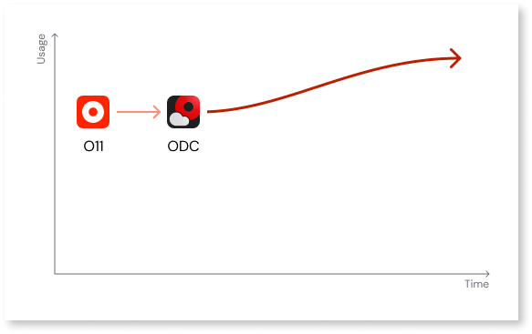
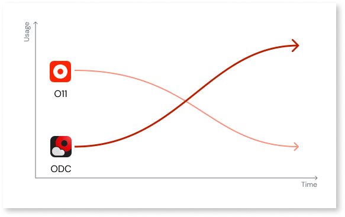

# Plan app migration

The planning phase is the first stage of your [O11 to ODC migration](../migration-intro.md). Once you complete your planning you are ready to start preparing your O11 app portfolio for the migration to ODC, with an understanding of your future ODC architecture, and of the effort required for the O11 app refactoring.

Depending on the size of your app portfolio, you may follow different migration journeys:

* **One-shot migration** is suitable for smaller app portfolios (infrastructures with less than 2 business apps) with up to 300 Application Objects. You can choose to migrate the entire portfolio at once and have it ported to ODC in a short timeframe. Follow this approach if you have been granted access to the Migration Kit, and check the [One-shot migration section](#one-shot) to learn more and start your journey.

    

* **Coexistence**  is suitable for larger app portfolios (infrastructures with more than 2 apps) where it is essential to continue providing business value and, at the same time, work on the migration activities. With this migration journey, new apps can be created in ODC while you independently migrate apps from O11. Check the [Prepare O11 application architecture](#coexistence) to start your incremental migration.

    

## One-shot migration { #one-shot }

Follow this approach if you have less than two business apps, less than 300 AOs, and if you been granted access to the Migration Kit. Otherwise, follow the [coexistence approach](#coexistence).

The main steps in the Planning phase of your one-shot migration are the following:

1. [Set up the Migration Assessment Tool](../setup-assessement-tool.md)

1. [Map O11 to ODC architecture for one-shot migration](plan-map-apps.md)

1. [Assess app refactoring](plan-assess-refactor.md)

## Coexistence approach { #coexistence }

Check [plan and prepare O11 architecture for coexistence migration](plan-incremental.md) to follow the coexistence approach.
