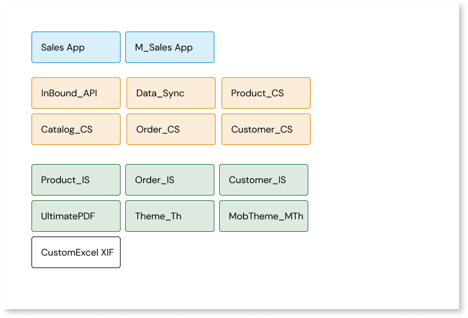
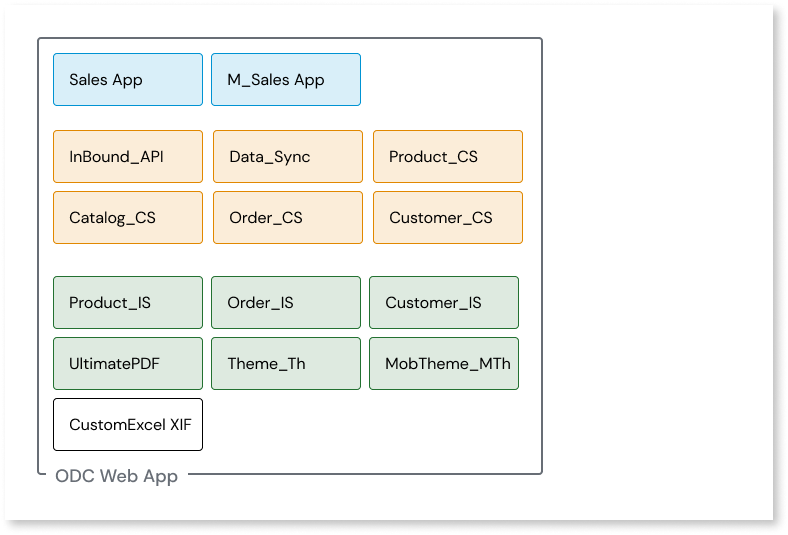
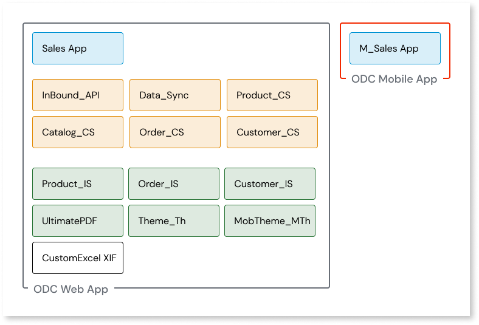
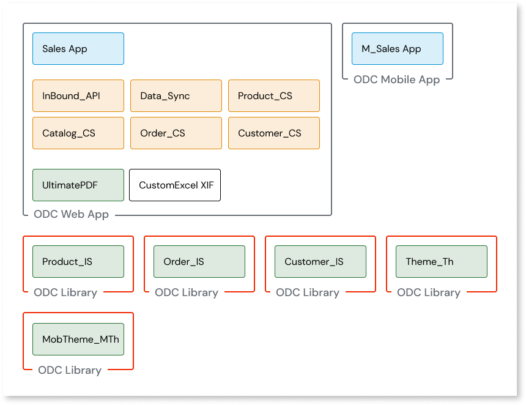
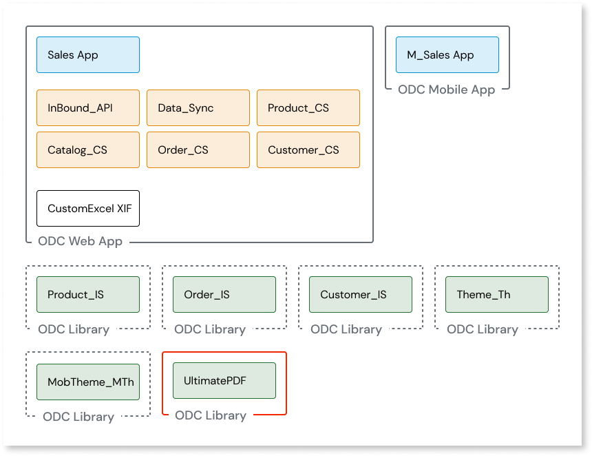
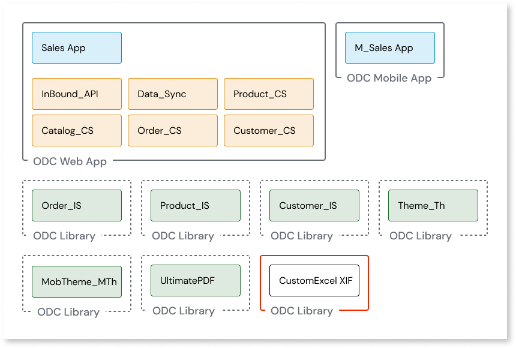
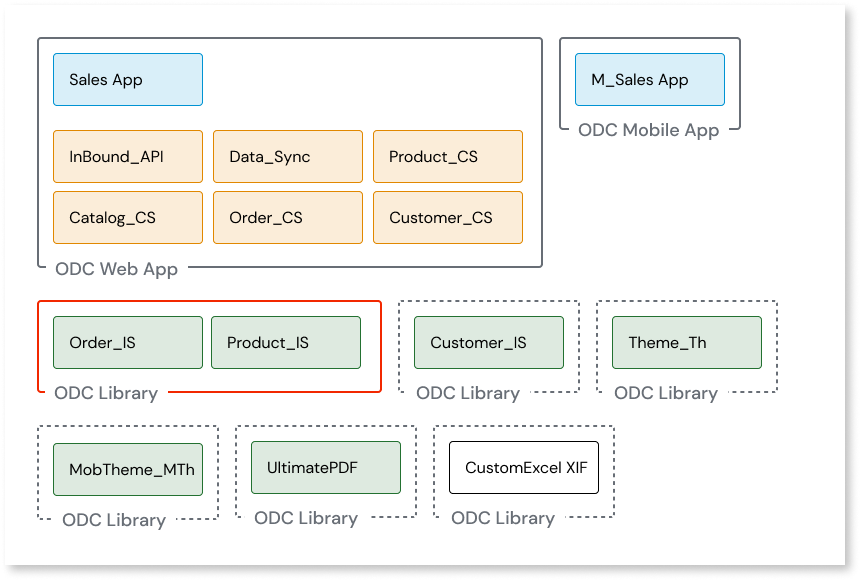
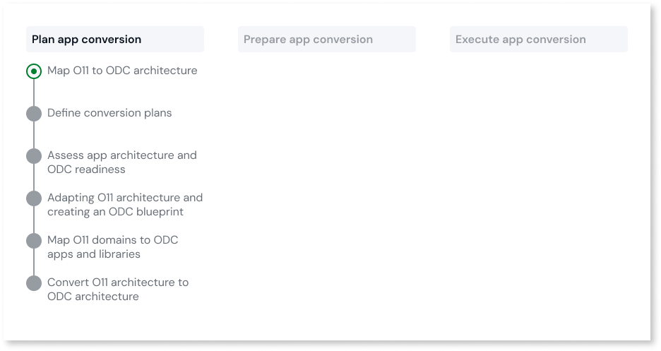
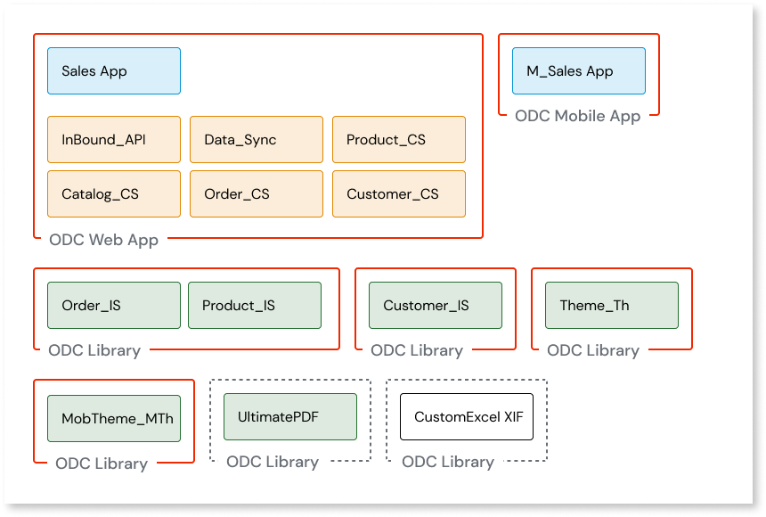

# Map O11 to ODC architecture for one shot migration

This article only applies to customers with access to the Migration Kit.

If your O11 factory has two or less business apps, use this simplified approach to the conversion of your O11 architecture to your ODC architecture.
This step of the [Plan app migration](plan-intro.md) stage enables you to start assessing the required adjustment needs of your O11 apps.

If your O11 factory has more than two business apps, we recommend you follow the [coexistence migration approach](plan-map-incremental.md).

Before you start, make sure you have an inventory of your O11 apps and modules. If you have previously classified your apps with the [Architecture Canvas](https://success.outsystems.com/documentation/best_practices/architecture/designing_the_architecture_of_your_outsystems_applications/the_architecture_canvas/), this helps with some of the upcoming steps.

As an example, consider the following O11 app and modules inventory.

The main steps for the simplified conversion of O11 to ODC architecture are the following:

1. [Create ODC architecture](#create-arch)

1. [Map O11 to ODC architecture in the Migration Assessement Tool](#map-in-tool)

## Create ODC architecture{ #create-arch }

Follow these steps as you analyze and map your existing O11 app architecture to the ODC architecture:

1. Identify all O11 apps and Modules belonging to each of your business apps and group them together respectively. Each of these groups represents a future ODC App.

    

    In the example, there's a single business app, the Sales app. This means that at this stage, there's a single future ODC app.

1. Next, check if any of the future ODC apps you defined in the previous step includes both Reactive Web apps and Mobile apps. If a future ODC app includes both types of apps, move the Mobile app to a new future ODC app.

    

    In the example, the Sales future ODC app includes both types of apps. There's now two ODC future apps, the Sales Web app and the Sales Mobile app.

1. For each ODC future app, identify apps and modules that can become ODC Libraries, and move each of these into new ODC future libraries. Examples of these are integration wrappers, themes, and reusable UI or logic patterns.

    

    In the example, there's three integration wrappers (Product_IS, Order_IS, and Customer_IS), and two themes (MobTheme_MTh and Theme_Th). Now, in addition to the two ODC future apps, there are five ODC future Libraries.

1. For each ODC future app, identify Forge components. These need to already exist in ODC or be ported to ODC before you conclude your migration, so make sure you plan for that. Move each Forge component to their own ODC future library.

    

    In the example, the Sales future ODC app includes a Forge component, UltimatePDF. Now, there's two ODC future apps, and six ODC future Libraries, including one Forge component.

1. For each ODC future app, identify Extensions and move each one to separate ODC future Libraries.

    

    In the example, the Sales future ODC app includes an extension, CustomExcel_XIF. Now, there's two ODC future apps, and seven ODC future Libraries, including one Forge component and one Extension.

1. Review each ODC future Libraries that isn't a Forge component or Extension, and consider if you can merge any of them into the same ODC future Library. For example, if two integration wrappers connect to the same external system, group them into a single ODC future library.

    

    In the example, both Product_IS and Order_IS connect to same external system (ERP), so they can be grouped together in same ODC future library. Customer_IS connects to a different external system (CRM), so it stays in a separate ODC future Library.

1. Start adapting your O11 architecture, while ensuring the following:

    * Ensure no future ODC App or Library (ODC future assets) includes O11 Modules that belong to different O11 Apps. This means that if two O11 modules belong to the same O11 app, but they're mapped to two different ODC future assets, you must move one of them to a new O11 app.

    * For O11 Apps mapped to **ODC Libraries**, make sure you convert all O11 Modules of that O11 App to O11 Library Modules.

    

    OutSystems recommends you do these changes in the Development Environment.

    

After adapting your O11 architecture, you are ready to start using the Migration Assessment Tool to map it to your future ODC architecture.

## Map O11 to ODC architecture in the Migration Assessment Tool { #map-in-tool }

Now, it's time to add the mapping you previously defined to the Migration Assessment Tool. The mapping is always based on the O11 Apps available in your Development Environment.

For all ODC Asset Types, currently, **Extensions** can't be mapped.
For **ODC Libraries**, you can only map O11 Apps that only contain O11 Library Modules. Make sure you convert all O11 Modules of O11 Apps you want to map to an ODC Library to O11 Library Modules.

Do the following:

1. In the Assessment Tool, create each of the future ODC Apps and Libraries, and map them to your O11 apps. For now you aren't able to map Extensions. Do the following:

    1. Access the Assessment Tool.

    1. If this is the first mapping after setting up the Assessment Tool, select **Start mapping O11 apps**. Otherwise, select **Map O11 apps**.

    1. In the **ODC** section, set the following:
        * **Asset name**, making sure you follow the [ODC naming best practices](https://www.outsystems.com/tk/redirect?g=4f33c44e-316d-43b3-9929-221138d053be)
        * **Asset type**
        * Optionally, set the **Asset description**. 

        

        The Icon is inherited from the first O11 app you map in the next step.

        

    1. In the **O11** section, select all the O11 apps that belong to the ODC asset.

        

        For all ODC Asset Types, currently, **Extensions** can't be mapped.
        For **ODC Libraries**, you can only map O11 Apps that only contain O11 Library Modules. Make sure you convert all O11 Modules of O11 Apps you want to map to an ODC Library to O11 Library Modules.

        

    1. Select **Save mapping**.

After you define and map all your ODC future assets, you are ready to [start validating your architecture and assessing the required adjustment needs of your apps, to get them ready for the migration](plan-assess-refactor.md).

**Example**

Considering the example O11 to ODC architecture mapping used in the previous section, the following mapping should be created in the Migration Assessment Tool:

* One **ODC Web App**, with the seven O11 Apps mapped to it.
* One **ODC Mobile App**, with the one O11 App mapped to it.
* Four **ODC Libraries**, one of which with two O11 Apps mapped to it, and with the rest with one O11 App mapped to each.
* The **Forge component** and the **Extension** **aren't mapped** to any ODC Library in the tool.
