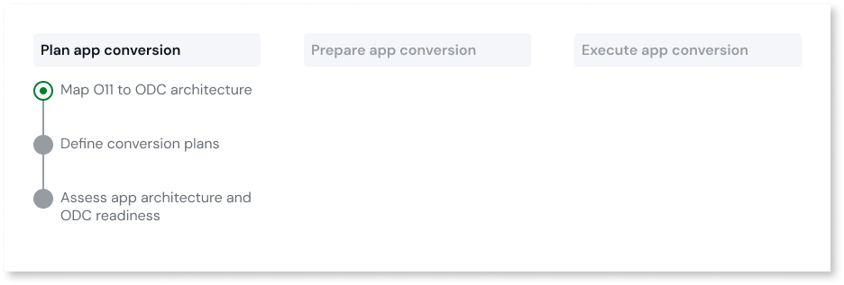
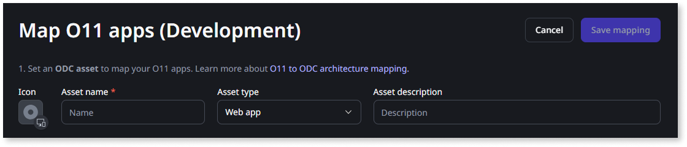

# Map O11 to ODC architecture

This article only applies to customers with access to the Migration Kit.

This step of the [Plan app migration](plan-intro.md) stage enables you to start assessing the required adjustment needs of your O11 apps. You can focus on small sets of apps based on your different app domains and your teams' development lifecycle.

Before you start, make sure you have an inventory of your O11 apps and modules that you want to migrate. OutSystems recommends that you classify your apps with the [Architecture Canvas](https://success.outsystems.com/documentation/best_practices/architecture/designing_the_architecture_of_your_outsystems_applications/the_architecture_canvas/), as this helps with some of the upcoming steps.

As an example, consider the following O11 app and modules inventory.

To map your O11 apps architecture to ODC architecture, start by [designing your ODC architecture](#design-arch) and then do the [O11 to ODC mapping in the Migration Assessment Tool](#map-in-tool).

## Design ODC architecture { #design-arch }

This section describes how to design your ODC architecture for a small set of apps in one business domain. If your O11 factory has more than two business apps, follow the best practices for [adapting your O11 architecture and creating an ODC blueprint](plan-incremental.md).

To fit your existing O11 app architecture into the ODC architecture, you need to design the **future** ODC apps that map your existing O11 apps and modules.

The following steps help you with that mapping:

1. Identify the O11 apps and modules belonging to a business app and group them together. This group represents a future ODC app.

    

    In the example, there's a single business app, the Sales app. This means that at this stage, there's one future ODC app.

1. Next, check if the future ODC app you defined in the previous step includes both Reactive Web apps and Mobile apps. If the future ODC app includes both types of apps, move the Mobile app to a new future ODC app.

    

    In the example, the future Sales ODC app includes both types of apps, so let’s move the mobile app to a new app. There are now two new future ODC apps: the Sales Web app and the Sales Mobile app.

1. For your future ODC app, identify the O11 apps and modules that can become ODC libraries, and move each of these into new future ODC libraries. Examples of these are integration wrappers, themes, and reusable UI or logic patterns.

    

    In the example, there's three integration wrappers (Product_IS, Order_IS, and Customer_IS), and two themes (MobTheme_MTh and Theme_Th). Now, in addition to the two future ODC apps, there are five new future ODC libraries.

1. For your future ODC app, identify Forge components. These need to exist in ODC or be ported to ODC before you conclude your migration, so make sure you plan for that. Move each Forge component to its own future ODC library.

    

    In the example, the future ODC Sales app includes a Forge component, UltimatePDF. Now, there's two future ODC apps, and six future ODC libraries, including one Forge component.

1. For your future ODC app, identify extensions and move each one to separate future ODC libraries.

    

    In the example, the future ODC Sales app includes an extension, CustomExcel_XIF. Now, there's two future ODC apps, and seven future ODC libraries, including one Forge component and one extension.

1. Review each future ODC library that isn't a Forge component or extension, and consider if you can merge any of them into the same future ODC library. For example, if two integration wrappers connect to the same external system, group them into a single future ODC library.

    

    In the example, both Product_IS and Order_IS connect to the same external system (ERP), so they can be grouped together in the same future ODC library. Customer_IS connects to a different external system (CRM), so it stays in a separate future ODC library.

1. Start adapting your O11 architecture, while ensuring the following:

    * No future ODC app or library (future ODC assets) includes O11 modules that belong to different O11 apps. This means that if two O11 modules belong to the same O11 app, but are mapped to two different future ODC assets, you must move one of them to a new O11 app or merge the two future ODC assets into a single one.

    * For O11 apps mapped to **ODC libraries**, make sure you convert all O11 modules of that O11 app to O11 library modules.

    

    OutSystems recommends you make these changes in the Development environment.

    

After adapting your O11 architecture, you are ready to start using the Migration Assessment Tool to map it to your future ODC architecture.

## Map O11 to ODC architecture in the Migration Assessment Tool { #map-in-tool }

Now, it’s time to define each of the future ODC Assets (apps and libraries) and map your O11 apps in the Migration Assessment Tool.

* The mapping is always based on the O11 Apps available in your **Development Environment**.
* You can only map up to 20 O11 modules per ODC Asset.
* Currently, you can’t map an O11 **Extension** into any ODC Asset type.
* For **ODC Libraries**, you can only map O11 Apps that contain only O11 Library Modules. Thus, for the O11 Apps that you want to map to an ODC Library, make sure you convert all O11 Modules to O11 Library Modules.

To map your O11 Apps into ODC Assets, follow these steps:

1. Log into the Migration Assessment Tool console (`https://<mat_console_environment>/MigrationAssessment/`) using your IT User credentials.

1. In the **ODC Blueprint** tab, click **Map O11 apps (Development)**.

1. Create an ODC asset to map your O11 apps:
    * Set the **Asset name**. Make sure you follow the [ODC naming best practices](https://www.outsystems.com/tk/redirect?g=4f33c44e-316d-43b3-9929-221138d053be)
    * Set the **Asset type**.
    * Optionally, set the **Asset description**.

    

    

    The Icon is inherited from the first O11 app you map in the next step.

    

1. Select all the O11 apps that you want to map to your ODC asset.

1. Click **Save mapping**.

Every time you create or update a mapping, the Migration Assessment Tool automatically queues an assessment for that asset. When the assessment finishes, you can go through the report to [assess the app architecture and ODC readiness](plan-assess-refactor.md) for that ODC asset.

After mapping a set of O11 apps into ODC assets, you can group those ODC assets in [migration plans](plan-define-migration-plans.md). This enables you to focus only on the assessment of a specific app domain.

### Example

Consider the O11 to ODC architecture mapping example used in the previous section:

For this ODC architecture design, create the following mapping in the Migration Assessment Tool:

* One **ODC Web App** asset, with seven O11 Apps mapped to it.
* One **ODC Mobile App** asset, with one O11 App mapped to it.
* Four **ODC Library** assets, one of which with two O11 Apps mapped to it, and the remaining with one O11 App mapped to each.

Currently, the **Forge component** and the **extension** aren't mapped to any ODC Library in the tool.

