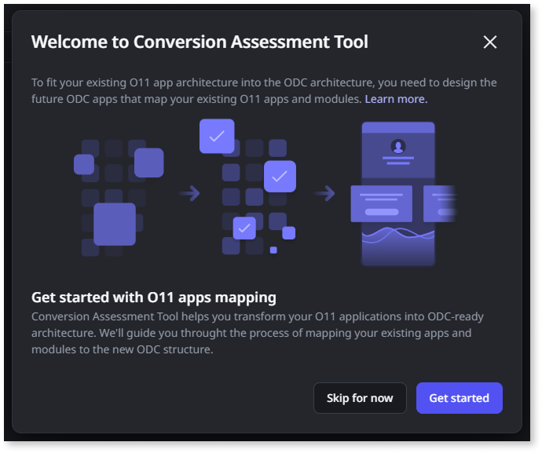
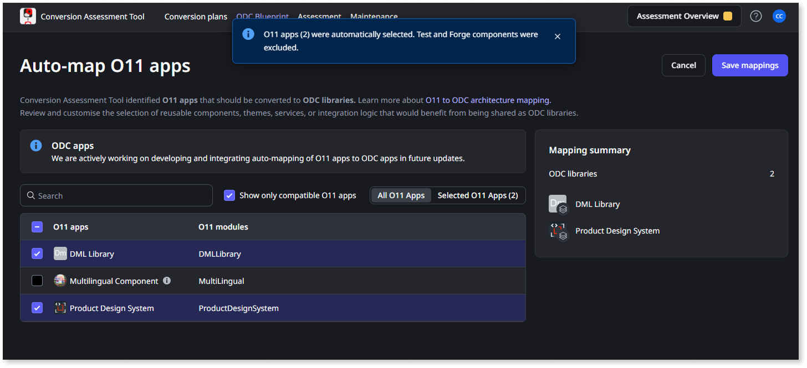
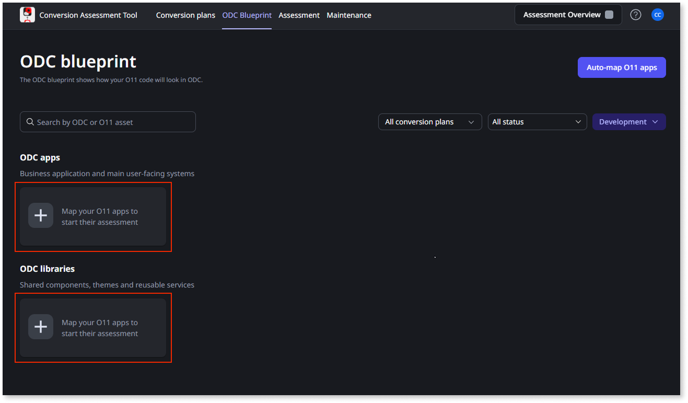

# Map O11 to ODC architecture in the Conversion Assessment Tool

After [designing your ODC architecture](plan-design-odc-arch.md), it’s time to define each of the future ODC Assets (apps and libraries) and map your O11 apps in the [Conversion Assessment Tool](../setup-assessement-tool.md).

The mapping is always based on the O11 Apps of the O11 environment where the [development probe](../setup-assessement-tool.md#probe) is installed.

Your [LifeTime permissions for that environment](mat-permissions.md#map) determine which O11 apps, ODC assets, and mapping operations are available to you in the Conversion Assessment Tool.

Important considerations:

* You can map **up to 20 O11 modules** per ODC asset. This limit ensures a good balance for managing the complexity within a single ODC app or library.
* Currently, the conversion process doesn’t support **O11 extensions**. Any extensions included in the O11 apps you map are automatically excluded from the resulting ODC asset.
* For **ODC Libraries**, you can only map O11 Apps that contain only O11 Library Modules. Thus, for the O11 Apps that you want to map to an ODC Library, make sure you convert all the required O11 Modules to O11 Library Modules.

## Mapping your apps

You can map your O11 Apps into ODC Assets using two methods:

* Quick start your ODC blueprint [using auto-mapping](#auto-mapping) to identify potential mappings.
* [Manually map your O11 apps](#manual-mapping) to new ODC assets.

### Use auto-mapping { #auto-mapping }

The Conversion Assessment Tool enables you to quick start your ODC blueprint using auto-mapping.

When you start auto-mapping, the Conversion Assessment Tool automatically analyzes your O11 apps and proposes a recommended ODC architecture. You can then review and adjust the proposed mappings before creating the ODC assets.

Currently, the tool auto-maps each O11 app that contains only library modules to a separate ODC library. OutSystems is working to enhance the auto-mapping capability so it can propose an ODC blueprint for your entire portfolio.

The proposed mapping excludes:

* Testing apps - O11 apps containing "test" or "sandbox" in its name. For these, [map them manually to a new ODC asset](#manual-mapping).
* O11 Forge components
* O11 extensions

Follow these steps to auto-map your O11 apps in the tool:

1. Log into the Conversion Assessment Tool console (`https://<cat_console_environment>/ConversionAssessment/`) using your IT User credentials.

1. If there are no mappings yet, you see a welcome pop-up. Click **Get started** to start the auto-mapping.

    

    Otherwise, you can start the auto-mapping at any time by clicking **Auto-map O11 apps** in the top-right corner of the **ODC blueprint** tab screen.

1. Review the mappings proposed on the **Auto-map O11 apps** screen.

    This screen presents you a list of suggested O11 apps to map into the ODC assets listed on the **Mapping summary** right-side area.

    

1. Use the checkbox next to each proposed **O11 app** to confirm the mappings you want to create.

    Only the selected O11 apps will be mapped.

1. Click **Save mappings** to create the ODC assets to map the selected O11 apps.

The Conversion Assessment Tool adds the created ODC assets to your **ODC blueprint** and [runs an assessment](#assess-plan) for those assets.

Now that you have bootstrapped your ODC blueprint, proceed with the [mapping of the remaining O11 apps](#manual-mapping).

### Map O11 apps to a new ODC asset { #manual-mapping }

Follow these steps to manually map your O11 apps to ODC assets, either from scratch or to complete the blueprint you started [using auto-mapping](#auto-mapping):

1. Log into the Conversion Assessment Tool console (`https://<cat_console_environment>/ConversionAssessment/`) using your IT User credentials.

1. In the **ODC Blueprint** tab, navigate to either the **ODC apps** or **ODC libraries** section, depending on the type of ODC asset you want to create.

1. Click the **+** (plus sign) button for the type of ODC asset you want to map.

    

1. Define the ODC asset to map your O11 apps:

    * Set the **Asset name**. Make sure you follow the [ODC naming best practices](https://www.outsystems.com/tk/redirect?g=4f33c44e-316d-43b3-9929-221138d053be).
    * Set the **Asset type**.
    * Optionally, set the **Asset description**.

    

    

    The Icon is inherited from the first O11 app you map in the next step.

    

1. Select all the O11 apps that you want to map to your ODC asset.

1. Click **Save mapping**.

The Conversion Assessment Tool adds the created ODC asset to your **ODC blueprint** and [runs an assessment](#assess-plan) for that asset.

### Mapping example

Consider the O11 to ODC architecture mapping example used to [design the ODC architecture](plan-design-odc-arch.md):

For this ODC architecture design, create the following mapping in the Conversion Assessment Tool:

* One **ODC Web app** asset, with seven O11 apps mapped to it.
* One **ODC Mobile app** asset, with one O11 app mapped to it.
* Four **ODC Library** assets, one of which with two O11 apps mapped to it, and the remaining with one O11 app mapped to each.

Currently, the **Forge component** and the **extension** aren't mapped to any ODC Library in the tool.

## Assess and plan your conversion { #assess-plan }

Every time you create or update a mapping, the Conversion Assessment Tool automatically queues an assessment for that ODC asset. When the assessment finishes, you can go through the report to [assess its architecture and ODC readiness](plan-assess-refactor.md).

After mapping a set of related ODC assets, you must group them in [conversion plans](plan-define-migration-plans.md). This enables you to focus on the assessment of a specific app domain, and later convert to ODC the apps within a conversion plan.
