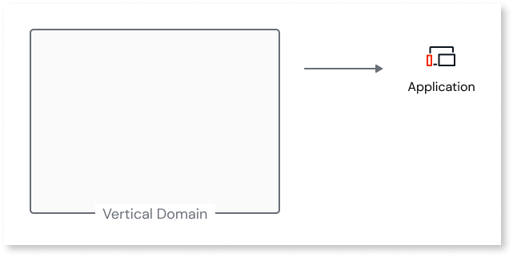
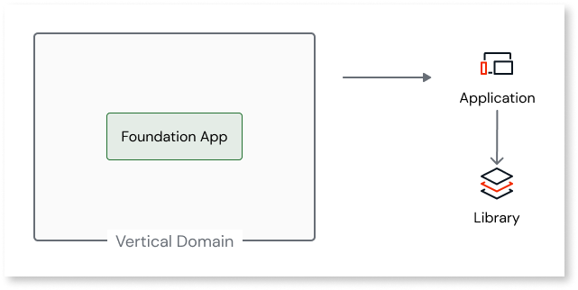
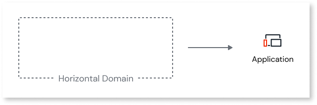
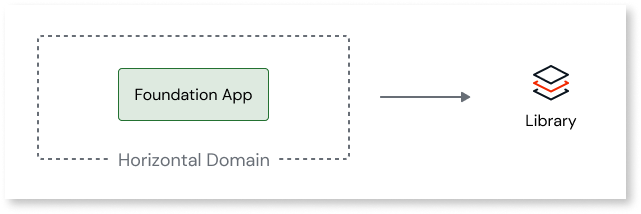

# Map O11 domains to ODC apps and libraries

In ODC, you can create apps or libraries. An app can be a web, tablet, or mobile app. An ODC app encapsulates business concepts, UI, logic, and data of a specific business context. The ODC apps are loosely coupled and have independent lifecycles.

Libraries are a collection of reusable components used across multiple apps. They are used to implement business-agnostic components such as themes, integration wrappers, and logic utilities. They are strongly coupled with ODC apps and are packaged into a version included inside the application container.

For detailed information on ODC apps and libraries, refer to [ODC application architecture](https://success.outsystems.com/documentation/outsystems_developer_cloud/building_apps/app_architecture/).

O11 domains have similar characteristics to ODC apps since they are both loosely coupled by definition and have a close match, with most of the referencing rules. ODC Libraries share  similarities with O11 Foundation apps and can be extracted from these foundation apps. Based on these principles, here are some recommendations to map O11 vertical and horizontal domains to ODC apps and libraries:

* Convert vertical domains to an ODC app, as both represent a business domain and have loosely coupled properties with the same type of possible dependencies.

    

* Convert vertical domains with foundation apps consumed only in a vertical to an ODC app and one or more libraries from the foundation app(s).

    

* Convert horizontal domains containing shared business logic, shared technical services, and data to ODC apps.

    

*  Convert horizontal domains with foundation apps consumed across multiple verticals to one or more ODC libraries.

    
