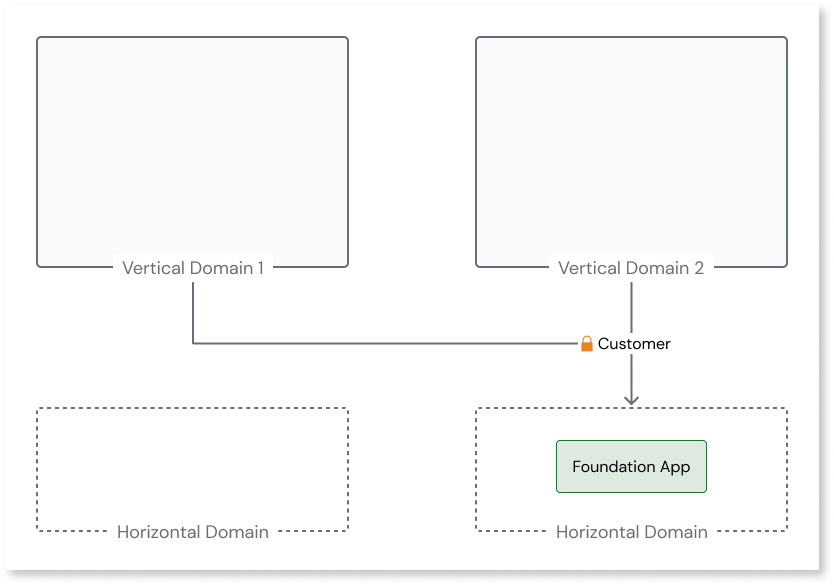

# Refactor public roles to be ODC-compatible

In O11, you can have public roles shared across domains. However, in ODC, public roles are not allowed.

This can cause issues when converting the horizontal domain with the foundation app to an ODC library since public roles are not allowed. To configure a public role in ODC, follow these steps:

1. Create a role in each vertical domain and ensure it's only consumed inside the domain.

    

1. Map your end users to both roles in the domain. For more information, refer to [End User Management](https://success.outsystems.com/documentation/outsystems_developer_cloud/user_management/roles/).
